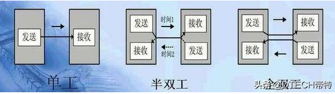
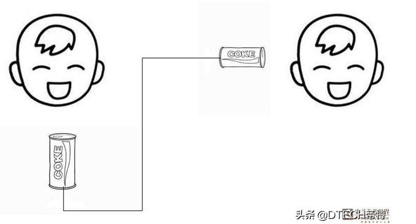

#### 1、基础概念

通信：数据传输

根据数据流的方向，可以分为三种基本的传送方式：单工、半双工、全双工

#### 2、定义

单工：信息在两个节点间只能单方向发送的方式。**收发方固定**：只能是一个发另一个收

单工通信，收发方固定

半双工：信息在两点之间能够在两个方向进行发送，但是不能同时发送的工作方式。场景代表：对讲机。

半双工通信，收发方不固定，但同一时刻只能一方发另一方收

全双工：通信允许数据在两个方向上同时传输，它在能力上相当于两个单工通信方式的结合。

全双工通信，双方可同时收与发

#### 3、区别

半双工和全双工的本质区别是 半双工通信双方只共用一条线路实现双向通信，但全双工通信方式却利用了两条线路，一条作发送数据，另一条做接受数据用。这样也决定了全双工模式无需进行方向的切换，没有切换操作所产生的延迟，这对于哪些不能有延迟的交互式应用（远程监测和控制系统）十分有利。

#### 4、举例

单工：电视、广播

半双工：对讲机，或只能过一辆车的桥，同时只能一个方向可以过。

全双工：电话，或双向各一车道的桥，来回双向都可以同时过。

#### 5、比喻

全双工：两个人你说我听 就如两个人面对面交流

半双工：你说我听  或  我说你听  不能同时说

---

单工：a和b说话，b只能听a说

半双工：参考对讲机，

​	A：能不能听到我说话，over

​	B：可以可以，over

全双工：参考打电话：

​	A：哎，老王啊！@@#@#@！#

​	B：￥#@@#！@

