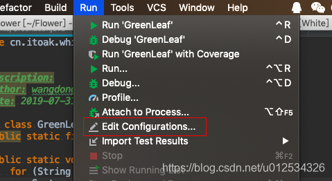
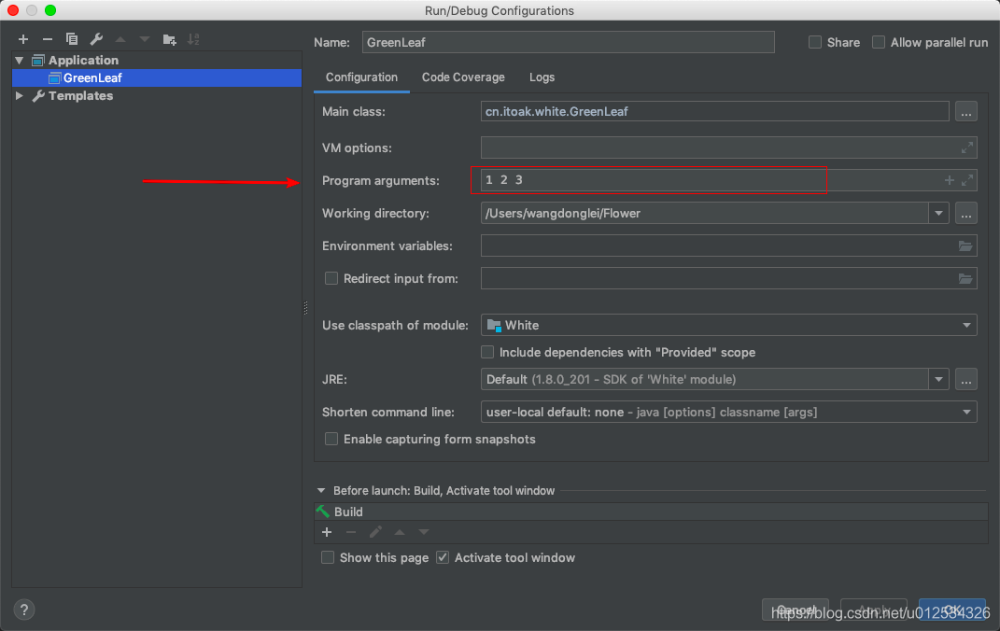
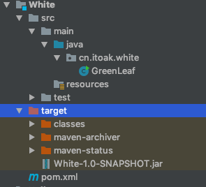
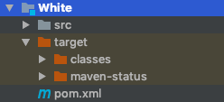
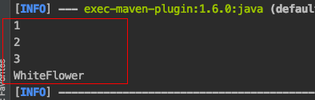

Java 的main方法是Java程序员最熟悉不过的一个方法了，因为我们大多数时候，启动程序都是需要使用到该方法的，且main方法的参数列表是String[] args，一个字符串数组，那么我们如何在启动的时候传入我们需要的参数呢，下面介绍三种方法。

程序示例代码如下：

```java
    public class GreenLeaf {
        public static final String TYPE = "WhiteFlower";
     
        public static void main(String[] args) {
            for (String a : args){
                System.out.println(a);
            }
            System.out.println(TYPE);
        }
    }
```

上面的简单示例代码将打印传入的参数及一个字符串。

**一、使用IDE集成开发环境运行Java main方法（Idea展示）**

1.首先，点击菜单Run->Edit Configurations：



2.然后，在主类的Configuration -> Program arguments中输入你的参数，多个参数以空格分隔：



点击保存即可。

**二、使用命令java -jar \**\*.jar方式运行Java程序，如何传参解决方案：**

0.首先你需要正确打一个jar包：

很多人打包的时候可能会出现这个问题：“White-1.0-SNAPSHOT.jar中没有主清单属性”, 笔者是使用maven管理项目的，解决方案是在pom文件里加入以下插件：

```xml
    <build>
            <plugins>
                <plugin>
                    <groupId>org.apache.maven.plugins</groupId>
                    <artifactId>maven-jar-plugin</artifactId>
                    <configuration>
                        <archive>
                            <manifest>
                                <addClasspath>true</addClasspath>
                                <mainClass>cn.itoak.white.GreenLeaf</mainClass>
                            </manifest>
                        </archive>
                    </configuration>
                </plugin>
            </plugins>
        </build>
```

1.然后在项目根目录下运行：mvn clean package 命令即可正确打jar包，包在如下位置：



2.进入target目录下，运行命令：

```shell
java -jar White-1.0-SNAPSHOT.jar 1 2 3
```

**三、使用mvn命令运行Java程序并传参：**

0.执行命令前，请确保已经正确编译（mvn compile）:



1.然后在项目根目录下执行命令：

```shell
mvn exec:java -Dexec.mainClass="cn.itoak.white.GreenLeaf" -Dexec.args="1 2 3"
```

1*.如果不想在命令中指定-Dexec.mainClass，则需要在pom文件中增加以下插件，并指定mainClass:

```xml
    <build>
            <plugins>
                <plugin>
                    <groupId>org.codehaus.mojo</groupId>
                    <artifactId>exec-maven-plugin</artifactId>
                    <version>1.6.0</version>
                    <configuration>
                        <mainClass>cn.itoak.white.GreenLeaf</mainClass>
                        <includePluginDependencies>false</includePluginDependencies>
                    </configuration>
                </plugin>
            </plugins>
        </build>
```

加入了上面的插件，则只需要执行如下命令即可：

```shell
mvn exec:java -Dexec.args="1 2 3"
```

**四、直接执行.class文件（了解一下，很少用）**

0.先编译生成.class文件：

```shell
javac GreenLeaf.java
```

最终执行结果：




