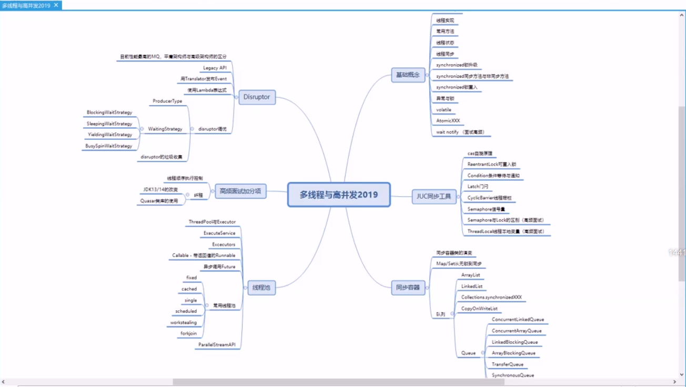
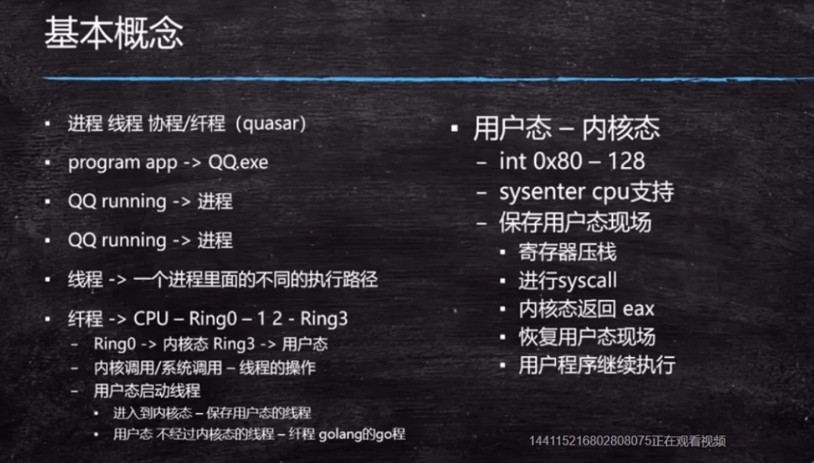
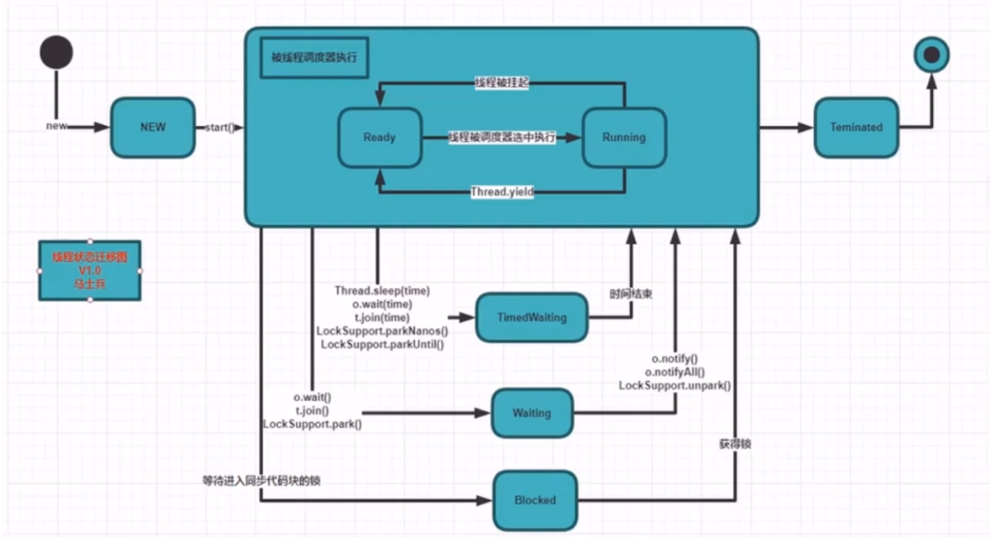

TODO：补纤程的概念 （2021-02-19）

### 什么是线程

#### 基本概念

 

* 进程 线程 协程/纤程(quasar)
* program app -> QQ.exe
* QQ running ->进程
* QQ running ->进程
* 线程 -> 一个进程里面的不同的执行路径
* 纤程 -> CPU-Ring0-12-Ring3
  - Ring0 -> 内核态Ring3 ->用户态
  - 内核调用/系统调用-纤程的操作
  - 用户态启动线程
    * 进入到内核态-保护用户态的线程
    * 用户态不经过内核态的线程-纤程golang的go程
* 用户态-内核态
  - int 0x80-128
  - sysenter cpu支持
  - 保存用户态现场
    * 寄存器压栈
    * 进行syscall
    * 内核态返回eax
    * 恢复用户态现场
    * 用户程序继续执行

--
T1 extends Thread{重写run()}

* new T1().run(); 这种方式是方法调用：是一条线程内顺序执行；
* new T1().start(); 两条路同时进行
**线程：一个程序里不同的执行路径**

#### 创建线程的2种方式

* 继承Thread类

```java
class T1() extends Thread{
    @Override
    public void run(){sout("hello T1")}
}

psvm{
    new T1().start();
}
```


* 实现Runnable接口

```java
class T2() implements Runnable{
    @Override
    public void run(){sout("hello T2")}
}

psvm{
    new Thread(new T2()).start();
}

```

或者lambda表达式

```java
new Thread(()->{ sout("hello lambda!") }).start();
```

**面试题：**创建线程的三种方式：1、Thread 2、Runnable 3：线程池 Executors.newCachedThread(其实也是用前两种之一)

### 线程状态

* sleep 睡眠，时间结束后自动复活，也是回到就绪状态
* yield 暂停一会（让出一下cpu），进入等待队列里（就绪状态），极少使用场景，压测有可能。
* join 加入，要等加入的线程执行完后才回到当前线程执行。可以用来等待另外一个线程结束。
  * 解决线程调用顺序问题：t1/t2/t3,如何保证先执行完t3，再执行t2，最后才执行t1。可以t1里面调t2.join，t2里面调t3.join。
  * 谁join谁有影响的

-- 知识边缘导致学得越多，不懂的也越多

#### 获取线程状态  JVM管理

Thread.getState();

 

* 线程调度器执行：交给操作系统执行
* 线程调度器执行的整个状态叫：Runnable ，里面细分两个状态：Ready(就绪状态) 和 Running（确实在运行的状态）
* Ready-就绪状态：在cpu的等待队列里面排队等着
* Running-运行状态：从等待队列里面进入cpu里面执行
* 线程Teminated之后不可能再start
* stop状态已经被弃用，不建议使用
* interrupt：打断，要catch异常处理

### synchronized关键字

* 对某个对象加锁：看这把锁是不是自己的，检查锁是自己的，才执行被锁的代码片段
  * 任意对象：比如 Object o = new Object(); sync(o);
  * this：锁定当前对象：void method(){sync(this){sout("hello")}}  ==  sync void method()；
  * class T{sync **static** void method()}  这里等同于sync(T.class)  
      static 方法不需要创建对象的，他锁定的是该类的字节码
* 底层 hashCode 与markword(对象头64位，拿出两位看是不是被锁)
* sync 既保证了原子性，也保证了可见性。
* 同步方法和非同步方法可以同时调用
* sync的可重入性：
  * 一个同步方法可以调用另外一个同步方法，一个线程已经拥有某个对象的锁，再次申请的时候仍然会得到该对象的锁。
  * 也就是说synchronized获得的锁是可重入的。
  * 父类子类都是同步的，子类里调用super.m()；不可重入的话就会死锁了。锁的是同一个对象：子类的对象。
* 程序如果出现异常，默认情况下锁会被释放


#### synchronized的底层实现

* JDK早期的时候，重量级 - OS 都要找操作系统申请锁，造成性能非常低
* 后来的改进：
  锁升级的概念：《我就是厕所所长 一/二》
    1. sync(Object) 在对象头上，markword记录这个线程ID （偏向锁）
    2. 如果线程争用，升级为 自旋锁(CAS) --占用cpu，但不访问操作系统，在用户态解决锁的问题
    3. 10次以后还得不到锁，升级为重量级锁（系统锁） - OS--不占cpu，使用操作系统，在内核态解决锁的问题
    4. 锁只有升级，没有降级（GC回收）
* Atomic、各种Lock 其实用的都是自旋锁
* 加锁代码执行时间短，线程数比较少，用自旋锁；
* 加锁代码执行时间长，线程数比较多，用系统锁；


### 总结

* 线程的概念  启动方式  常用方法(sleep,yield,join)
* s ynchronized(Object)
  - 不能用String常量    Interger   Long
  - "Object"
* 线程同步
- synchronized 
  * 锁的是对象不是代码
  * synchronized m() 锁的是this，如果m方法是static修饰的，那么锁的是XX.class
  * 锁定方法 非锁定方法  同时执行
  * 锁升级
    - 偏向锁  自旋锁 重量级锁
    - 线程少：自旋，线程多：重量级锁
    - 操作时间长 重量级锁 