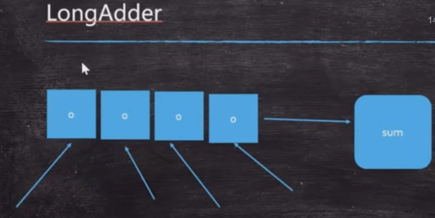
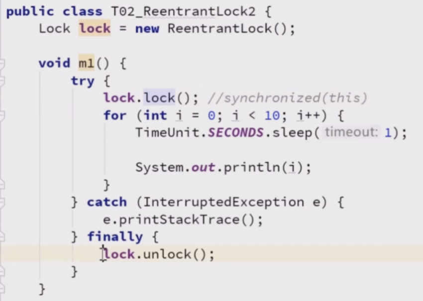
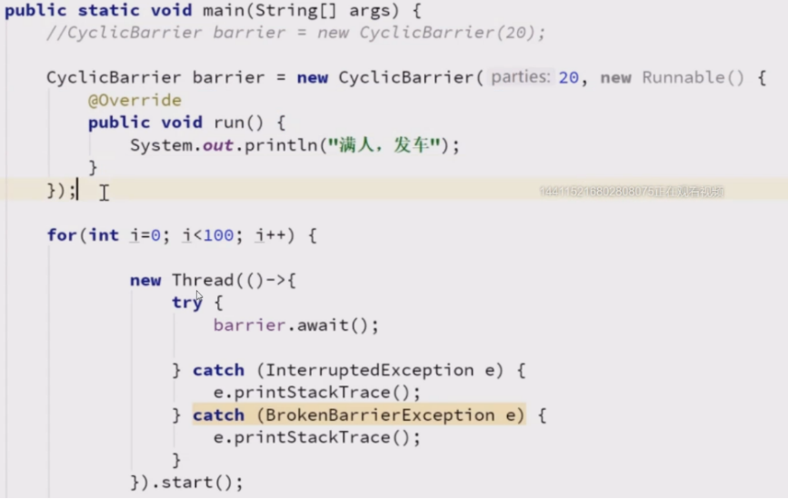
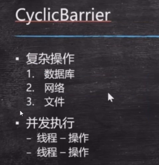
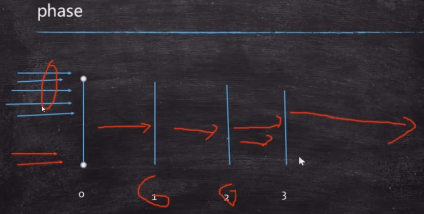
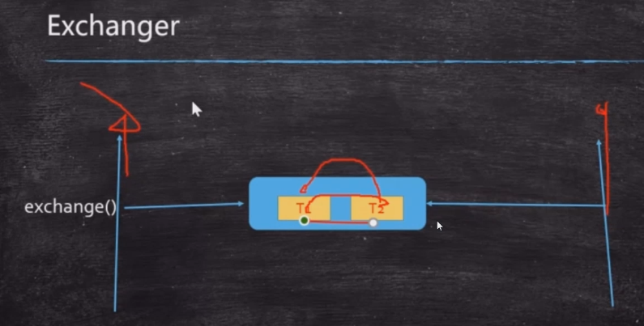

### 复习

cas(期望值，更新值)

m=0
m++

expected = read m;
cas(0,1){
   for(;;){如果当前m值==0，m=1}
}

cas：乐观锁 ，synchronized： 悲观锁

---

### Atomic 继续

* 不同锁之间性能比较： synchronized / AtomicLong /  LongAdder
    synchronized : 有锁
    AtomicLong : 无锁-cas
    LongAdder : 分段锁-cas  在并发数特别高的时候有优势
  例子：通过递增来对比

 

#### 间歇性复习

  * synchronized
  * volatile
  * atomicXXX -> CAS
  * increment -> sync  atomicXXX   LongAdder

### ReentrantLock 可重入锁

* synchronized 本身就是可重入锁的一种 ，针对同一条线程可重入
* 可以替代synchronized的，原来写synchronized(this)的地方，直接换为lock.lock();但是要手动解锁，放到finally里面lock.unlock();

 

* **比synchronized强大的地方**
* 可以使用tryLock进行尝试锁定，不管锁定与否，方法都将继续执行。可以根据tryLock的返回值来判定是否锁定。也可指定tryLock的时间。
* lock.lockInterruptibly(); 可以对interrupt()方法做出响应，别人打断我的话是可以做出响应的；和sync的区别在，比如sync一旦wait之后，自己是醒不过来的，必须要别人notify才可以。
* 可以指定为公平锁 new ReentrantLock(true) 参数为true表示为公平锁：谁等在前面，就先让谁执行；而不是说谁后来就可以马上执行。默认是非公平的锁。


#### ReentrantLock vs Synchronized

* ReentrantLock可以替代Synchronized是没问题的，本身也是可重入锁。
* CAS VS sync(锁升级的概念，四种锁：无锁，偏向锁，自旋锁，重量级锁)
* tryLock
* lockinterruptibly
* 公平和非公平的切换，而synchronized只有非公平锁

----


### 其他同步工具

AQS是CAS，新的锁都用了AQS，所以新的锁都用了CAS

#### CountDownLatch 倒数的门闩：滚动发车，坐满就走   就是倒计数

-- 倒数的一个门闩，数到了，门闩就开了
* CountDownLatch latch = new CountDownLatch(要倒数的数字);
* latch.countDown();要倒数的数字减一，到0的时候就继续往前走；原子性的，不会有线程安全问题。
* latch.await();门闩闩着，等着（阻塞的，性能也不会高哪去）
* 性能上 应该不会比join高多少
* CountDownLatch一个线程就可以做到，join的话依赖于别的线程

#### CycliBarrier 栅栏-循环使用；  满人，发车 

* CycliBarrier barrier = new CicleBarrier(发车条件数，满足条件后执行什么)
  或者用lambda的写法：CycliBarrier barrier = new CicleBarrier(20,()->sout("满人，发车"));
* barrier.await();自增条件数

 

* 场景：

 

#### Phaser 按照不同的阶段，来对线程进行执行 分阶段的栅栏

* 较少考，扫盲知识点，使用场景：遗传算法
 * 限流的场景 （一般常用的是 Guava RateLimiter）
 * phaser.bulkRegister(7);
 * phaser.arriveAndAwaitAdvance();
 * phaser.arriveAndDeregister();

 


#### **ReadWriteLock 读写锁  重点掌握**

```java
ReadWriteLock readWriteLock = new ReentrantReadWriteLock(); 
Lock readLock = readWriteLock.readLock(); 
Lock writeLock = readWriteLock.writeLock();
```

* 共享锁==读锁
* 排他锁(互斥锁)==写锁  sync


#### Semaphore 信号灯  限流场景

 ** 可以自定义允许多少个线程同时执行**

```java
Semaphore s = new Semaphore(1);
//允许一个线程同时执行
s.acquire(); // 获得这把锁，阻塞方法，到了就执行 ==> s对象的值被该调用方法获取，值从1变为0
s.release();'//释放得到的锁  ==>方法执行完，释放，s对象的值从0变回1，其他人可以获得
```
* 使用场景：限流  -->卖票允许多少个窗口，还有高速公路的收费站，3车道前面只有一个收费站

 

* 默认非公平，构造入参为true的时候，表示公平

#### Exchanger 交换器

* 线程间 交换

 

游戏中两个人交换装备？


-----
分段锁==concurentHashMap
 jStack 可以排查到线程间的死锁