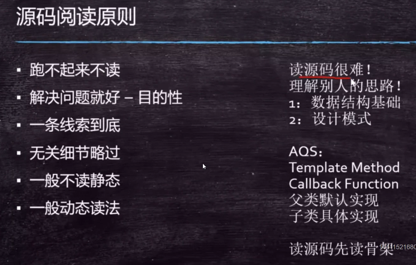

### 复习

* 线程的基本概念
* synchronized
* volatile
* AtomicXXX
* 各种JUC同步锁
  * ReentrantLock
  * CountDownLatch
  * CyClicBarrier
  * Phaser
  * ReadWriteLock - StampedLock
  * Semaphore
  * Exchanger
  * LockSupport


synchronized 系统自动加锁解锁，ReentrantLock需要我们手动加锁解锁，ReentrantLock可以出现各种各样的condition，就是不同的等待队列，synchronized做不到这点


---

### TestLockSupport

可以指定某个具体的线程阻塞。
* LockSupport.park();--当前线程阻塞
* LockSupport.unpark(t);--叫醒指定线程。 
* unpark(t) 可以先于park()调用


### 淘宝面试题

* 实现一个容器，提供两个方法，add，size。
  写两个线程，线程1添加10个元素到容器中，线程2实现监控元素的个数，当个数到5个时，线程2给出提示并结束。
* 方法一：wait / notify
  **notify(); 不释放锁
  wait(); 会释放锁**
* 方法二：CountDownLatch
根本方法，要两道CountDownLatch
* 方法三：LockSupport
根本方法：要两道LockSupport
* 方法四：Semaphore


---

* 面试题：写一个固定容量同步容器，拥有put和get方法，以及getCount方法，能够支持2个生产者线程以及10个消费者线程的阻塞调用。
**生产者消费者问题**
* 方法一：synhronized
* 方法二：ReentrandLock condition 本质是不同的等待队列。
```java
Lock lock = new ReentrantLock();
Condition producer = lock.newCondition();
Condition consumer = lock.newCondition();
producer.await();
consumer.signalAll();
```
**condition的本质就是等待队列个数**


### 源码阅读技巧

 

* 设计模式可以看坦克的视频
**要求**

1. 画方法调用泳道图


