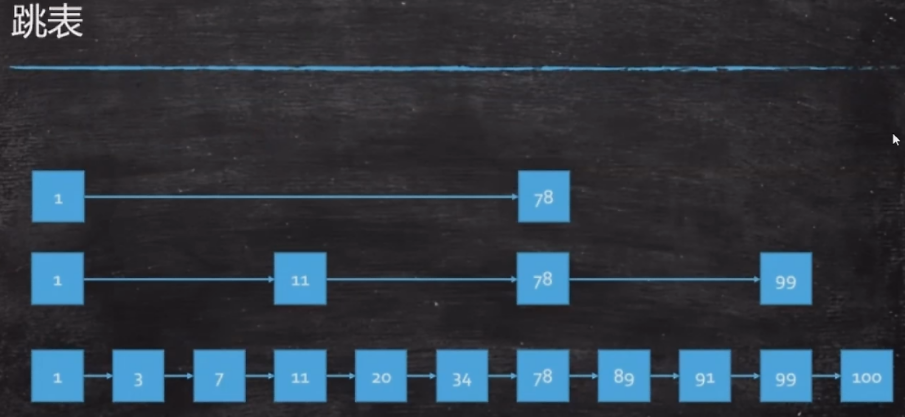
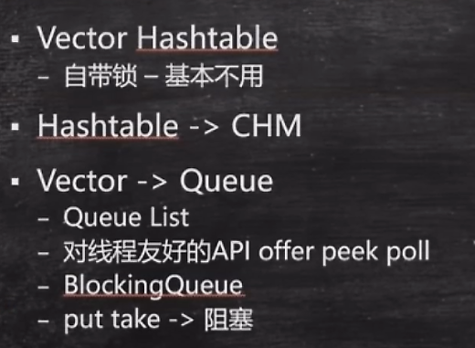

背容器图

 


  *  容器-Vector - Hashtable
*  CopyOnWriteList
*  ConcurrentHashMap
*  ConcurrentSkipListMap
*  BlockingQueue
*  目标：为ThreadPool做准备

容器：高频中的高频，涉及的知识点：
* 数据结构
* 算法
* 组织结构
* 高并发

1. 分两大类：Collection 集合，装一个一个对象的集合；Map 存一对一对
2. 数组也是容器中的一种
3. 物理上存储结构只有两种：连续存储的数组；非连续存储的链表。其他都是逻辑结构：树，树可以用链表或数组实现。

Collection分三大类：
1. List：可重复
2. Set：不重复
3. Queue/队列：高并发专用，现实很多多线程专用的方法。阻塞对列
    Deque：双端队列

评判一个人牛或不牛：看他写过什么，产品是什么。写开源软件还能卖钱的人。

1.0时只有两个容器：Vector 和 HashTable，但是缺点是把所有的方法都默认加了synchronized，不太合理。

基于上述情况，在HashTable的基础上，新增了HashMap，但是HashMap是完全不加锁了，在多线程的情况下又会出现问题。

这时，就补充了SynchronizedHashMap  -->把HashMap变成加锁的版本，还是用了synchronized，但是加锁的力度细化了，不再是方法级，而且细化到了函数内部，mutex对象。
```
Map<String,String> m = Collections.synchronizedMap(new HashMap(String,String));
```

**Vector和Hashtable 自带锁，基本不用**

JUC包出来之后，新增了ConcurrentHashMap。 这就是从Hashtable发展到HashMap的一个过程。不是替代的过程。从Vectort发展到ConcurrentList也是一样的过程。

* ConcurrentHashMap性能提高主要体现在读上面，本来是链表，到8之后变成红黑树，还有各种cas判断，所以写的判断会比较低。

---

多线程的时候，单个元素的时候多考虑Queue，少考虑list

ConcurrentLinkedQueue 
* poll 

treeMap  红黑树
ConcurrentHashMap 无序的  cas 要实现tree太复杂了


CopyOnWriteList   CopyOnWriteSet  写时复制
写的时候将原来的数组复制一份添加末节点，读的时候不加锁就读原来的数组。添加后再把引用指向新的数组。

SynchroniedList

BlockingQueue--为线程池做准备   blocking：阻塞
* 1  对线程友好的API
offer - 添加，又Boolean返回值，
peek - 取，但是不会删除
poll -取，但是会删除
        

* 2 正真会产生阻塞的
put：存，存不进会阻塞
take：存，为空会阻塞
场景：就是天生处理生产者消费者的问题。处理任务队列，
生产者消费者模型是多线程最重要的模型，是MQ的基础。 

 


* LinkedBlockingQueue ：无界对列（链表）       
* ArrayBlockingQueue：有界的
* DelayQueue：时间上的排序 : 按时间进行任务调度
* PriorityQueue：排序的（基于树）
* SynchronusQueue：线程间传递内容，只能传一个。像exchanger
* TransferQueue：等结果才会继续走。阻塞的。