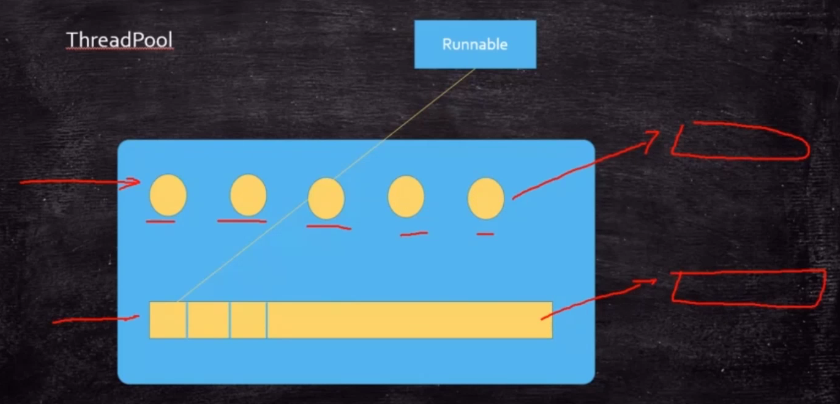

硬货：[美团线程池讲解](https://tech.meituan.com/2020/04/02/java-pooling-pratice-in-meituan.html)

### 需求：字母和数字交替输出 

方案一：wait  notify  (synchronized)
方案二：lockSupport
方案三：condition
方案四：cas
方案五：blockingQueue 阻塞队列
方案六：pipedStream
方案七：Semaphore  不可行
方案八：Exchanger  不可行
方案九：Transfer


### Executor 接口

定义和运行就可以分开了

### ExecutorService

 除了实现Executor可以执行一个任务之外，还完善了整个任务执行器的生命周期。

### Callable 接口

 和Runnable，区别是有返回值
一般配合线程池，配合future来用的

### Future 未来的结果

 结合Callable，拿到Callable的结果
future.get()方法是阻塞的
FutureTask 可以作为一个任务来用，同时结果也存在自己里面（继承了Runnable/future）
ForkJoinPool  和  WaitStealingPool 会用到

//----------------------以上就是常用的类

### CompletableFuture 各种任务的管理类

底层是ForkJoinPool
可以组合各种各样的任务，然后组合成一个结果。
例子：从各大电商网站拉价格  allOf  
从论文库查重   anyOf

### Executors


### 线程池

提供两种类型的线程池：
* ThreadPoolExecutor 七个参数
* ForkJoinPool
   * 分解汇总的任务
   * 用很少的线程可以执行很多的任务（子任务）TPE做不到先执行子任务
   * CPU密集型

#### ThreadPoolExecutor 的七个参数
线程池维护者两个集合，第一个是线程的集合，另一个是任务的集合 （用了HashSet）

 

```java

ThreadPoolExecutor tpe = new ThreadPoolExecutor(
    corePoolSize:2,
    maximumPoolSize:4,
    keepAliveTime:60,
    TimeUnit.SECONDS,
    new ArrayBlockingQueue<Runnable>(capacity:4),  固定长度的队列，可以更换别的队列类型
    Executors.defaultThreadFactory(),
    new ThreadPoolExecutor.DiscardOldestPolicy()
    );
```

**七个参数的含义：**
核心线程数，
最大线程数，线程不够的时候最大可以扩充到多少个
生存时间，多少时间没活干的线程要归还给操作系统
生存时间单位，
任务队列，各种各样的BlockingQueue都可以作为这个参数        
线程工厂：产生线程的，自己定义的产生线程的方式，阿里一般要求要重写，定义有意义的线程名
拒绝策略。线程池忙，任务队列满，执行拒绝策略。可以自定义，jdk默认提供了四种。一般情况都是自己自定义。保存到kafka，或者redis，或者数据库，或者mq，随便哪里，做好日志，统计还有那些任务没有处理，对于那些实时性没那么高的，什么时候有功夫，再进行处理。什么时候发现有大量的任务没有处理完的时 候，就需要加机器性能了。

 四种拒绝策略：
 Abort：抛异常
 Discard：扔掉，不抛一场
 DiscardOldest：扔掉排队时间最久的   场景：游戏服务器的移动位置改变的存储
 CallerRuns：调用者处理任务


找阿里的手册，华山版 1.5.0


#### 有哪些线程池

#### 线程池的优点和使用场景

