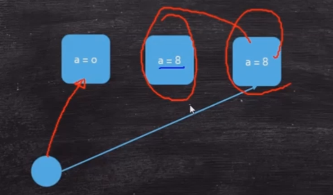

### volatile

* 保证线程可见性
  - MESI
  - 缓存一致性协议
* 禁止指令重排序（CPU）
  **代码见设计模式的单例模式** 
  - DCL单例
  - Double Check Lock(双重检查单例)
  - Mgr06.java
  - loadfence原语指令--读屏障
  - storefence语言指令--写屏障
  超高并发：创建对象的时候，指令重排序会出问题：

 

  instance有了值，其实是不会进入到同步锁的代码
**synchronized 保证了原子性，但不能禁止指令重排序**

* 不能保证原子性，不能替代synchronized