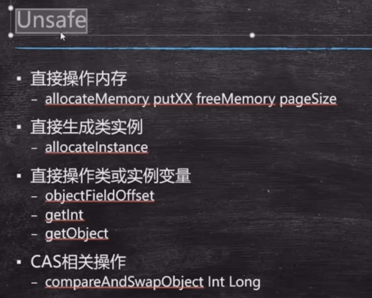

### volatile

* 保证线程可见性
  - MESI
  - 缓存一致性协议
* 禁止指令重排序（CPU）
  **代码见设计模式的单例模式** 
  - DCL单例
  - Double Check Lock(双重检查单例)
  - Mgr06.java
  - loadfence原语指令--读屏障
  - storefence语言指令--写屏障
  超高并发：创建对象的时候，指令重排序会出问题：

 

  instance有了值，其实是不会进入到同步锁的代码
**synchronized 保证了原子性，但不能禁止指令重排序**

* 不能保证原子性，不能替代synchronized

### synchronized 优化

  * 同步代码块中的语句越少越好
  * 把锁粒度变细：争用比较少
  * 把锁细度加粗：争用特别频繁（多个细锁放大）
  * 锁定某个对象o，如果o的属性发生变化，不影响锁的使用，但是如果o变成另外一个对象，则锁定的对象发生变化。应该避免将锁定对象的引用变成另外的对象   final 修饰符

### CAS（无锁优化  自旋  乐观锁）

* Compare And Set/Swap 比较并且设定
* cas(V, Expected, NewValue）  原值，期望值，新值  如果原值==期望值，那么表示期间没被别的线程改动过，可以变更为新值。但是会引出ABA问题。
  - if V == E
    V = newValue
    otherwise try again or fail
  - CPU 原语支持  （在赋新值得时候容易出现多线程问题，但是cas在cpu语言层面解决了这个问题，在这块要操作的内存的内容加了读写屏障，保证了原子性，所以cas是线程安全的）
* AtomicInterger -> CompareAndSet--> Unsafe(类)
* ABA问题
  -  加version
  -  A 1.0
  -  B 2.0
  -  A 1.0
  - cas(version)
  - Atomic里面带版本号的类： AtomicStampedReference
* ABA在基础数据类型没问题，如果是Object会有不能预知的问题
* 如果是基础类型，无法锁；引用类型 你的女朋友跟你复合，中间经历了别的女人

 

Unsafe = c c++的指针
 c -> malloc分配内存，free 释放内存
 c++ -> new delete