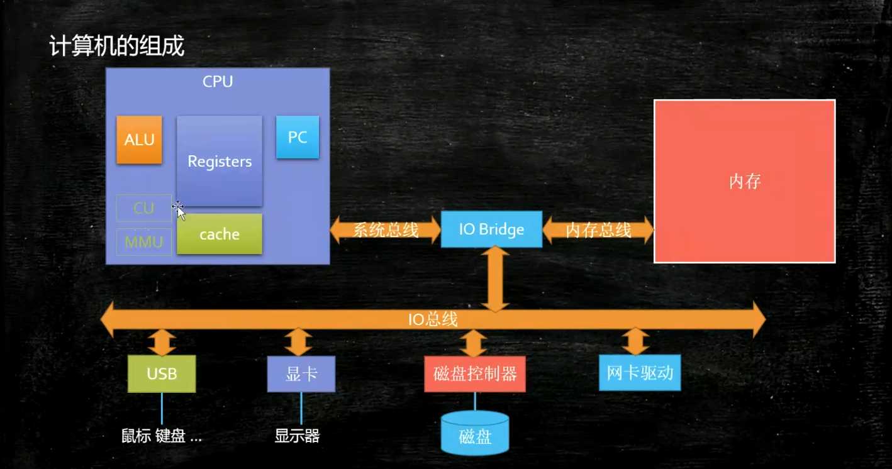
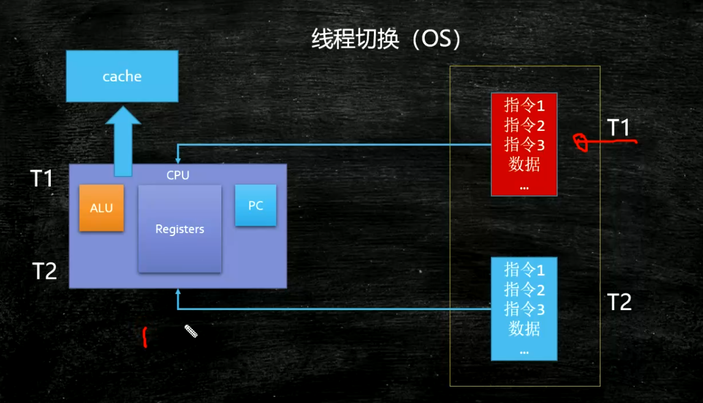
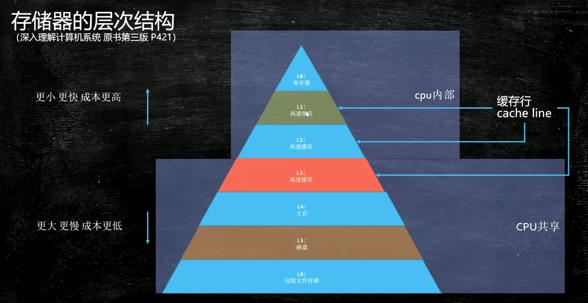

### 线程是什么

什么是进程？什么是线程？什么是纤程/协程？

是不是线程数量越多，效率越高？

1. 进程是静态概念，操作系统分配资源的基本单位

2. 线程是动态的概念，是运行和调度的基本单位

3. go语言诞生后，才问的纤程。

某一个时刻有多个不同的路径同时运行

底层角度：

![image-20200902201844380](C:\Users\user\AppData\Roaming\Typora\typora-user-images\image-20200902201844380.png

