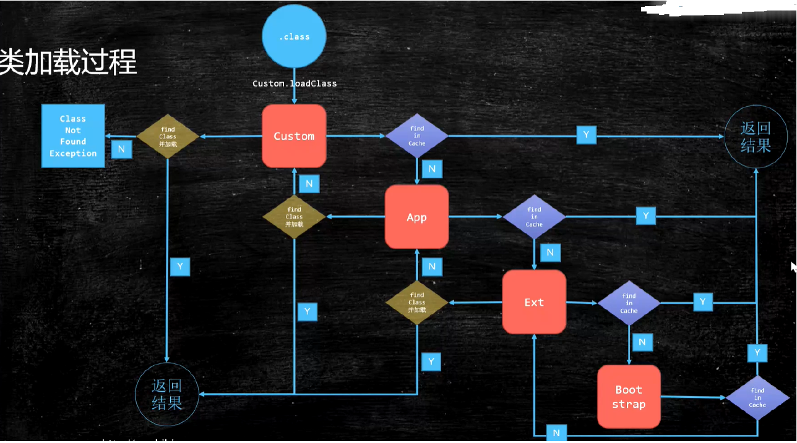

## 一、classloader类加载器

### 1、类加载过程

 

* 加载

> 将类的.class文件中的二进制数据读入到内存中，将其放在运行时数据区的方法区内，然后在内存
> 上创建一个java.lang.Class 对象用来封装类在方法区内的数据结构作为这个类的各种数据的访
> 问入口。

* 验证

> 主要是为了确保class文件中的字节流包含的信息是否符合当前JVM的要求，且不会危害JVM自身安
> 全，比如校验文件格式、是否是cafe baby魔数、字节码验证等等。

* 准备

> 为类变量分配内存并设置类变量（是被static修饰的变量，变量不是常量，所以不是final的，就是
> static的）初始值的阶段。这些变量所使用的内存在方法区中进行分配。比如
>
> > private static 1 int age = 26;
>
> 类变量age会在准备阶段过后为 其分配四个（int四个字节）字节的空间，并且设置初始值为0，而
> 不是26。
> 若是final的，则在编译期就会设置上最终值。

* 解析

> JVM会在此阶段把类的二进制数据中的符号引用替换为直接引用。

* 初始化

> 初始化阶段是执行类构造器<clinit>() 方法的过程，到了初始化阶段，才真正开始执行类定义的
> Java程序代码（或者说字节码 ）。比如准备阶段的那个age初始值是0，到这一步就设置为26。

* 使用

> 对象都出来了，业务系统直接调用阶段。

* 卸载

> 用完了，可以被GC回收了。


## 2、类加载器种类以及加载范围


* 启动类加载器（Bootstrap ClassLoader）

> 最顶层类加载器，他的父类加载器是个null，也就是没有父类加载器。负责加载jvm的核心类库，
> 比如java.lang.* 等，从系统属性中的sun.boot.class.path 所指定的目录中加载类库。他的
> 具体实现由Java虚拟机底层C++代码实现。

* 扩展类加载器（Extension ClassLoader）

> 父类加载器是Bootstrap ClassLoader。从java.ext.dirs 系统属性所指定的目录中加载类库，
> 或者从JDK的安装目录的jre/lib/ext 子目录（扩展目录）下加载类库，如果把用户的jar文件放
> 在这个目录下，也会自动由扩展类加载器加载。继承自java.lang.ClassLoader 。

* 应用程序类加载器（Application ClassLoader）

> 父类加载器是Extension ClassLoader。从环境变量classpath或者系统属性java.class.path 所
> 指定的目录中加载类。继承自java.lang.ClassLoader 。

* 自定义类加载器（User ClassLoader）

> 除了上面三个自带的以外，用户还能制定自己的类加载器，但是所有自定义的类加载器都应该继承
> 自java.lang.ClassLoader 。比如热部署、tomcat都会用到自定义类加载器。

* 补充：不同ClassLoader加载的文件路径配置在如下源码里写的：

```java
// sun.misc.Launcher
public class Launcher {
    // Bootstrap类加载器的加载路径，在static静态代码块里用的
    private static String bootClassPath =
    System.getProperty("sun.boot.class.path");
    
    
    // AppClassLoader 继承 ClassLoader
    static class AppClassLoader extends URLClassLoader {
        public static ClassLoader getAppClassLoader(final ClassLoader var0)
            throws IOException {
            // java.class.path
            final String var1 = System.getProperty("java.class.path");
        }
    }
        
    // ExtClassLoader 继承 ClassLoader
    static class ExtClassLoader extends URLClassLoader {
        public static Launcher.ExtClassLoader getExtClassLoader() throws
            IOException {
            // java.ext.dirs
            String var0 = System.getProperty("java.ext.dirs");
        }
    }
}
```

## 3、双亲委派是什么

如果一个类加载器收到了类加载的请求，他首先会从自己缓存里查找是否之前加载过这个class，加载过
直接返回，没加载过的话他不会自己亲自去加载，他会把这个请求委派给父类加载器去完成，每一层都
是如此，类似递归，一直递归到顶层父类，也就是Bootstrap ClassLoader ，只要加载完成就会返回
结果，如果顶层父类加载器无法加载此class，则会返回去交给子类加载器去尝试加载，若最底层的子类
加载器也没找到，则会抛出ClassNotFoundException 。

源码在java.lang.ClassLoader#loadClass(java.lang.String, boolean)

