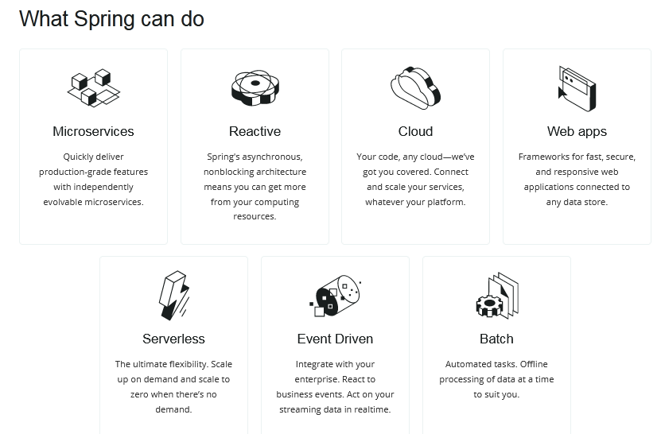
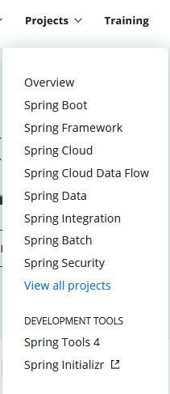
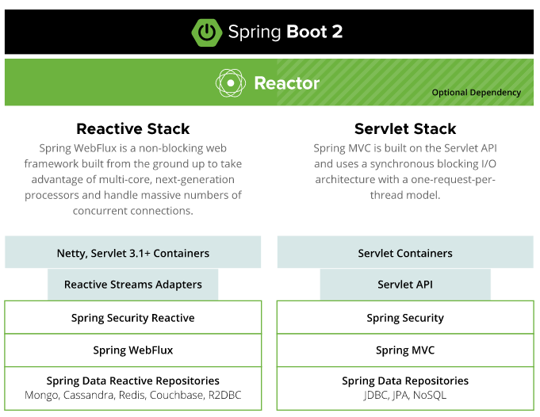
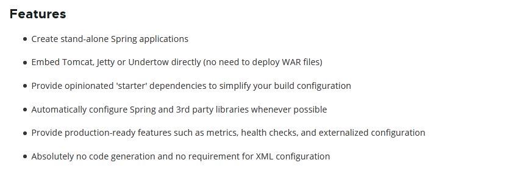
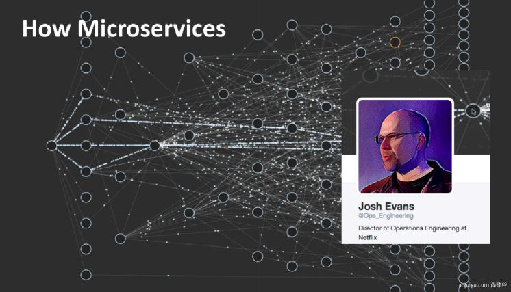
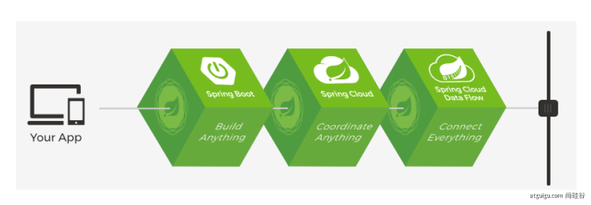
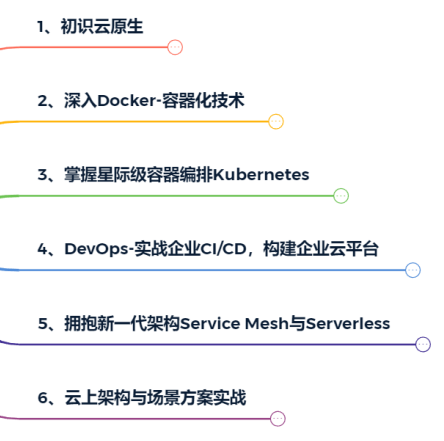
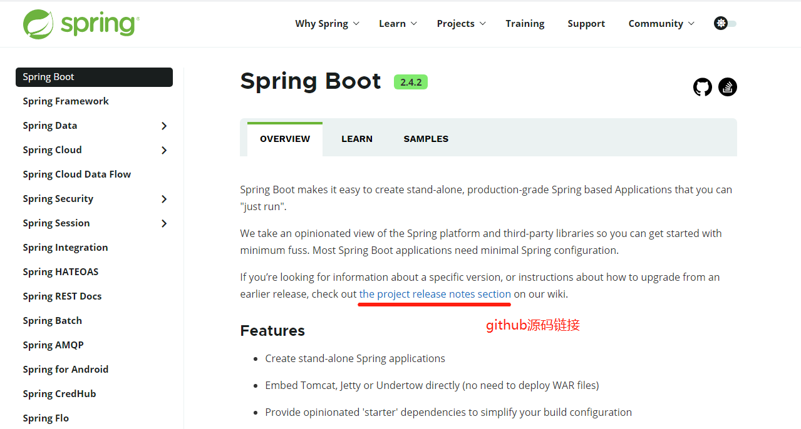
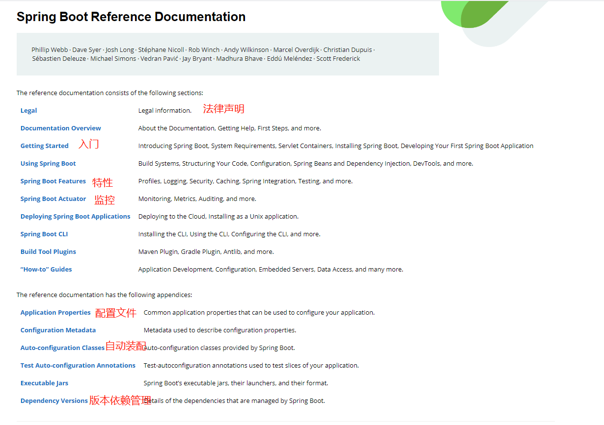

### 1、Spring能做什么

#### 	1.1、Spring的能力

#### 	1.2、Spring的生态

> https://spring.io/projects/spring-boot

覆盖了：

web开发

数据访问

安全控制

分布式

消息服务

移动开发

批处理

......

#### 	1.3、Spring5重大升级

##### 		1.3.1、响应式编程

> https://spring.io/reactive

##### 		1.3.2、内部源码设计

​		基于java8的一些新特性，如接口默认实现，重新设计源码架构，把原来的很多适配器废弃掉。

### 2、为什么用SpringBoot

> Spring Boot makes it easy to create stand-alone, production-grade Spring based Applications that you can "just run".
>
> 能快速的创建出生产级别的Spring应用

#### 2.1、SpringBoot优点

* Create stand-alone Spring applications

  * 创建独立的Spring应用

* Embed Tomcat, Jetty or Undertow directly (no need to deploy WAR files)

  * 内嵌Web容器

* Provide opinionated 'starter' dependencies to simplify your build configuration

  * 自动Starter依赖，简化构建配置

* Automatically configure Spring and 3rd party libraries whenever possible

  * 自动配置Spring及第三方功能

* Provide production-ready features such as metrics, health checks, and externalized configuration

  * 提供生产级别的监控、健康检查以及外部化配置

* Absolutely no code generation and no requirement for XML configuration

  * 无代码生成、无需编写XML

  > SpringBoot是整合Spring技术栈的一站式框架
  >
  > SpringBoot是简化Spring技术栈的快速开发脚手架

#### 	2.2、SpringBoot缺点

* 人称版本帝，迭代快，需要时刻关注变化
* 封装太深，内部原理复杂，不容易精通

### 3、时代背景

#### 	3.1、微服务

[James Lewis and Martin Fowler (2014)](https://martinfowler.com/articles/microservices.html)  提出微服务完整概念。https://martinfowler.com/microservices/

> In short, the microservice architectural style is an      approach to developing a single application as a **suite of small      services**, each **running in its own process** and communicating with      lightweight mechanisms, often an HTTP resource API. These      services are **built around business capabilities** and      **independently deployable** by fully automated deployment      machinery. There is a **bare minimum of centralized management** of      these services, which may be written in different programming      languages and use different data storage      technologies.
>
> -- [James Lewis and Martin Fowler (2014)](https://martinfowler.com/articles/microservices.html)

> 中文译文：https://www.cnblogs.com/liuning8023/p/4493156.html

* 微服务是一种架构风格
* 一个应用拆分为一组小型服务
* 每个服务运行在自己的进程内，也就是可以独立部署和升级
* 服务之间使用轻量级的HTTP交互
* 服务围绕业务功能拆分
* 可以由全自动化部署机制独立部署
* 去中心化，服务自治。服务可以使用不同的语言、不同的存储技术

#### 	3.2、分布式

<>

##### 		分布式的困难

远程调用

服务发现

负载均衡

服务容错

配置管理

服务监控

链路追踪

日志管理

任务调度

......

##### 		分布式的解决

SpringBoot + Springcloud

#### 	3.3、云原生

原生应用如何上云。Cloud Native

##### 		上云的困难

* 服务自愈
* 弹性伸缩
* 服务隔离
* 自动化部署
* 灰度发布
* 流量治理
* ......

##### 		上云的解决

 

### 4、如何学习SpringBoot

#### 	4.1、官网文档结构

版本更新，中间位数的可以看github的版本迭代信息，也可以看Reference Doc文档，至于第三位数的版本变更一般可以不看，一般都是写bug修复。

源码位置：

版本文档：

GA是当前稳定版的意思

点解中间的 Reference Doc.可以查看文档的详细信息

点击上图左侧菜单栏中的 Application Properties 可以查看整个springboot 对于各类组件应该怎么配置，springboot2给定的默认值是啥：

