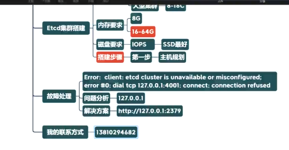

> https://www.jianshu.com/p/f68028682192

介绍：

etcd是CoreOS团队于2013年6月发起的开源项目，它的目标是构建一个高可用的分布式键值(key-value)数据库。etcd内部采用`raft`协议作为一致性算法，etcd基于Go语言实现。

etcd作为服务发现系统，有以下的特点：

简单：安装配置简单，而且提供了HTTP API进行交互，使用也很简单

安全：支持SSL证书验证

快速：根据官方提供的benchmark数据，单实例支持每秒2k+读操作

可靠：采用raft算法，实现分布式系统数据的可用性和一致性

etcd比较多的应用场景是用于服务发现，服务发现(Service Discovery)要解决的是分布式系统中最常见的问题之一，即在同一个分布式集群中的进程或服务如何才能找到对方并建立连接。

从本质上说，服务发现就是要了解集群中是否有进程在监听upd或者tcp端口，并且通过名字就可以进行查找和链接。

分布式锁前置知识--etcd集群

[硬件要求](https://etcd.io/docs/current/op-guide/hardware/)

 