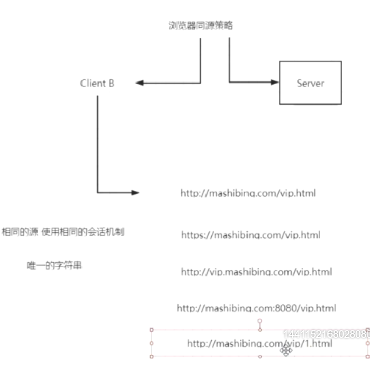
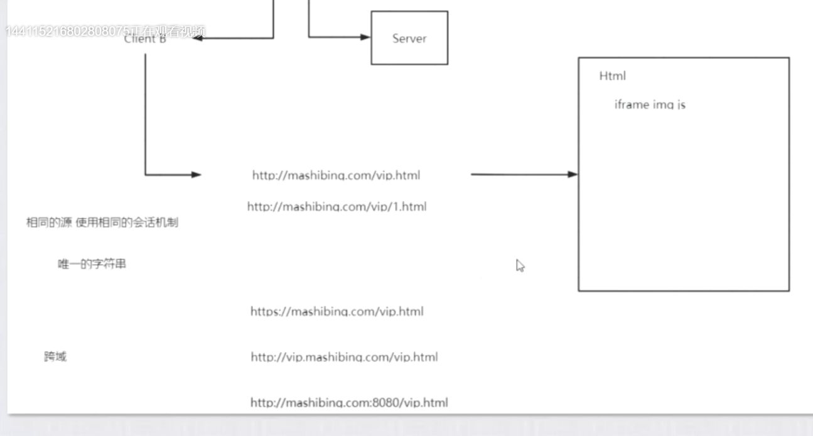
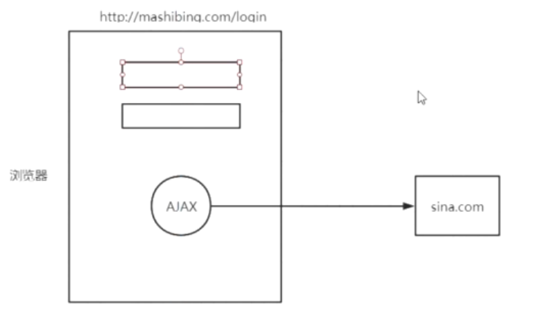
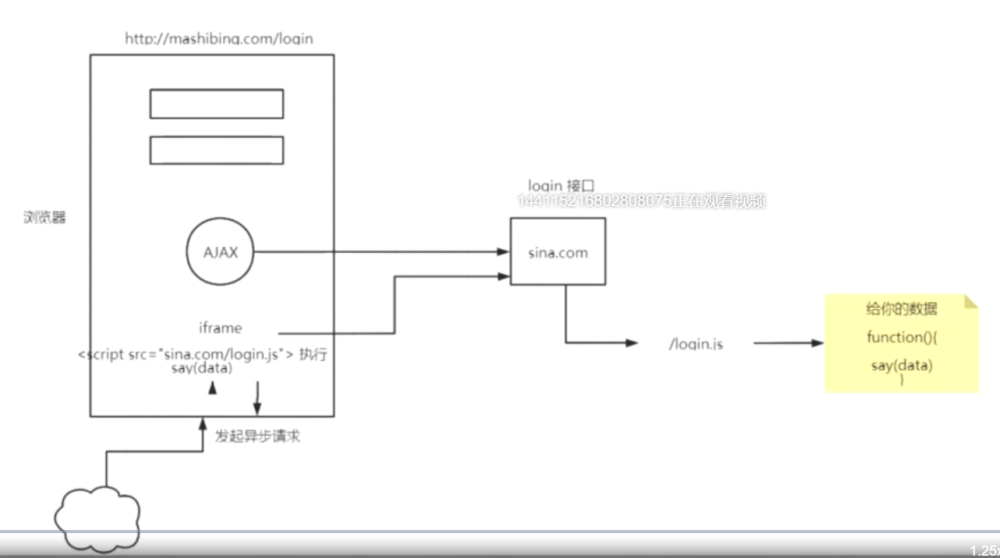

---

iframe  img  js  里面的src可以访问得到跨域的资源，但是无法传输会话信息。比如，在http://mashibing.com/vip.html页面要实src一个login.action请求到http://vip.mashibing.com/vip.html，是做不到的。

从上图的，login页面post请求到sina.com是可以的，但是如果ajax请求，是会跨域的。这是浏览器为了保护用户安全。

jsonp通过回调函数解决跨域：

DefaultServlet

DefauleSavedRequest.java

