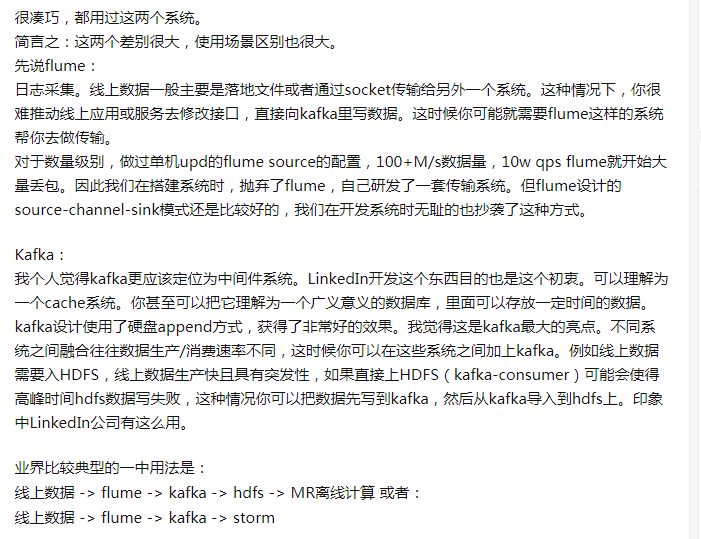

我的短链接就是，项目按照格式记录日志，比如ip，浏览器型号，请求时间，这些数据用json格式写到日志中，然后flume会监听一行一行的读取出来扔kafka，flink消费kafka，把json转成对象，在flink中把对象聚合得到我要的数据

flink每分钟汇总一次数据到redis上保存

那跟Msql出binlog日志，cancal解析日志仍kafak，fink消费kafak进行计算大致一样

流程都是差不多的

可以参考方案：https://mp.weixin.qq.com/s/UpMyMN4NB5CTU5AKZ69gXA

---

日志采集系统flume和kafka有什么区别及联系

---

#程序员上班摸鱼大法#
作为一名资深摸鱼程序员，经过我的不断实践与更新，分享给各位的摸鱼法则：

1. 多喝热水，带薪上厕所：
每天 8 杯水，不仅对身体有益，还能增加上厕所的时间，上厕所时不管有没有屎，都一定选隔间，不玩半小时不出来。

2. 充分利用自家产品特性：
开发游戏的玩游戏、开发视频网站的看视频、开发 App 的玩手机，总之一句话：问就是在做测试！

3. 熟练使用 alt+tab：
手速要快，当你眼角的膀胱发现有人经过时，一定要迅速切换到IDE，万一被发现了，就伸个懒腰缓解一下尴尬。

4. 多和同事讨论方案：
找到志同道合的摸鱼同事，没事就去 TA 座位转转，讨论讨论技术方案，至于是什么技术，那就不重要了。

5. 脚本大法好：
写个脚本，随便 for 循环输出点东西，每次执行半小时，就算老板来了也不怕，因为：“我在等脚本执行完”。

6. fakeupdate 用起来：
一个可以模拟任何系统升级界面的网站，选择好系统之后，就可以愉快摸鱼了。毕竟：“系统需要升级，我也没办法啊…”