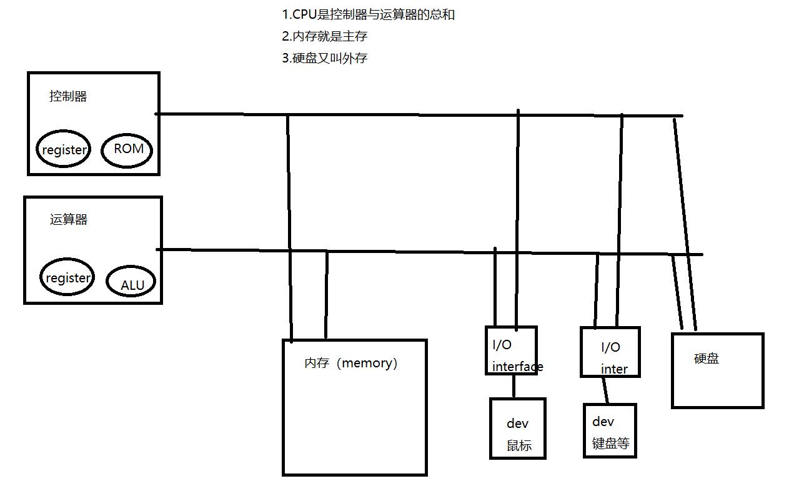

# Redis 产生背景

#### 1.1.数据存储的发展史

##### 1.1.1.磁盘时代

  很久之前，我们的数据存储方式是磁盘存储，每个磁盘都有一个磁道。每个磁道有很多扇区，一个扇区接近512Byte。

  **磁盘**的寻址速度是毫秒级的，带宽是GB/M的。**内存**是ns级的，带宽也比磁盘大上好几个数量级。总体来说，磁盘比内存在寻址上慢了接近10W倍。

  在这段历史中，我们的面临的问题是，I/O问题。在读写文件时，我们常常面临很大的I/O成本问题。但是最初有个最初的解决方案是加一个buffer。

```
科普：什么是buffer？
  buffer是指一个缓冲区，我们在缓冲区来进行一个暂时的存放，之后统一运输给内存，这样会使得I/O的性能有略微提升。
```

##### 1.1.2.数据库的产生

  任何技术都不会平白无故产生。

  我们数据库技术就是由于磁盘的I/O瓶颈。为了解决这个问题，我们将磁盘扇区分为4K的一个个小的分区，构成索引。有了这些索引值，我们能通过索引，进行更加便捷的查找。为了我们能够更快的查找，我们将索引使用B+树进行存储。

```
科普：B+树是什么？
  我们普通的1-0树，又称二叉查找树（二叉排序树），二叉查找树和排序树是同一种树，就是单纯的1-0树，按照中序遍历的存储方式进行从小到大（从大到小）进行存储。（初学者可能误以为两种树，包括我刚开始学习数据结构的时候）。
  二叉查找树（二叉排序树）由于在插入和删除的时候，容易出现不太ok的情况，例如，可能在删除过程中删除为一个链表，这样查找效率依旧会变得很低。所以，我们使用旋转，通过左右旋转，将这种“链表”式（极端情况下）的树转化为左右平衡的树，这就是所谓的B-树。（注意误区，B树和B-树是一个树么？初学者认为后面一种是B减树，实际不是，是翻译过来的时候加的分隔符。B为Balance平衡的意思）
  当然，我们的数据库文件不是二叉的，文件系统也不是，所以，我们多叉的查找树，就是所谓的B+树。+号代表每个节点不止二叉的意思。
  
  （用自己的话粗略总结，详细还是看B-tree，B+tree的定义）
```

  在我们数据库的查找中，我们遇到一个问题？那就是字节宽度问题。我们建库的时候必须给出schema，我们行级存储，即使是该列为空，依旧要占位，那么，数据量庞大的时候，将会浪费很大的存储空间。但是这样的好处是，我们可以在update的时候不需要移动数据的位置。

##### 1.1.3.key-value数据库的产生


  任何技术都不会平白无故产生。

   我们将数据库发展到极致，产生出类似SAP公司的HANA数据库。这种数据库，硬件需求大，内存约2T，硬件软件服务总和约2亿一个套餐。

   随着互联网的发展，我们面临了一个新的问题。如何才能抵挡高并发，以及大数据导致的查找变慢呢？（注意，数据量变大，仅仅影响多数据查找，单数据查找并不会影响性能。我们的业务逻辑，通常是多条数据查找，所以才会有瓶颈）

   于是我们的k-v数据库产生了，这依赖于两个基础设施。冯诺依曼体系的硬件，以太网，和tcp/ip网络。**参考附件：冯诺依曼体系图**

```
科普：什么是冯诺依曼体系？
  我们的操作系统老师是个年纪很大的教授，这边引用他的上课原话。
  冯诺依曼体系，至今没有一个明确的定义。有的书说有5个，有的书说有7个，但是，我依照某年考研题，来规范一下冯诺依曼体系。
  冯诺依曼体系由五部分组成，控制器，运算器，内存，总线，硬盘和I/O接口6部分组成。
  
  （如何记忆冯诺依曼体系构成：CPU分为控制器运算器，其他都为CPU服务，运算需要内存，连接需要总线，我们要读写必须要I/O接口。一切以CPU考虑，就能记全6个）
  
  参考附件：冯诺依曼体系图
  
```

