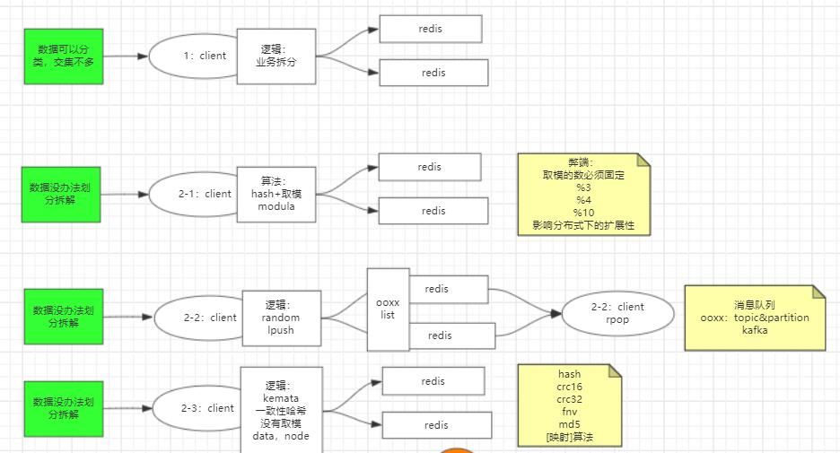
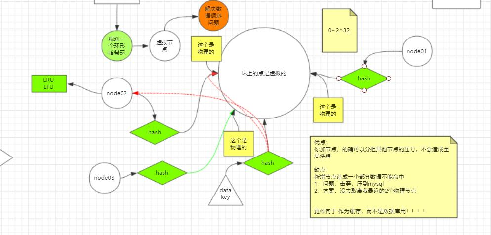

# Redis单节点容量问题

###  一、单节点容量问题

我们在实际场景中，往往遇上一个单节点容量问题。

1.进行**业务拆分**，数据分类

2.到了**数据**不能拆分的时候，可以进行数据分片

- 进行哈希取模（影响分布式下的扩展性%3,%4，如果多加一台机器，就会收到影响）
- 进行逻辑随机（可以放进去，但是拿不出来）
  - 解决方案：两台机器同时存储一个list，然后client直接连2台redis，进行两台一起消费
- 一致性哈希算法
  - crc16 crc32 md5 sha1 sha256
  - 没有进行取模，等宽16位，将16位抽象出一个哈希环，计算一致性哈希算法

```
一致性哈希算法（哈希环）：
1.求出memcached服务器（节点）的哈希值，并将其配置到0～232的圆（continuum）上。
2.采用同样的方法求出存储数据的键的哈希值，并映射到相同的圆上。
3.从数据映射到的位置开始顺时针查找，将数据保存到找到的第一个服务器上。如果超过232仍然找不到服务器，就会保存到第一台memcached服务器上。
来源：（https://www.cnblogs.com/williamjie/p/9477852.html）
```

3.优缺点

优点：加节点的确可以分担其他节点压力（而且也不会造成全局洗牌）

缺点：新增节点会造成一小部分数据不能命中

### 二、twemproxy

twemproxy是一种代理分片机制，由twitter开源，twemproxy作为代理，可以接受多个程序访问，按照路由规则，转发为后台各个Redis服务器，再进行原路返回，该方案很好的解决了Redis实例承载能力问题。

**安装**

```
git clone https://github.com/twitter/twemproxy.git
如果报错，执行：yum update nss
yum install automake libtool
autoreconf -fvi
如果报错，执行
wget -O /etc/yum.repos.d/epel.repo http://mirrors.aliyun.com/repo/epel-6.repo
yum clean all
yum install autoconf268.noarch -y
autoreconf268 -fvi
./configure --enable-debug=full
make
查看服务文件
cd scripts
nutcracker.init
拷贝这个文件进/etc/init.d目录
拷贝编译运行文件进/usr/bin目录
拷贝conf文件夹进/etc/nutcracker目录
进入/etc/nutcracker，修改nutcracker.yml进行配置

alpha:
  listen: 127.0.0.1:22121
  hash: fnv1a_64
  distribution: ketama
  auto_eject_hosts: true
  redis: true
  server_retry_timeout: 2000
  server_failure_limit: 1
  servers:
   - 127.0.0.1:6379:1
   - 127.0.0.1:6380:1

之后开启nutcracker服务，开启service服务，之后连接redis-cli进行连接22121端口
我们通过nutcracker进行get和set，我们在nutcracker不支持的命令：
keys *
watch k1
multi
这些命令都不支持

```

predixy软件，也可作为替代品

```
wget https://github.com/joyieldInc/predixy/releases/download/1.0.5/predixy-1.0.5-bin-amd64-linux.tar.gz
```

修改predixy.conf

```
打开Bind 127.0.0.1:7617
打开include sentinel.conf
```

修改26379的哨兵

```
port 26379
sentinel monitor ooxx 127.0.0.1 36379 2
sentinel monitor xxoo 127.0.0.1 46379 2
```

修改26380的哨兵

```
port 26380
sentinel monitor ooxx 127.0.0.1 36379 2
sentinel monitor xxoo 127.0.0.1 46379 2
```

下面分别启动，省略了。

之后可以直接测试




