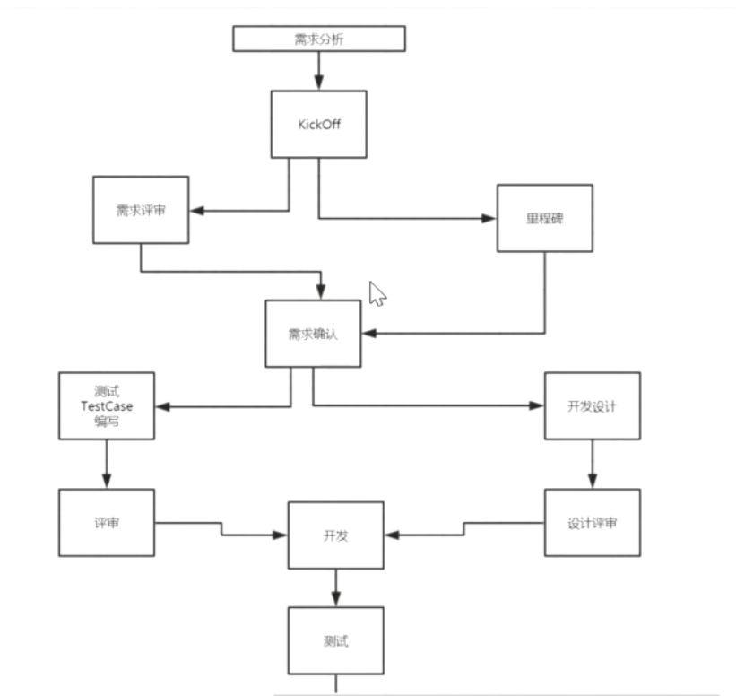
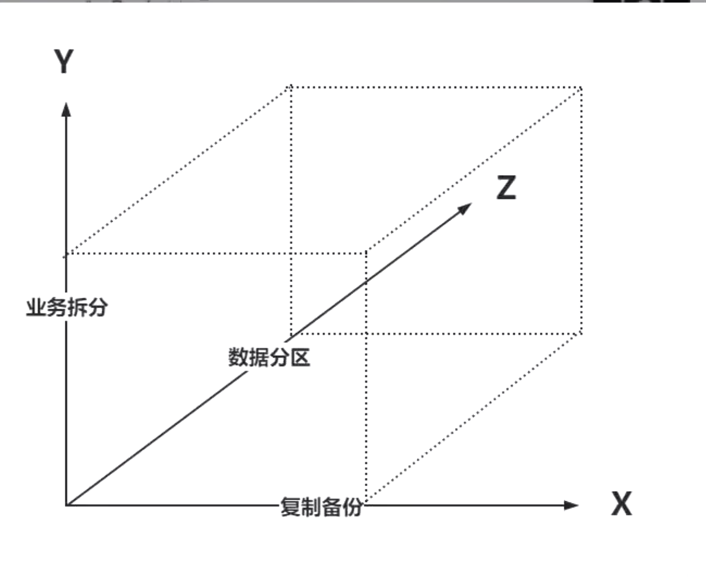
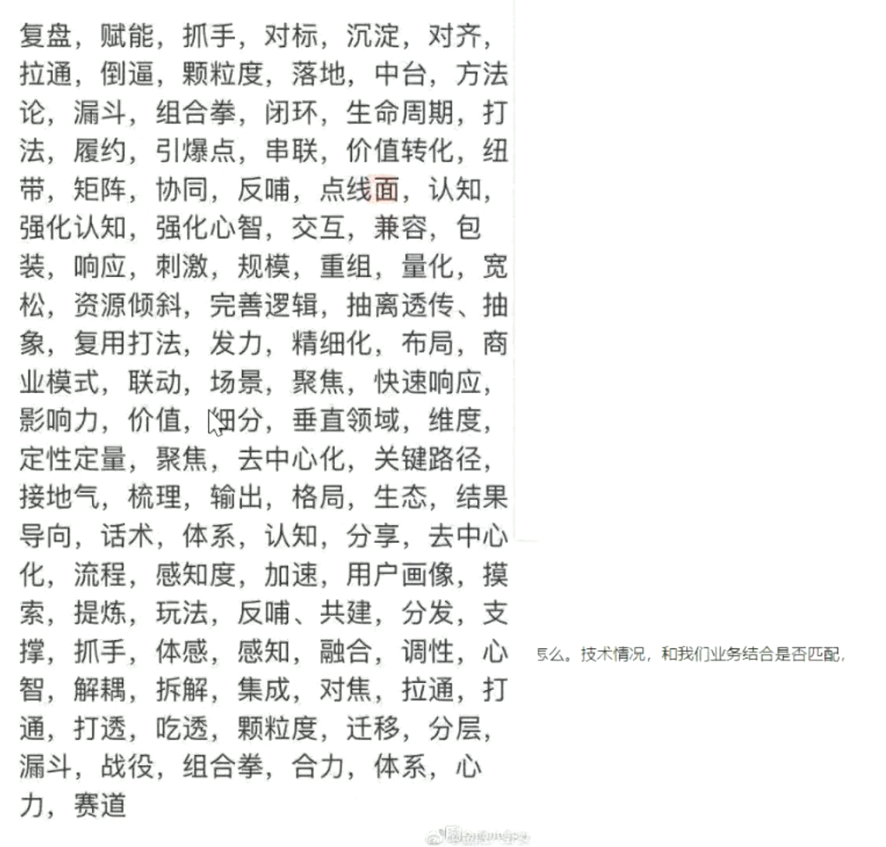

什么是项目？

在有限的资源下开发一个服务




# 项目过程

## 启动

可行性分析，立项。项目背景：**面试：（背景，为什么做？残障人士（后备箱有轮椅），孕妇（开车比较稳司机），小孩（儿童座椅））。**


## 计划阶段：

进度安排，资源计划，成本估计，质量保证计划，风险，实施。

**面试：（1 加班，2加人，加资源，3 功能排优先级，重要的先做保证能用，后面再迭代。）**


## 实施控制阶段：

开发，测试，等等。


## 收尾

验收。产品验收。


# 项目和产品

矩阵式（开发：1组，2组，产品1组，2组），项目组。


# 人员安排

项目管理：3（1高级项目经理，2助理）

技术总监：1

运维：2

能力层：10

业务层：12

产品：10，（乘客，司机，boss，h5）

安卓：4

ios：3

h5:5

测试：20（功能，自动化测试，接口测试，安全测试）

运营，市场，大客户关系：未知。

## 你在项目中的职责

组长：接口定义，工程结构设计，代码review，各方沟通（产品，测试），核心功能开发。

组员：具体开发实现。核心功能开发。


----

Kick Off

各方参与，齐聚一堂。启动会。动员大会。

---


# 实现的需求

## 乘客端：

1. 发送验证码。

```sh
三挡验证。技术人员防止恶意发短信。
```


2. 登录/注册。

3. 查看开通区域

```sh
高德围栏
```

4. 预估价格。
5. 下单
6. （司机流程）
7. 支付（分布式事务：订单，支付，积分）
8. 评价。

# 司机端

1. 发送验证码
2. 登录，注册
3. 查看，改变司机状态。
4. 司机抢单（分布式锁）
5. 订单状态变更。
6. 发起收款

# boss

运营。


#### AKF



#### 包装

