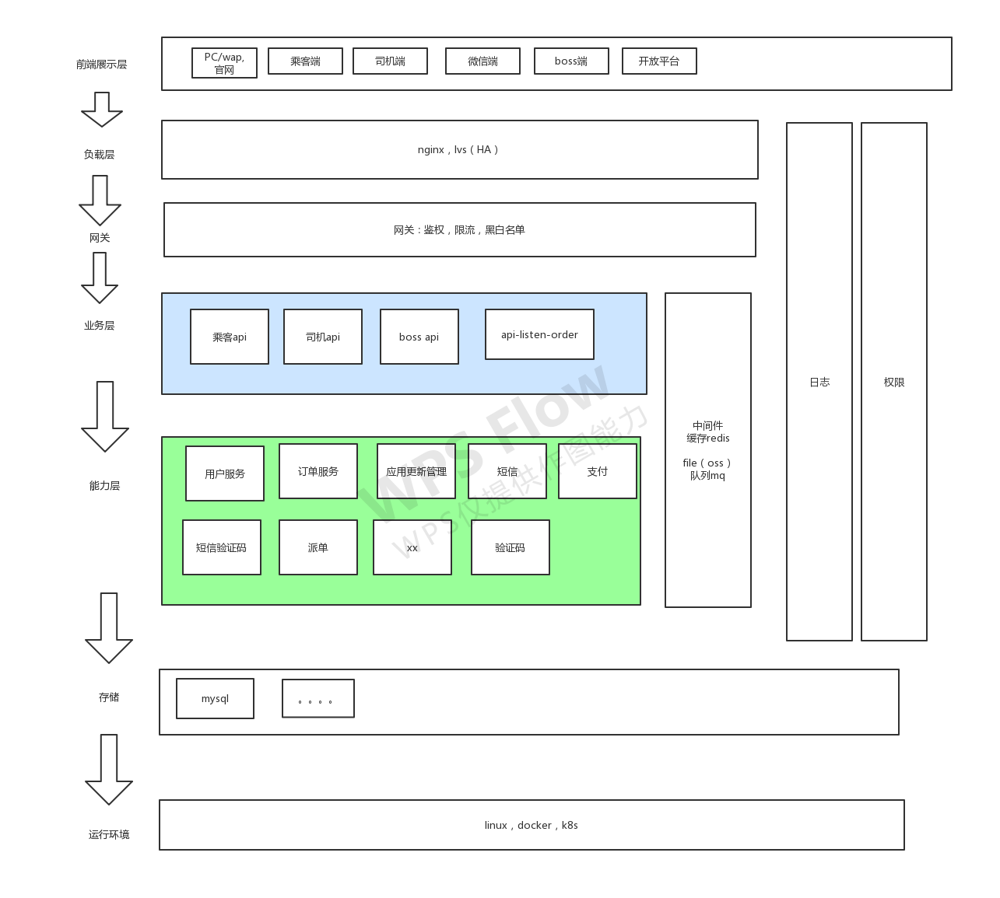

第一节重点：微服务设计的原则-隔离系统的变化点

---

# 业务架构图

# 服务拆分

## 业务层

| 模块     | 项目名                                             | 描述     |
| -------- | -------------------------------------------------- | -------- |
| 乘客端   | api-passenger（订单bean。@RequestBody 订单的bean） | 乘客端   |
| 司机端   | api-driver                                         | 司机端   |
| 司机听单 | api-listen-order                                   | 司机听单 |

## 能力层

| 模块         | 项目名                                             |
| ------------ | -------------------------------------------------- |
| app升级      | service-app-update                                 |
| 订单         | service-order（订单bean。@RequestBody 订单的bean） |
| 派单         | service-order-dispatch                             |
| 乘客用户管理 | service-passenger-user                             |
| 短信         | service-sms                                        |
| 计价         | service-valuation                                  |
| 验证码       | service-verification-code                          |
| 钱包         | service-wallet                                     |
| 支付         | service-payment                                    |
| 地图         | service-map                                        |

## springcloud 基础组建

| 模块           | 项目名                  |
| -------------- | ----------------------- |
| 注册中心       | cloud-eureka            |
| 配置中心       | cloud-config-server     |
| 网关           | cloud-zuul              |
| 熔断监控（ui） | cloud-hystrix-dashboard |
| 健康检查       | cloud-admin             |
| 链路追踪       | cloud-zipkin-ui         |

## 基础common 

也叫二方库，放到公司内部的nexus仓库中，各个项目的公共依赖包

| 模块                     | 项目名          |
| ------------------------ | --------------- |
| 通用，工具类，异常，校验 | internal-common |

# 用到的技术

boot,cloud,maven,git,mysql,redis,mq

## 第三方

短信服务（腾讯，阿里短信，华信）

语音服务：隐私号（乘客和司机订单匹配后，A,B,X），录音。

文件服务oss：（图片功能要求较多，对比阿里oss和七牛，基于七牛支持完善的图片处理，最终选择了七牛云）

地图：高德

消息推送（app的系统通知）：极光。透传，通知。

支付：微信，支付宝

航旅纵横：查航班。

发票：百望云

前端：vue。android， ios

# 面试

包装很重要

包装：云云。商务都来公司，跟我们技术做个交流，我们也了解他们怎么。技术情况，和我们业务结合是否匹配，开发是否易用，稳定，。。XXX。

能力层1500正常，2000更优。不要盲目夸大，因为业务量的关系，没有往更高的优化，不过如果并发慢慢上来之后，还可以怎么怎么优化

能力层：qps：2000（配置？比如4g，8核），有些300

2000，了解到qps，该如何做：xxxx。

 

接口定了之后，app，后端，同时开发

# 接口设计

1. 后端定接口。

http://xxxx:port/urixxx/?xx

body{}

接口名字。user/   user/add user/xxx

restful（资源变现层状态转移）:风格。多种实现，http。

**重在：资源。**

2. 考虑的点

   协议：https。iOS只能用https（？）。

   域名：/restapi.yuming.com/

   版本：v1

   路径：/xxoo/xxoo/ (名词)

   动作：
   
   * post:新建
   * put:修改（修改后的全量数据）
   * patch:修改(修改哪个，传哪个)
   * delete:删除
   * get:查询。

# 接口安全

​	三级等保

​		国家bai信息安全等级保护三级认证，三级等保认证最严的地方是在技术层面，主要体现在系统安全管理和恶意代码防范上，简单的说，就是每当有黑客对平台进行攻击时，平台具备一定的防范能力。

1. CIA：保密性，完整性，可用性

   手机号，身份证号，脱敏

2. 数据层面：sql注入，（id, sql）

   select * from table where name = (变量1;delete table)

   过滤jsoup框架

   

3. xss:,spring-htmlUtils

   理解：在正常的用户请求中执行了黑客提供的恶意代码，问题出在：**用户数据没有过滤，转义。**

   **防止形XSS：**[owasp-java-html-sanitizer](999-owasp-java-html-sanitizer.md)

> 参考：https://www.cnblogs.com/qizhelongdeyang/p/9884716.html 

> XSS又叫CSS  (Cross Site Script) ，**跨站脚本攻击**。它指的是恶意攻击者往Web页面里插入恶意html代码，当用户浏览该页之时，嵌入其中Web里面的html代码会被执行，从而达到恶意用户的特殊目的。
>
> 它与SQL注入攻击类似，SQL注入攻击中以SQL语句作为用户输入，从而达到查询/修改/删除数据的目的，而在xss攻击中，通过插入恶意脚本，实现对用户游览器的控制，获取用户的一些信息。

   csrf，**跨站请求伪造攻击**，防止：人机交互。token。

   理解：冒充别人的登录信息，问题出在：**没有防范不信任的调用。**

​		referer

4. 数据权限控制

   link1链接。

   A用户请求，删除 order/a1

   B用户请求，删除 order/a1 

​	

1000，压测1500

qps：Query Per Seconds

tps：Tracation Per Seconds

jsoup 里的xss  whitelist （白名单）有6种方法，一个构造方法和5种静态方法。

**技术演进的背景比技术本身更重要**

