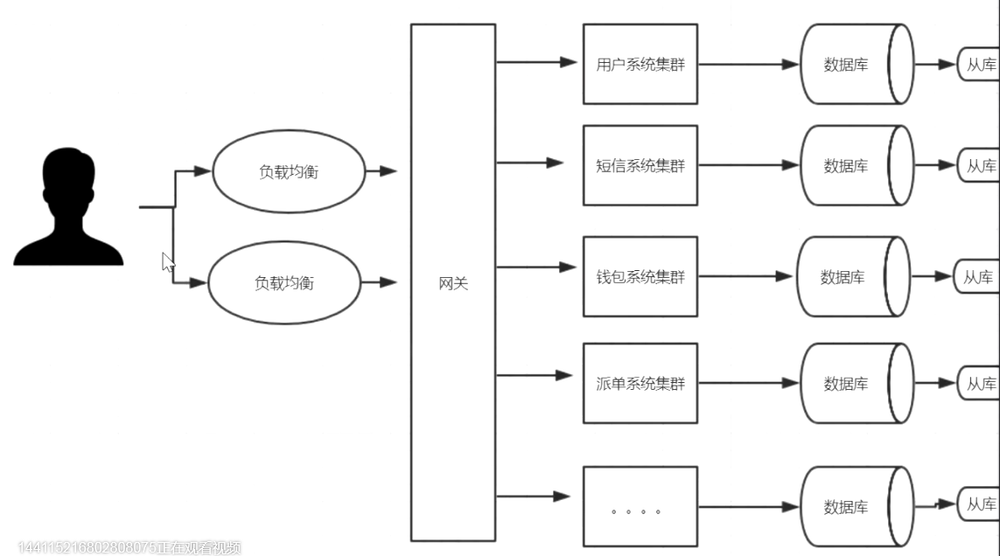

# 1 课程概述

1. Spring Cloud技术点

   Eureka：服务注册与发现，用于服务管理。

   Feign： web调用客户端，能够简化HTTP接口的调用。

   Ribbon：基于客户端的负载均衡。

   Hystrix：熔断降级，防止服务雪崩。

   Zuul：网关路由，提供路由转发、请求过滤、限流降级等功能。

   Config：配置中心，分布式配置管理。

   Sleuth：服务链路追踪

   Admin：健康管理

   

2. 网约车实战

   服务划分

   项目结构

   接口设计

   分布式锁

   分布式事务

   关键业务

   

# 2 网约车介绍

1. 先介绍网约车项目，后续例子，基于项目。

2. 需求概况

   乘客端，司机端，boss端（Business & Operation Support System，业务运营支撑系统）。

   3个端 PRD 文档演示。

3. 程序演示

   乘客端，司机端，boss UI

   项目：online-taxi-demo-app

   乘客端：

   ```sh
   http://localhost:8083/index.html#/user
   ```

   司机端：

   ```sh
   http://localhost:8083/index.html#/driver
   ```

   boss端：

   ```sh
   online-taxi-boss-ui中的ui
   ```

   

# 3 服务进化概述

1. 传统服务到微服务进化。

   > 《传统到分布式演进》

    

    

2. 单体应用-> SOA ->微服务（下面讲）

```
课外扩展：
持续集成，持续部署，持续交付。
集成:是指软件个人研发的部分向软件整体部分集成，以便尽早发现个人开发部分的问题；
部署: 是代码尽快向可运行的开发/测试节交付，以便尽早测试；
交付: 是指研发尽快向客户交付，以便尽早发现生产环境中存在的问题。
   如果说等到所有东西都完成了才向下个环节交付，导致所有的问题只能在最后才爆发出来，解决成本巨大甚至无法解决。而所谓的持续，就是说每完成一个完整的部分，就向下个环节交付，发现问题可以马上调整。使问题不会放大到其他部分和后面的环节。
   这种做法的核心思想在于：既然事实上难以做到事先完全了解完整的、正确的需求，那么就干脆一小块一小块的做，并且加快交付的速度和频率，使得交付物尽早在下个环节得到验证。早发现问题早返工。

上面的3个持续，也都随着微服务的发展而发展，当架构师的同学，可以参考这种方式。

持续集成的工具，向大家推荐：https://jenkins.io/doc/book/pipeline/
```


## 3.1 单体应用

1. 概念：所有功能全部打包在一起。应用大部分是一个war包或jar包。我参与网约车最开始架构是：一个乘客项目中有 用户、订单、消息、地图等功能。随着业务发展，功能增多，这个项目会越来越臃肿。

2. 好处：容易开发、测试、部署，适合项目初期试错。

3. 坏处：

   	随着项目越来越复杂，团队不断扩大。坏处就显现出来了。

   - 复杂性高：代码多，十万行，百万行级别。加一个小功能，会带来其他功能的隐患，因为它们在一起。
   - 技术债务：人员流动，不坏不修，因为不敢修。
   - 持续部署困难：由于是全量应用，改一个小功能，全部部署，会导致无关的功能暂停使用。编译部署上线耗时长，不敢随便部署，导致部署频率低，进而又导致两次部署之间 功能修改多，越不敢部署，恶性循环。
   - 可靠性差：某个小问题，比如小功能出现OOM，会导致整个应用崩溃。
   - 扩展受限：只能整体扩展，无法按照需要进行扩展，  不能根据计算密集型（派单系统）和IO密集型（文件服务） 进行合适的区分。
   - 阻碍创新：单体应用是以一种技术解决所有问题，不容易引入新技术。但在高速的互联网发展过程中，适应的潮流是：用合适的语言做合适的事情。比如在单体应用中，一个项目用spring MVC，想换成spring boot，切换成本很高，因为有可能10万，百万行代码都要改，而微服务可以轻松切换，因为每个服务，功能简单，代码少。

## 3.2 SOA

   	对单体应用的改进：引入SOA（Service-Oriented Architecture）面向服务架构，拆分系统，用服务的流程化来实现业务的灵活性。服务间需要某些方法进行连接，面向接口等，它是一种设计方法，其中包含多个服务， 服务之间通过相互依赖最终提供一系列的功能。一个服务 通常以独立的形式存在于操作系统进程中。各个服务之间 通过网络调用。但是还是需要用些方法来进行服务组合，有可能还是个单体应用。


所以要引入微服务，是SOA思想的一种具体实践。

微服务架构 = 80%的SOA服务架构思想 + 100%的组件化架构思想

# 4 微服务

## 4.1 微服务概况

- 无严格定义。
- 微服务是一种架构风格，将单体应用划分为小型的服务单元。
- 微服务架构是一种使用一系列粒度较小的服务来开发单个应用的方式；每个服务运行在自己的进程中；服务间采用轻量级的方式进行通信(通常是HTTP API)；这些服务是基于业务逻辑和范围，通过自动化部署的机制来独立部署的，并且服务的集中管理应该是最低限度的，即每个服务可以采用不同的编程语言编写，使用不同的数据存储技术。
- 英文定义：

```sh
看这篇文章：
http://www.martinfowler.com/articles/microservices.html
```

- 小类比

  合久必分。分开后通信，独立部署，独立存储。

```sh
分封制：
服从天子命令：服从服务管理。
有为天子镇守疆土的义务：各自完成各自的一块业务。
随从作战：服务调用。
交纳贡献：分担流量压力。
```

- 段子（中台战略）

```
Q：大师大师，服务拆多了怎么办？
A：那就再合起来。
Q：那太没面子了。
A：那就说跨过了微服务初级阶段，在做中台。
```


## 4.2 微服务特性

独立运行在自己进程中。

一系列独立服务共同构建起整个系统。

一个服务只关注自己的独立业务。

轻量的通信机制RESTful API

使用不同语言开发

全自动部署机制

## 4.3 微服务组件介绍

不局限与具体的微服务实现技术。

- 服务注册与发现：服务提供方将己方调用地址注册到服务注册中心，让服务调用方能够方便地找到自己；服务调用方从服务注册中心找到自己需要调用的服务的地址。

- 负载均衡：服务提供方一般以多实例的形式提供服务，负载均衡功能能够让服务调用方连接到合适的服务节点。并且，服务节点选择的过程对服务调用方来说是透明的。

- 服务网关：服务网关是服务调用的唯一入口，可以在这个组件中实现用户鉴权、动态路由、灰度发布、A/B测试、负载限流等功能。

  ```
  灰度发布（又名金丝雀发布）是指在黑与白之间，能够平滑过渡的一种发布方式。在其上可以进行A/B testing，即让一部分用户继续用产品特性A，一部分用户开始用产品特性B，如果用户对B没有什么反对意见，那么逐步扩大范围，把所有用户都迁移到B上面来。灰度发布可以保证整体系统的稳定，在初始灰度的时候就可以发现、调整问题，以保证其影响度。
  ```

- 配置中心：将本地化的配置信息(Properties、XML、YAML等形式)注册到配置中心，实现程序包在开发、测试、生产环境中的无差别性，方便程序包的迁移，也是无状态特性。

- 集成框架：微服务组件都以职责单一的程序包对外提供服务，集成框架以配置的形式将所有微服务组件(特别是管理端组件)集成到统一的界面框架下，让用户能够在统一的界面中使用系统。Spring Cloud就是一个集成框架。

- 调用链监控：记录完成一次请求的先后衔接和调用关系，并将这种串行或并行的调用关系展示出来。在系统出错时，可以方便地找到出错点。

- 支撑平台：系统微服务化后，各个业务模块经过拆分变得更加细化，系统的部署、运维、监控等都比单体应用架构更加复杂，这就需要将大部分的工作自动化。现在，Docker等工具可以给微服务架构的部署带来较多的便利，例如持续集成、蓝绿发布、健康检查、性能监控等等。如果没有合适的支撑平台或工具，微服务架构就无法发挥它最大的功效。

  ```
  1. 蓝绿部署是不停老版本，部署新版本然后进行测试，确认OK，将流量切到新版本，然后老版本同时也升级到新版本。
  2. 灰度是选择部分部署新版本，将部分流量引入到新版本，新老版本同时提供服务。等待灰度的版本OK，可全量覆盖老版本。
  
  灰度是不同版本共存，蓝绿是新旧版本切换，2种模式的出发点不一样。
  ```

  

## 4.4 微服务优点

1. 独立部署。不依赖其他服务，耦合性低，不用管其他服务的部署对自己的影响。
2. 易于开发和维护：关注特定业务，所以业务清晰，代码量少，模块变的易开发、易理解、易维护。
3. 启动块：功能少，代码少，所以启动快，有需要停机维护的服务，不会长时间暂停服务。
4. 局部修改容易：只需要部署 相应的服务即可，适合敏捷开发。
5. 技术栈不受限：java，node.js等
6. 按需伸缩：某个服务受限，可以按需增加内存，cpu等。
7. 职责专一。专门团队负责专门业务，有利于团队分工。
8. 代码复用。不需要重复写。底层实现通过接口方式提供。
9. 便于团队协作：每个团队只需要提供API就行，定义好API后，可以并行开发。

## 4.5 微服务缺点

1. 分布式固有的复杂性：容错（某个服务宕机），网络延时，调用关系、分布式事务等，都会带来复杂。

2. 分布式事务的挑战：每个服务有自己的数据库，有点在于不同服务可以选择适合自身业务的数据库。订单用MySQL，评论用Mongodb等。目前最理想解决方案是：柔性事务的最终一致性。

   ```sh
   刚性事务：遵循ACID原则，强一致性。
   柔性事务：遵循BASE理论，最终一致性；与刚性事务不同，柔性事务允许一定时间内，不同节点的数据不一致，但要求最终一致。
   
   BASE 是 Basically Available(基本可用)、Soft state(软状态)和 Eventually consistent (最终一致性)三个短语的缩写。BASE理论是对CAP中AP的一个扩展，通过牺牲强一致性来获得可用性，当出现故障允许部分不可用但要保证核心功能可用，允许数据在一段时间内是不一致的，但最终达到一致状态。满足BASE理论的事务，我们称之为“柔性事务”。
   ```

3. 接口调整成本高：改一个接口，调用方都要改。

4. 测试难度提升：一个接口改变，所有调用方都得测。自动化测试就变的重要了。API文档的管理也尤为重要。推荐：yapi。

5. 运维要求高：需要维护 几十 上百个服务。监控变的复杂。并且还要关注多个集群，不像原来单体，一个应用正常运行即可。

6. 重复工作：比如java的工具类可以在共享common.jar中，但在多语言下行不通，C++无法直接用java的jar包。


## 4.6 设计原则

单一职责原则：关注整个系统功能中单独，有界限的一部分。

服务自治原则：可以独立开发，测试，构建，部署，运行，与其他服务解耦。

轻量级通信原则：轻，跨平台，跨语言。REST,AMQP 等。

粒度把控：与自己实际相结合。 不要追求完美，随业务进化而调整。《淘宝技术这10年》。


# 5 技术选型

1. Spring Cloud和dubbo组件比较

   ```sh
   dubbo：zookeeper+dubbo+springmvc/springboot
   通信方式：rpc
   注册中心：zookeeper，nacos
   配置中心：diamond（淘宝开发）
   
   spring cloud：spring+Netflix
   通信方式：http restful
   注册中心：eureka，consul，nacos				
   配置中心：config
   断路器：hystrix
   网关：zuul，gateway
   分布式追踪系统：sleuth+zipkin
   
   ```

2. 差别

   |            | **dubbo**                                                 | **spring cloud**                                             |           |
   | ---------- | --------------------------------------------------------- | ------------------------------------------------------------ | --------- |
   | 背景       | 国内影响大                                                | 国外影响大                                                   | 平手      |
   | 社区活跃度 | 低(现在又好了)                                            | 高                                                           | cloud胜出 |
   | 架构完整度 | 不完善（dubbo有些不提供，需要用第三方，它只关注服务治理） | 比较完善，微服务组件应有尽有。                               | cloud胜出 |
   | 学习成本   | dubbo需要配套学习                                         | 无缝spring                                                   | cloud胜出 |
   | 性能       | 高。（基于Netty）                                         | 低。（基于http，每次都要创建）。 此性能的损耗对大部分应用是可以接受的。而HTTP风格的API,是很方便的。用小的性能损耗换来了方便。 | dubbo胜出 |

   

# 6 Spring Cloud

## 6.1 概念

Spring Cloud是实现微服务架构的一系列框架的有机集合。

是在Spring Boot基础上构建的，用于简化分布式系统构建的工具集。是拥有众多子项目的项目集合。利用Spring Boot的开发便利性，巧妙地简化了分布式系统基础设施（服务注册与发现、熔断机制、网关路由、配置中心、消息总线、负载均衡、链路追踪等）的开发。


## 6.2 版本演进

1. 版本过程：版本名.版本号。

2. 版本名：伦敦地铁字母顺序。

3. 版本号：M（milestone）：里程碑，

   				SR（Service Releases）：稳定版，
		
   				RC(Release Candidate)：稳定版的候选版，也就是稳定版的最后一个版本。

```
看官网：查询每个cloud版本下面的子模块的版本。
https://spring.io/projects/spring-cloud
此网页的最下面，目前最新的SpringCloud最新版本是：Greenwich.SR2
```


```sh
版本记录
https://github.com/spring-cloud/spring-cloud-release/releases
```


```sh
采用版本
Spring Boot 2.1.7.RELEASE
https://docs.spring.io/spring-boot/docs/2.1.7.RELEASE/reference/html/

Spring Cloud Greenwich.SR2
```

## 6.3 整体架构

> 《Spring Cloud整体架构图》

 

组成：

1. 服务注册与发现组件：Eureka，Zookeeper，Consul,Nacos等。Eureka基于REST风格的。

2. 服务调用组件：Hystrix(熔断降级，在出现依赖服务失效的情况下，通过隔离 系统依赖服务  的方式，防止服务级联失败，同时提供失败回滚机制，使系统能够更快地从异常中恢复)，Ribbon（客户端负载均衡，用于提供客户端的软件负载均衡算法，提供了一系列完善的配置项：连接超时、重试等），OpenFeign（优雅的封装Ribbon，是一个声明式RESTful网络请求客户端，它使编写Web服务客户端变得更加方便和快捷）。

3. 网关：路由和过滤。Zuul，Gateway。

4. 配置中心：提供了配置集中管理，动态刷新配置的功能；配置通过Git或者其他方式来存储。

5. 消息组件：Spring Cloud Stream（对分布式消息进行抽象，包括发布订阅、分组消费等功能，实现了微服务之间的异步通信）和Spring Cloud Bus（主要提供服务间的事件通信，如刷新配置）

6. 安全控制组件：Spring Cloud Security 基于OAuth2.0开放网络的安全标准，提供了单点登录、资源授权和令牌管理等功能。

7. 链路追踪组件：Spring Cloud Sleuth（收集调用链路上的数据），Zipkin（对Sleuth收集的信息，进行存储，统计，展示）。

   

   每个点中的内容，后面都会讲到。

# 7 实战准备

安装工具：jdk1.8，Maven3.6.1, STS, Lombok(工具插件，jar包)


# 8 Spring Cloud基石

1. Spring Cloud Context为Spring Cloud应用上下文提供了实用工具和特性服务。
2. Spring Cloud common针对不同的Spring Cloud实现（比如注册中心：eureka，consul）提供上层抽象和公共类。

### 8.1 Spring Cloud Context

1. 我们原来在Spring Boot中学过 应用上下文通过application.yml配置。

2. Bootstrap上下文（Spring Cloud提供，也叫引导程序上下文）

   		Spring Cloud启动的时候会创建一个bootstrap的上下文，它是应用的父级上下文(请注意这里所说的bootstrap指的是启动最开始时加载的配置项，与bootstrap.yml或者说bootstrap.properties是两码事)；它负责从一些外部环境中加载配置项，如配置中心；这部分配置项的优先级是最高的，因此它不会被其它的配置文件中加载的配置项给覆盖。

      		它是主程序的父级上下文，负责从外部资源中（Git仓库）加载配置属性 和 解密本地外部配置文件中的属性。是所有Spring程序的外部属性来源。通过Bootstrap加载进来的属性的优先级较高，不能被本地配置覆盖。

   bootstrap.yml

   ```sh
   spring:
       application:
           name: my-application
       cloud:
           config:
             //远程仓库地址，我们后面讲配置中心会讲到
             uri: ${CONFIG_SERVER:http://localhost:8080}
   ------------------------------------------------------------
   如果想要禁止Bootstrap引导过程，可以在bootstrap.yml中设置，如下所示：
   spring:
       cloud:
           bootstrap:
               enabled: false
   ```

3. 加载顺序

   Spring Cloud应用加载的配置项可以来自于以下几个位置：

   		启动命令中指定的配置项；

    　　配置中心中的配置文件
   　　本地的application.properties(yml)
   　　本地boostrap.properties（yml）
   　　这几个位置的配置项从上往下优先级递减，即从上面位置加载的配置项会覆盖下面位置加载的配置项。如下面代码中 配置中心加载的配置项优先级要高于bootstrap.yml中加载的配置项

4. 演示代码

```
依次启动eureka（7900），config-server，service-verification-code（默认）

远程端口为：8012
本地端口为：8011

实际启动的是8011
证明远程配置优先级高
访问：http://localhost:8012/config/env，看env的获取值，也可以证明
```


5. application上下文

   Bootstrap上下文是application上下文的父级。子级从父级继承配置文件和属性。

   bootstrap.yml中的属性 会添加到子级的上下文。它们的优先级低于application.yml和其他添加到子级中作为创建Spring Boot应用的属性源，boostrap.yml中的属性具备非常低的优先级，因此可以作为默认值。

   Bootstrap中上下文的属性优先，但是注意这些属性并不包括任何来自于bootstrap.yml中的属性。

### 8.2 Spring Cloud Commons

		将服务发现，负载均衡，断路器等封装在Commons中，供Cloud客户端使用，不依赖于具体的实现（Eureka，Consul），类似于jdbc提供了一套规范，数据库厂商来实现它。

```sh
例如：

org.springframework.cloud.client.discovery.DiscoveryClient
是Spring Cloud中用来进行服务发现的顶级接口，在Netflix Eureka或者Consul中都有相应的具体实现类。

DiscoveryClient目前的实现有Spring Cloud Netflix Eureka、Spring Cloud Consul Discovery和Spring Cloud Zookeeper Discovery。

org.springframework.cloud.client.serviceregistry.ServiceRegistry接口实现了服务注册和服务下线。

```

# 9 阶段小结

Spring Cloud目前只是Java世界中微服务实践的最佳落地方案，是一个基于Spring Boot的服务治理工具包。并不能代表微服务或者微服务架构。

微服务是一种架构理念：重点是微服务设计原则，不用Spring cloud也能实现微服务，重在架构理念。