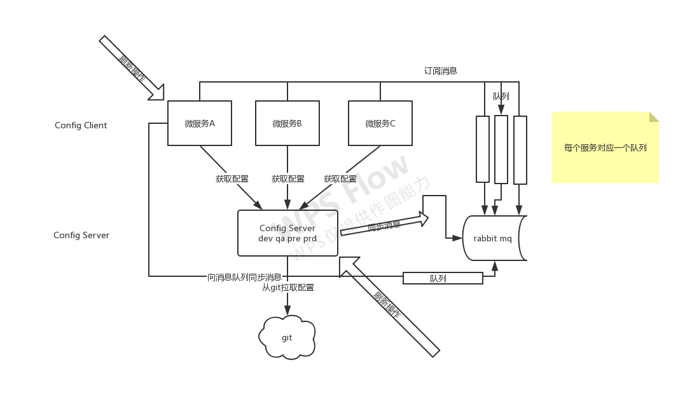
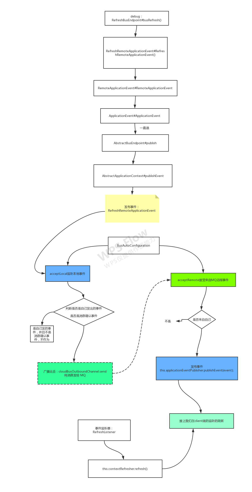
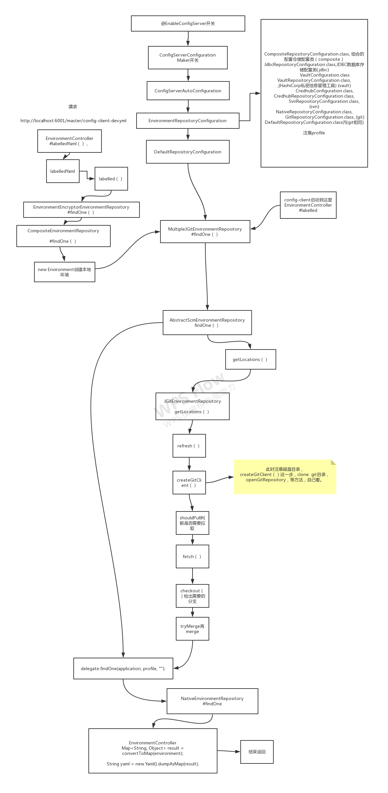
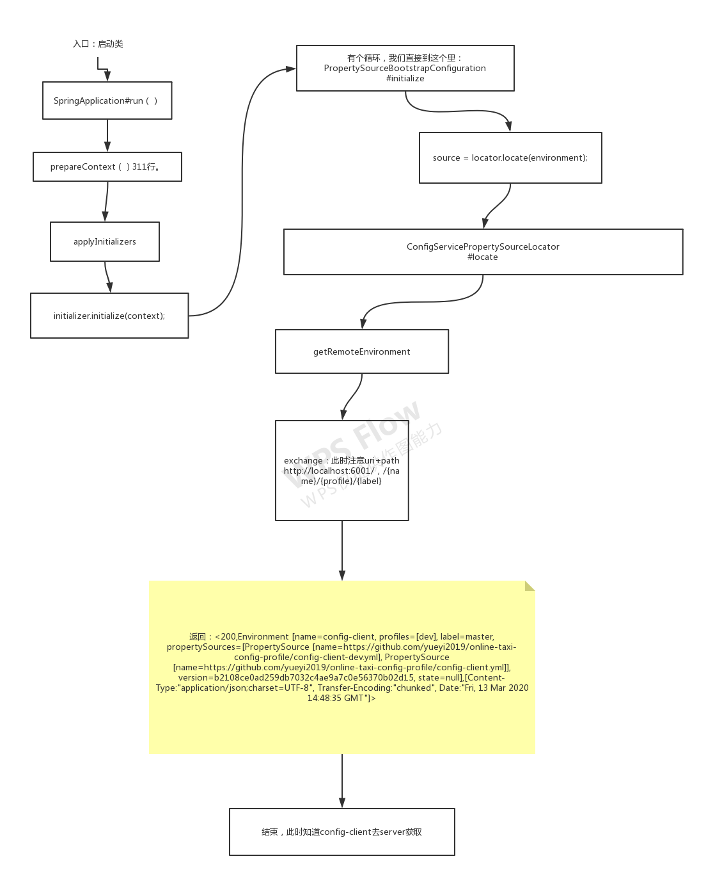
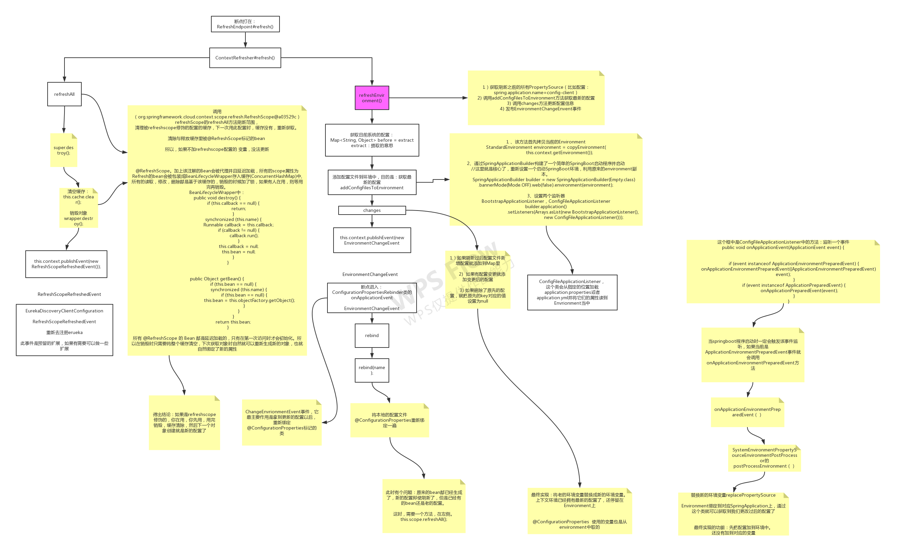

# 17 配置中心

## 17.1 概念

### 为什么需要配置中心

单体应用，配置写在配置文件中，没有什么大问题。如果要切换环境 可以切换不同的profile（2种方式），但在微服务中。

1. 微服务比较多。成百上千，配置很多，需要集中管理。

2. 管理不同环境的配置。

3. 需要动态调整配置参数，更改配置不停服。

   

### 配置中心介绍

分布式配置中心包括3个部分：

1. 存放配置的地方：git ，本地文件 等。
2. config  server。从 1 读取配置。   主要任务就是连git
3. config client。是 config server 的客户端 消费配置。

> 《配置中心架构图》


阿里中间件的一篇文章：《一篇好TM长的关于配置中心的文章》

http://jm.taobao.org/2016/09/28/an-article-about-config-center/


配置都不会自己更新，都是需要触发client才去git上拉取的。或者触发 在config-server上查看配置时，才去git上拉取。


## 17.2 使用 

- 环境部署之前，将所需的配置信息推送到配置仓库
- 启动配置中心服务端，将配置仓库的配置信息拉取到服务端，配置服务端对外提供RESTful接口
- 启动配置客户端，客户端根据 spring.cloud.config 配置的信息去服务器拉取相应的配置

### git

git地址：https://github.com/yueyi2019/online-taxi-config-profile


创建4个配置文件：


config-client-dev.yml

```sh
env: dev
```


### Config Server

1. pom

   ```sh
   <!-- 配置中心服务端：config-server -->
   		<dependency>
   			<groupId>org.springframework.cloud</groupId>
   			<artifactId>spring-cloud-config-server</artifactId>
   		</dependency>
   		<dependency>
   			<groupId>org.springframework.cloud</groupId>
   			<artifactId>spring-cloud-starter-netflix-eureka-client</artifactId>
   		</dependency>
   ```

2. yml

```sh
spring: 
  cloud:
    config:
      server:
        git:
        #https://github.com/yueyi2019/online-taxi-config-profile.git
          uri: https://github.com/yueyi2019/online-taxi-config-profile
          username: 
          password: 
                      #默认是秒，因为git慢
          timeout: 15
```

3. 启动类

```sh
@EnableConfigServer
```


测试：

启动eureka，config-server。

访问：

```sh
http://localhost:6001/config-client-dev.yml

http://localhost:6001/config-client-dev.properties

http://localhost:6001/config-client-dev.json

```

小结

```sh
获取配置规则：根据前缀匹配
/{name}-{profiles}.properties
/{name}-{profiles}.yml
/{name}-{profiles}.json
/{label}/{name}-{profiles}.yml

name 服务名称
profile 环境名称，开发、测试、生产：dev qa prd
lable 仓库分支、默认master分支

匹配原则：从前缀开始。
```


换分支：

dev分支上：config-client-dev.yml

```sh
#服务端口
server: 
  port: 8001


env: branch-dev-dev

访问：
http://localhost:6001/dev/config-client-dev.yml

http://localhost:6001/dev/config-client-dev.json
```


不写分支，默认是master。


### Config client(只我们所有的微服务)

*discovery方式*

1. pom

```sh
<!-- 配置中心客户端：config-client -->
		<dependency>
			<groupId>org.springframework.cloud</groupId>
			<artifactId>spring-cloud-config-client</artifactId>
		</dependency>
		
		<!-- web -->
		<dependency>
			<groupId>org.springframework.boot</groupId>
			<artifactId>spring-boot-starter-web</artifactId>
		</dependency>
		
		<!-- eureka客户端 -->
		<dependency>
			<groupId>org.springframework.cloud</groupId>
			<artifactId>spring-cloud-starter-netflix-eureka-client</artifactId>
		</dependency>
```

2. application.yml

```sh
server:
  port: 8011
```

3. bootstrap.yml

```sh
#应用名称，配置文件名，此时:congif-client-dev.yml
spring: 
  application: 
    name: config-client
  cloud: 
    config:
      discovery:
        enabled: true
        # config server 的服务id
        service-id: config-server
      # 环境
      profile: dev
      # 分支
      label: master    
```

4. 代码

```sh
@Value("${env}")
	private String env;
```


访问：

```sh
http://localhost:8011/config/env0
```

看到远程 配置，带过来了。


*url方式*

```sh
spring:
  cloud: 
    config:
    # 和下面的discovery互斥
#      uri:
#      - http://localhost:6001
```


------


第9节课。2020年3月12日。


### 刷新

config-server访问：

```sh
http://localhost:6001/dev/config-client-dev.yml
```


#### 手动刷新

在config-client端：

1. pom

```sh
<!-- 服务监控开启refresh 端口 -->
		<dependency>
			<groupId>org.springframework.boot</groupId>
			<artifactId>spring-boot-starter-actuator</artifactId>
		</dependency>
```

2. Java代码

```sh
@RefreshScope

ConfigController上添加
```

启动：eureka7900，config-client-8011

3. 访问：

   ```sh
   http://localhost:8011/config/env0，发现配置没变
   修改git上env配置：
   http://localhost:8011/config/env0，发现配置还没变
   但是：
   config-server:http://localhost:6001/master/config-client-dev.yml 变了
   ```

4. 手动更新操作：

   ```sh
   执行：
   yapi上congig-client:手动刷新配置
   访问地址：http:localhost:8011/actuator/refresh  这个是actuator提供的刷新功能。
   其实也属于热刷新，因为没有停服
   ```

5. 再访问:

   ```sh
   http://localhost:8011/config/env0，发现配置 改变了
   ```

6. 不加注解@RefreshScope

```sh


http://localhost:8011/config2/env01
此时配置不变。没有刷新
原理后面讲。
```


有一个问题：


我们再启动 一个端口8012，这样，有两个config client，8011,8012。（eureka7900，config-server,client 8011，client 8012）

是否2个client 可以变呢？

修改git，刷新8011（yapi，config-client,手动刷新配置），发现8011变，而8012没变。


单独刷新8011(yapi config-client-8011)，看8011和8012的变化。

```sh
http://localhost:6001/master/config-client-dev.yml

http://localhost:8011/config/env0

http://localhost:8012/config/env0

```

所以要引入自动刷新。


***看源码：调试refresh。***

> 《config-client-刷新-源码图》


#### 自动刷新


1. 安装rabbit mq

```sh
启动：vm虚拟机。
docker run -d --name="MyRabbitMQ" -p 5672:5672 -p 15672:15672 rabbitmq:management

docker rm -f 容器id

访问http://localhost:15672/

guest,guest

直接启动：docker start MyRabbitMQ
```

2. 在 config client 的pom，config-server也要加。

```sh
<dependency>
			<groupId>org.springframework.cloud</groupId>
			<artifactId>spring-cloud-starter-bus-amqp</artifactId>
		</dependency>
```

3. bootstrap.yml

```sh
spring: 
  application: 
    name: config-client
  rabbitmq:
    host: localhost
    port: 5672
    username: guest
    password: guest
```

测试，启动8011,8012，刷新8011，看8012是否改变。


这样违背了，微服务单一职责性原则。不应该在每个微服务中刷新，配置。

应该刷新config-server。


在config-server中添加 bus，actuator。yml中配置rabbitmq。

修改git配置后：配置中心服务端：http://localhost:6001/master/config-client-dev.yml，可以看到变化。

但是8011,8012中并没有变。

刷新配置server 中bus，yapi，config-server，手动刷新配置。

发现8011遍，8012也变了。


> 《配置中心动态更新原理》



每个client都有一个队里，server也有一个队列。


注意yapi的刷新地址中 refresh，和bus-refresh的区别。

#### 钩子

钩子需要重新写：controller：在client中：WebhookController。

***自动刷新源码***

> 《config-bus刷新源码》



不要用自动刷新，别万一哪个配置不对，灾难。


## 17.3 原理

config-server职责：（config-server服务器启动时，会去远程git拉取配置文件。此处质疑，），实际：对于git上配置更新，configserver是在restful请求的时候再更新的。然后提供出 API 供客户端来调用。


***验证上面的存疑：启动config-server***

***我只启动config-sever 的时候，仓库目录，只是单纯的一个文件目录，连git仓库都不算。***


config-client职责：启动时去config-server 拿配置，缓存后，自己用。


好多书上说的是：config-server启动时，去拉取git，但我实践后，发现不是这样的。3个条件下才会拉取：

1. 访问server 配置。
2. 启动client，client获取server。
3. 刷新client，或刷新server。


## 17.4 源码

### 服务端源码

请求过来->去git拉取 配置->用controller提供出去。

> 《config-server-启动-请求-源码图》



### 客户端源码

> 《config-client-启动-源码》



#### 刷新

> 《config-client-刷新-源码图》



---

第10课完，2020年3月14日。


上节课差《config-client-启动-源码图》，《config-bus 刷新源码》


---

### 扩展小知识：

给mq发消息，监听mq消息，给自己发消息，监听自己消息。


#### 事件监听机制

基于发布-订阅。1对多。

三要素：

事件：ApplicationEvent，继承自JDK的EventObject，所有事件都将继承他，并通过source得到事件源。

事件发布者：ApplicationEventPublisher和ApplicationEventMulticaster，使用它service就有了发布事件的能力。

事件订阅者：ApplicationListener，继承自jdk的EventListener，所有监听器将继承它。

##### 事件的定义

事件：都继承自ApplicationEvent，

spring bus中的事件类，都继承自RemoteApplicationEvent。

AckRemoteApplicationEvent：对特定事件确认的事件。确认远端事件。

EnvironmentChangeRemoteApplicationEvent：环境变更事件。

RefreshRemoteApplicationEvent：刷新事件。刷新远端应用配置的事件。

UnknownRemoteApplicationEvent：未知事件。

```sh
public abstract class RemoteApplicationEvent extends ApplicationEvent {

	private static final Object TRANSIENT_SOURCE = new Object();
事件源
	private final String originService;
事件目的服务（serviceId：appContextId）
	private final String destinationService;
事件的全局id
	private final String id;
```


```sh
public class EnvironmentChangeRemoteApplicationEvent extends RemoteApplicationEvent {

	private final Map<String, String> values;key:环境变量名，value对应后的值。
```

##### 事件监听器

1、实现：父类ApplicationListener，

刷新监听器：RefreshListener，监听的事件是：RefreshRemoteApplicationEvent。

```sh
public class RefreshListener
		implements ApplicationListener<RefreshRemoteApplicationEvent> {

	private static Log log = LogFactory.getLog(RefreshListener.class);

	private ContextRefresher contextRefresher;

	public RefreshListener(ContextRefresher contextRefresher) {
		this.contextRefresher = contextRefresher;
	}
```

通过：ContextRefresher的refresh（）执行。回想我们的刷新。

环境变更监听器：EnvironmentChangeListener，知道即可。

##### 通道定义

```sh
SpringCloudBusClient

	/**
	 * Name of the input channel for Spring Cloud Bus.
	 */
	String INPUT = "springCloudBusInput";

	/**
	 * Name of the output channel for Spring Cloud Bus.
	 */
	String OUTPUT = "springCloudBusOutput";
	发布
	@Output(SpringCloudBusClient.OUTPUT)
	MessageChannel springCloudBusOutput();
订阅
	@Input(SpringCloudBusClient.INPUT)
	SubscribableChannel springCloudBusInput();
```


bus的监听与发送

```sh
@Configuration
@ConditionalOnBusEnabled 启用开关
@EnableBinding(SpringCloudBusClient.class)  绑定通道。
@EnableConfigurationProperties(BusProperties.class)
@AutoConfigureBefore(BindingServiceConfiguration.class)
// so stream bindings work properly
@AutoConfigureAfter(LifecycleMvcEndpointAutoConfiguration.class)
// so actuator endpoints have needed dependencies
public class BusAutoConfiguration


@EventListener(classes = RemoteApplicationEvent.class)
	public void acceptLocal(RemoteApplicationEvent event) {
		if (this.serviceMatcher.isFromSelf(event)
				&& !(event instanceof AckRemoteApplicationEvent)) {
				当事件是来自自己，并且不是ack事件，则向消息队列发送消息。
			this.cloudBusOutboundChannel.send(MessageBuilder.withPayload(event).build());
		}
	}

	@StreamListener(SpringCloudBusClient.INPUT)
	public void acceptRemote(RemoteApplicationEvent event) {
		if (event instanceof AckRemoteApplicationEvent) {
			if (this.bus.getTrace().isEnabled() && !this.serviceMatcher.isFromSelf(event)
					&& this.applicationEventPublisher != null) {
				this.applicationEventPublisher.publishEvent(event);
			}
			// If it's an ACK we are finished processing at this point
			return;
		}
		if (this.serviceMatcher.isForSelf(event)
				&& this.applicationEventPublisher != null) {
			if (!this.serviceMatcher.isFromSelf(event)) {
				this.applicationEventPublisher.publishEvent(event);
			}
			if (this.bus.getAck().isEnabled()) {
				AckRemoteApplicationEvent ack = new AckRemoteApplicationEvent(this,
						this.serviceMatcher.getServiceId(),
						this.bus.getAck().getDestinationService(),
						event.getDestinationService(), event.getId(), event.getClass());
				this.cloudBusOutboundChannel
						.send(MessageBuilder.withPayload(ack).build());
				this.applicationEventPublisher.publishEvent(ack);
			}
		}
		if (this.bus.getTrace().isEnabled() && this.applicationEventPublisher != null) {
			// We are set to register sent events so publish it for local consumption,
			// irrespective of the origin
			this.applicationEventPublisher.publishEvent(new SentApplicationEvent(this,
					event.getOriginService(), event.getDestinationService(),
					event.getId(), event.getClass()));
		}
	}
```


##### 监听小例子

本地给本地发事件。

config-client-diy下：

事件订阅者：

```sh
@Configuration
@RemoteApplicationEventScan
public class BusConfiguration {

	@EventListener
	public void onUserRemoteApplicationEvent(CustomRemoteApplicationEvent event) {
		System.out.println("原始服务："+event.getOriginService()+",内容："+event.getSource());
	}
}
```

事件：

```sh
public class CustomRemoteApplicationEvent extends RemoteApplicationEvent {
	
	public CustomRemoteApplicationEvent(String content , String originService, String destinationService) {
		
		super(content,originService,destinationService);
		
	}
}
```


事件发布者：

```sh
	@PostMapping("/publish")
	public boolean publishEvent(@RequestBody String content) {
		String serviceId = applicationContext.getId();
		CustomRemoteApplicationEvent event = new CustomRemoteApplicationEvent(content,serviceId,"destination");
		eventPublisher.publishEvent(event);
		return true;
	}
```


访问yapi：config-client中：监听例子。

#### 消息队列事件

项目：config-client-diy

对于发布/订阅模式模式而言，消息的发送者一般只注重将消息推送到相应的Exchange 对应的Channel中，并不在意订阅者是否成功接收并消费掉某条消息。消息发布者只负责把消息送到队列中，订阅者只负责把消息从队列中取出然后消费，两者在业务逻辑上理应是不存在任何耦合或关联的，这也是发布/订阅模式的职责和优点所在。

1. 启动队列

   ```sh
   docker start MyRabbitMQ
   ```

2. yml

   ```sh
   spring: 
     application: 
       name: config-client
     rabbitmq:
       host: localhost
       port: 5672
       username: guest
       password: guest
     cloud:
       stream:
         default-binder: rabbit  
         bindings: 
           input: 
                        #交换机名称
             destination: stream-des-exchange
           output: 
                        #交换机名称
             destination: stream-des-exchange    
   ```

3. pom

   ```sh
   <!-- 总线 -->
   		<dependency>
   			<groupId>org.springframework.cloud</groupId>
   			<artifactId>spring-cloud-starter-bus-amqp</artifactId>
   		</dependency>
   ```

4. 监听

   ```sh
   @EnableBinding(Sink.class)
   public class MyStreamListener {
   
       @StreamListener(Sink.INPUT)
       public void input(String s){
   
           System.out.println("监听 消息队列 手动的内容 : " + s);
       }
   }
   ```

5. 发送

   ```sh
   @EnableBinding(Source.class)
   @RestController
   @RequestMapping("/rabbitmq")
   public class MyStreamSend {
   
       @Resource
       private MessageChannel output;
   
       @PostMapping("/send")
       public String sendTestData(@RequestBody String content) {
           this.output.send(MessageBuilder.withPayload(content).build());  // 发出消息
           return "发送成功";
       }
   }
   ```

6. 访问：yapi，config-client：diy发送队列。启动2个 80和81，看看效果。

   只给80发事件，81也会收到。

---


Stream是构建消息驱动能力的组件。可以进行基于消息队列的消息通信，使用Spring Integration连接消息中间件以实现事件驱动。Bus基于Stream。

消息队列：异步，解耦合，削峰。

rabbitmq：生产者，消费者，交换器，队列。


Spring Cloud Bus基于rabbitmq（amqp，稳定性，安全性好，金融），kafka（吞吐量达，大数据领域）。

