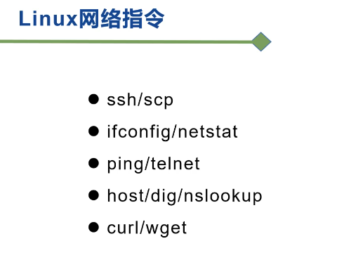

 


linux上的网络抓包命令：tcpdump

```shell
tcpdump -nn -i eth0 port 8082
```

网络抓包效果如下：


扩展使用：

```shell
tcpdump

tcpdump -i 网卡

tcpdump -nn 数字的方式显示IP和端口。一个n是ip

tcpdump -c x 抓包数量，x为数字

tcpdump port xx 抓指定端口的包，xx为端口号

tcpdump tcp and port xx 指定协议和端口，xx为端口号，and可以省略不写

tcpdump host xx.xx.xx.xx 指定来源IP或目标IP的包 xx.xx.xx.xx为IP地址。

tcpdump -w xx.txt 把抓的包写入一个文件，xx.txt为文件名

tcpdump -s0 -w xx.txt  抓包时防止包截断，s0的0为数字0，抓一个完整的包必须加s0。

tcpdump -r xx.txt 用户查看-w抓的包，xx.txt为文件名

-w抓的包实际是包的内容，非简单的流向。如果访问一张图片，用-w可以把这张图片抓出来。只看流向的话，可以使用重定向。
```


> 参考：https://blog.51cto.com/u_11060853/2113574

