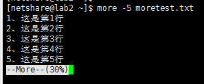
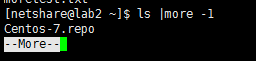

# 1、修复默认进程ID为1的问题

## 1、问题描述

spring boot应用以docker容器方式启动后，进程ID是1而导致的jstack和jmap等命令不可用的问题

报：`1: Unable to get pid of LinuxThreads manager thread` 错误

## 2、还原现场

以下场景基于k8s展开，docker同理。

### 2.1、工程打包方式

docker-maven-plugin

```xml
<plugin>
    <groupId>com.spotify</groupId>
    <artifactId>docker-maven-plugin</artifactId>
    <version>1.0.0</version>
    <configuration>
        <dockerHost>http://192.168.105.71:2375</dockerHost>
        <serverId>dockerId</serverId>
        <imageName>${dockerImageUrl}</imageName>
        <baseImage>openjdk:8-jdk-alpine</baseImage>
        <entryPoint>["java", "-Xdebug", "-Xnoagent", "-Djava.compiler=NONE", "-Xrunjdwp:transport=dt_socket,address=5005,server=y,suspend=n","-Duser.timezone=GMT+08","-Djava.security.egd=file:/dev/./urandom", "-jar", "/${project.build.finalName}.jar"]</entryPoint>
        <resources>
            <resource>
                <targetPath>/</targetPath>
                <directory>${project.build.directory}</directory>
                <include>${project.build.finalName}.jar</include>
            </resource>
        </resources>
    </configuration>
    <executions>
        <execution>
            <phase>install</phase>
            <goals>
                <goal>build</goal>
            </goals>
        </execution>
        <execution>
            <id>tag-image</id>
            <phase>install</phase>
            <goals>
                <goal>tag</goal>
            </goals>
            <configuration>
                <image>${dockerImageUrl}</image>
                <newName>
                    ${dockerImageUrl}
                </newName>
            </configuration>
        </execution>
        <execution>
            <id>push-image</id>
            <phase>install</phase>
            <goals>
                <goal>push</goal>
            </goals>
            <configuration>
                <imageName>
                    ${dockerImageUrl}
                </imageName>
            </configuration>
        </execution>
    </executions>
</plugin>
```


### 2.2、无法使用jvm工具

环境上使用镜像创建容器，使用exec -it 的交互模式进入容器，使用jps 查看当前的活动进程，使用jmap -histo [进程号] 打印堆对象统计。

****

发现执行jmap命令时，报`1: Unable to get pid of LinuxThreads manager thread`错误

### 2.3、报错原因

从jps命令结果可以发现，当前只有一个1号进程，即我们的服务，说明服务占用着1号进程。但pid 1-5为linux的特殊进程。

* pid=1：init进程，系统启动的第一个用户进程，是所有进程的父进程，引导用户空间服务。
* pid=2：kthreadd：用于内核线程管理。
* pid=3：migration，用于进程在不同的cpu间迁移。
* pid=4：ksoftirqd，内核里的软中断守护线程，用于在系统空闲时定时处理软终端事务。
* pid=5：watchdog，此进程是看门狗进程，用于监听内核异常。当系统出现宕机，可以利用watchdog进程将宕机时的一些堆栈信息写入指定文件，用于事后分析宕机的原因。

## 3、解决方法

### 3.1、思路

想要解决问题思路就是让启动的服务进程pid不能是1。可以将启动命令写成启动脚本进行启动，也可以先执行Linux的init命令进行初始化之后再执行启动命令。

分两种情况使用dockerfile文件进行配置的、使用docker-maven-plugin插件进行配置的。

### 3.2、dockerfile文件方式

```shell
#基础镜像基于openjdk，利用alpine
FROM openjdk:8u212-jdk-alpine
#所属团队
MAINTAINER chengf

ENV JAVA_OPTS="-server -Xms512m -Xmx512m" LOGGING_LEVEL="INFO"
#编译时变量无法在运行时用，此处做一次转换
ENV TARGET_JAR="spring-boot-sample-0.0.1-SNAPSHOT.jar"

#将编译好的工程jar包copy到镜像容器中
COPY ${TARGET_JAR} /usr/src/${TARGET_JAR}


ENV OPTS=${JAVA_OPTS}" -Dfile.encoding=UTF8    -Duser.timezone=GMT+08"
WORKDIR /usr/src
#程序入口


#CMD java -jar ${OPTS} ${TARGET_JAR} --logging.level.root=${LOGGING_LEVEL}

RUN echo "java -jar \${OPTS} \${TARGET_JAR} --logging.level.root=\${LOGGING_LEVEL}" > start.sh \
             && chmod 777 start.sh
CMD ./start.sh
```

### 3.3、docker-maven-plugin插件方式

```xml
<plugin>
    <groupId>com.spotify</groupId>
    <artifactId>docker-maven-plugin</artifactId>
    <version>1.0.0</version>
    <configuration>
        <dockerHost>http://192.168.105.71:2375</dockerHost>
        <serverId>dockerId</serverId>
        <imageName>${dockerImageUrl}</imageName>
        <baseImage>openjdk:8-jdk-alpine</baseImage>
        <!--					<entryPoint>["java", "-Xdebug", "-Xnoagent", "-Djava.compiler=NONE", "-Xrunjdwp:transport=dt_socket,address=5009,server=y,suspend=n", "-Duser.timezone=GMT+08","-Djava.security.egd=file:/dev/./urandom", "-jar", "/${project.build.finalName}.jar"]</entryPoint>-->
        <entryPoint>echo "java -Xdebug -Xnoagent -Djava.compiler=NONE -Xrunjdwp:transport=dt_socket,address=5005,server=y,suspend=n -Duser.timezone=GMT+08 -Djava.security.egd=file:/dev/./urandom -jar /${project.build.finalName}.jar" > start.sh &amp;&amp; chmod 777 start.sh &amp;&amp; ./start.sh</entryPoint>
        <resources>
            <resource>
                <targetPath>/</targetPath>
                <directory>${project.build.directory}</directory>
                <include>${project.build.finalName}.jar</include>
            </resource>
        </resources>
    </configuration>
    <executions>
        <execution>
            <phase>install</phase>
            <goals>
                <goal>build</goal>
            </goals>
        </execution>
        <execution>
            <id>tag-image</id>
            <phase>install</phase>
            <goals>
                <goal>tag</goal>
            </goals>
            <configuration>
                <image>${dockerImageUrl}</image>
                <newName>
                    ${dockerImageUrl}
                </newName>
            </configuration>
        </execution>
        <execution>
            <id>push-image</id>
            <phase>install</phase>
            <goals>
                <goal>push</goal>
            </goals>
            <configuration>
                <imageName>
                    ${dockerImageUrl}
                </imageName>
            </configuration>
        </execution>
    </executions>
</plugin>
```

原来的<entryPoint>采用EXEC的方式编写dockerfile执行命令，这里改用shell的方式编写dockerfile执行命令。

注意：

1. pom.xml属于xml文件类型，不允许书写&字符，所以配置中<entryPoint>里面的&& 命令采用了转义字符替换。

不管通过什么方式 只要让启动命令不是第一个执行的就能解决问题。

### 3.4、测试验证


从图上可以发现业务进程是7号，不再占用1号进程了，而且jmap命令也正常使用了。

## 4、附加知识

参考：[Linux命令大全](https://www.linuxcool.com/)

### 4.1、linux命令行 &   ;     && 三者的区别

* command1 & command2 & command3

  三个命令同时执行

* command1 ; command2 ;  command3

  不管前面的命令执行成功没有，后面的命令继续执行

* command1 && command2 &&  command3

  只有前面的命令执行成功，后面的命令才继续执行。

### 4.2、linux命令行 \ 的作用

\ 一般出现在行尾，是因为当前行中字符太多，在行尾尚有未写完的字符串，加上该符号后就可以下行行首的字符相连，相当于替换\n的作用。

注意不能 \ 要表示换行时，不能写在行中，不然该字符会被认为是前边字符串的一部分。

> https://blog.csdn.net/qq_34113993/article/details/83991759

### 4.3、more命令的使用技巧

准备了一份名为moretest.txt的测试文件，内容如下：

```txt
1、这是第1行
2、这是第2行
3、这是第3行
4、这是第4行
5、这是第5行
6、这是第6行
7、这是第7行
8、这是第8行
9、这是第9行
10、这是第10行
11、这是第11行
12、这是第12行
13、这是第13行
14、这是第14行
15、这是第15行
shindo
```

#### 4.3.1、快捷命令

* 显示文件从第3行起内容

> more +3 moretest.txt 

```shell
[netshare@lab2 ~]$ vi moretest.txt 
[netshare@lab2 ~]$ more +3 moretest.txt 
3、这是第3行
4、这是第4行
5、这是第5行
6、这是第6行
7、这是第7行
8、这是第8行
9、这是第9行
10、这是第10行
11、这是第11行
12、这是第12行
13、这是第13行
14、这是第14行
15、这是第15行
shindo

```

* 设定每屏显示行数

> more -5 moretest.txt  【-n 定义屏幕大小为n行】

 

* 列一个目录下的文件，每n个一列

> ls | more -1

 

#### 4.3.2、more和less的使用技巧

```txt
less: -N  显示行号

  首次展开一页面

  回车表示一行

  空格表示一屏

  PageUp 向前翻一行

  PageDown向下走
```

```txt
more:

   回车向下

   空格一屏

   PageUp不能向上走

   PageDown向下走
```

#### 4.3.3、more和less的区别

| more       | less                                 |
| ---------- | ------------------------------------ |
| 只能向下搜 | 可以随意浏览文件，可以向下，也可向上 |
| 加载全文   | 查看之前不会加载全文                 |
| 仅可以向下 | 不止可以向下搜，也可以向上搜         |

