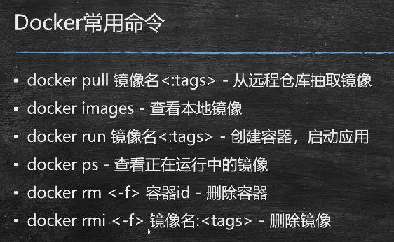
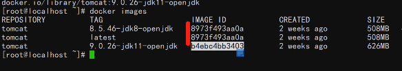
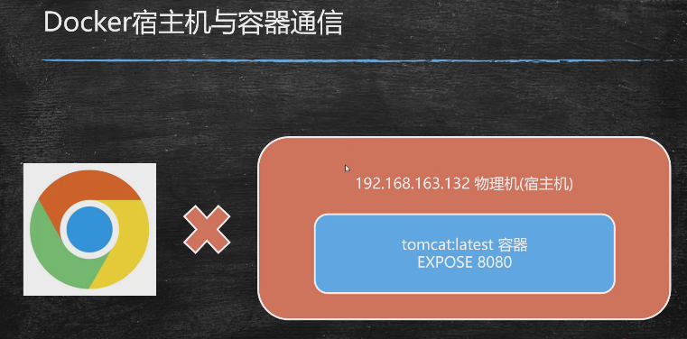
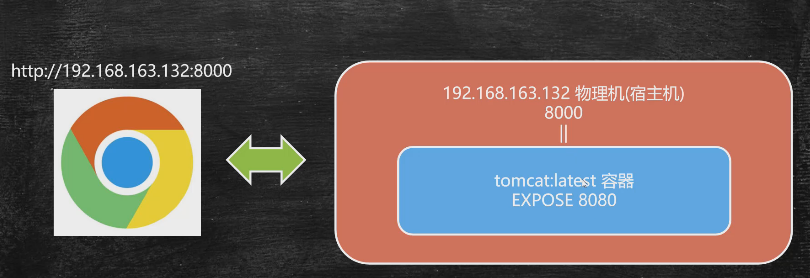
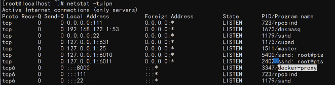

本节涉及6个命令

可以通过imageID来判断当前镜像和其他镜像是否相同

端口映射：

端口映射命令：

查看启用的端口：

后台运行（非阻塞状态）： -d

查看当前运行的容器：docker  ps

查看所有容器（包括已停止的）：docker ps -a

停止容器：docker stop 容器ID

删除容器：docker rm 容器ID

强制删除容器：docker rm -f 容器ID

删除镜像：docker rmi 镜像ID

强制删除镜像：docker rmi -f 镜像ID

