Dockerfile中提供了三个执行命令：

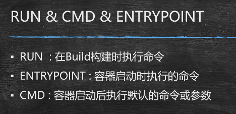

三个执行命令的区别：

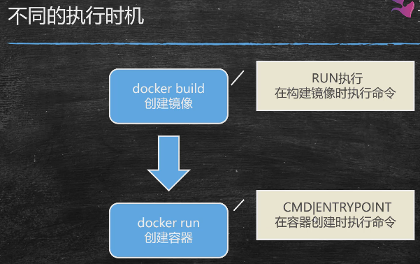

run：镜像创建时，修改镜像内部的文件

cmd\entrypoint：创建容器时， 对容器内执行命令。

---

书写语法：

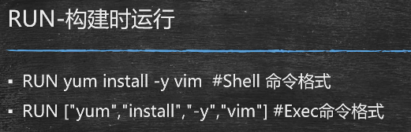

根本区别：是否创建子进程

结论：在大多数情况下，从综合应用的角度考虑，推荐使用Exec的方式运行指令。

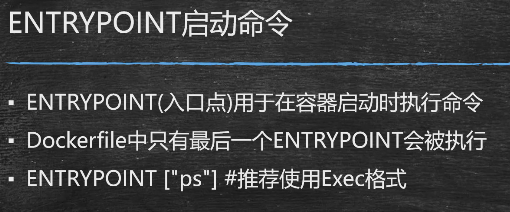

Dockerfile中如果书写了多行Entrypoint命令，只有最后一行会被执行。

entrypoint一定会被运行，而cmd不一定会被运行

例子：

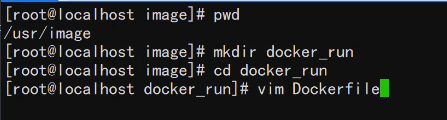

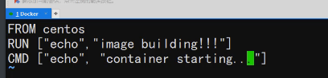

构建镜像：

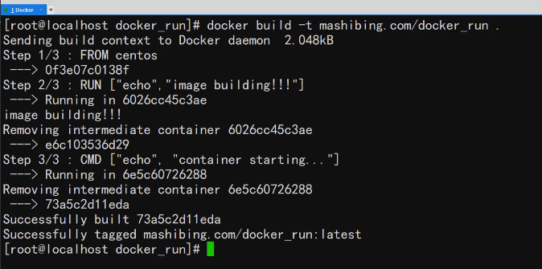

可以发现上述构建镜像时，只执行了RUN命令。

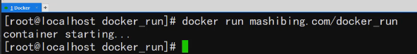

启动容器的时候，CMD命令执行

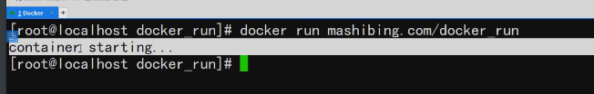

启动容器，发现执行了CMD命令

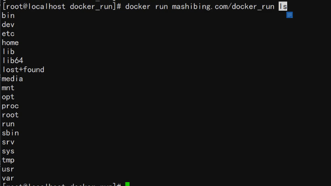

但是如果在创建容器时，使用了额外的命令，这个命令会取代CMD命令，从上图可以看到 ls 命令取代了 cmd命令，Dockerfile中的CMD命令并没有执行。这就是CMD命令不一定执行的说法的由来。

再来看下ENTRYPOINT命令：

修改刚才的Dockerfile文件

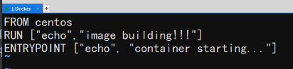

和cmd没什么差别。

但是将cmd和entrypoint组合使用的话，就大有所为了：

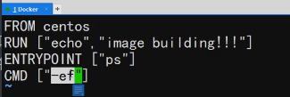

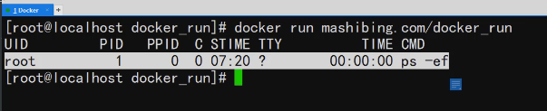

当entrypoint和cmd紧挨着的时候，两个命令会组合使用。

作用：CMD可以接受外部传参。

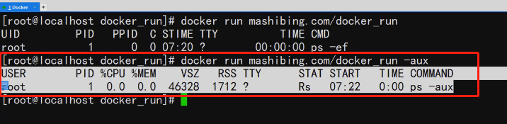

上图我们发现 -aux 替换了Dockerfile中 -ps命令，使输出结果呈现bsd格式。

