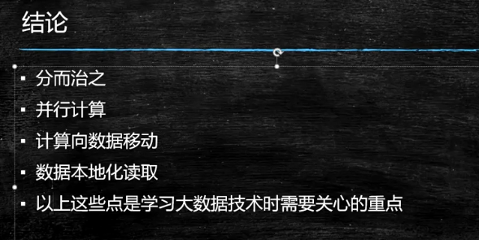

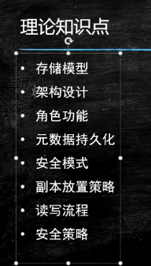

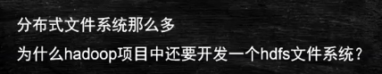

更适用于计算

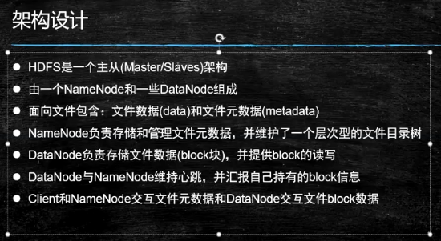

hdfs 和linux系统类似，也有自己的虚拟目录树

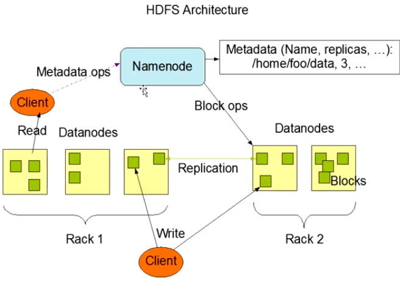

角色  即  JVM进程，上图的Namenode角色即一个JVM进程

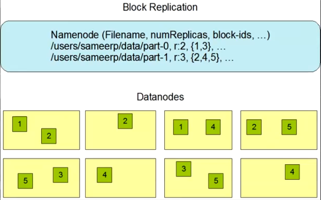

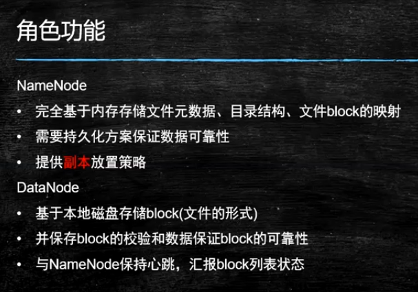

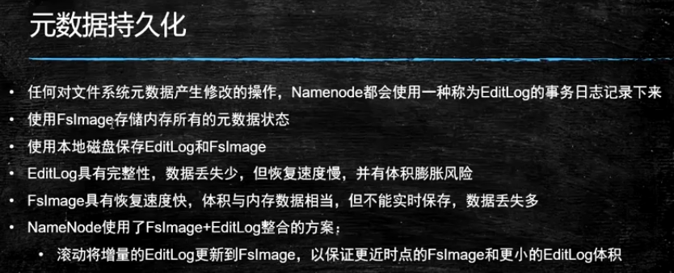

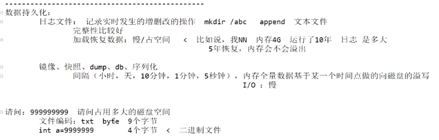

日志是文本的形式，是人可以读得懂的，所以是按ascII码存储，比较占空间，镜像比较快，所以是按二进制存储。但是镜像的缺点是容易丢失一部分数据。

这两个方案在redis是一样的，但是redis的持久化方案在这两种里面只能挑一个来用。

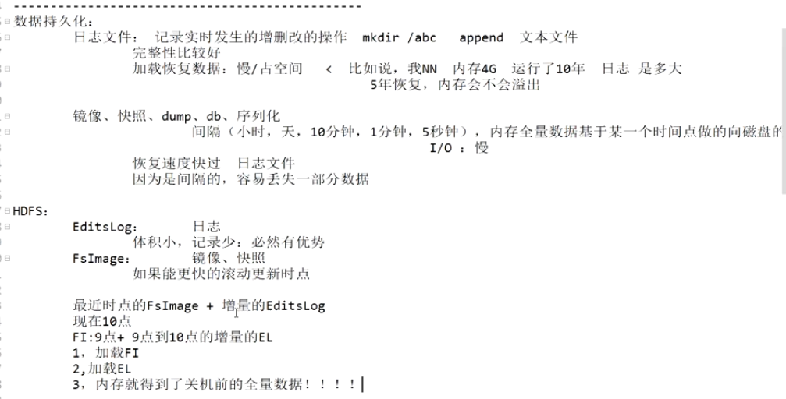

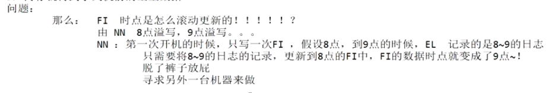

此问题引出后续的SNN

---

FI 和 EL 是如何产生的？

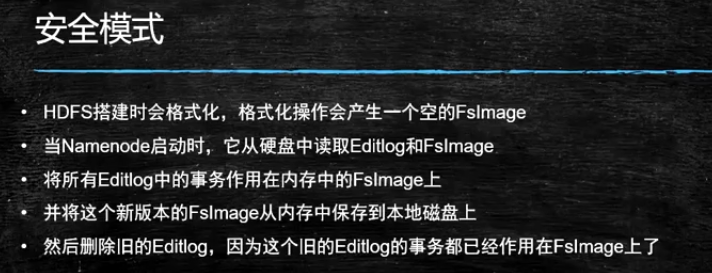

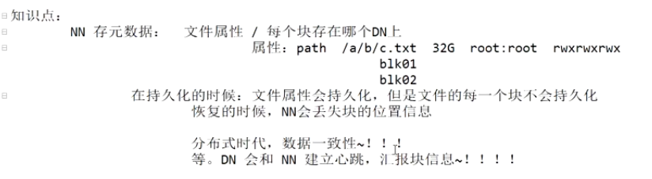

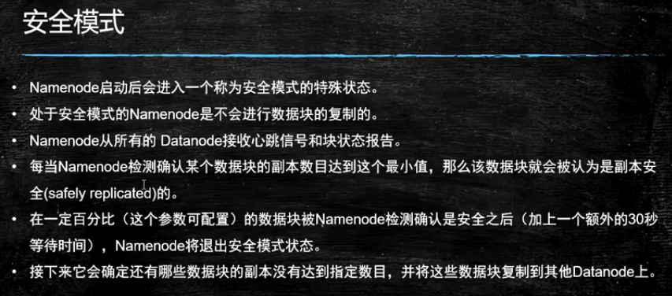

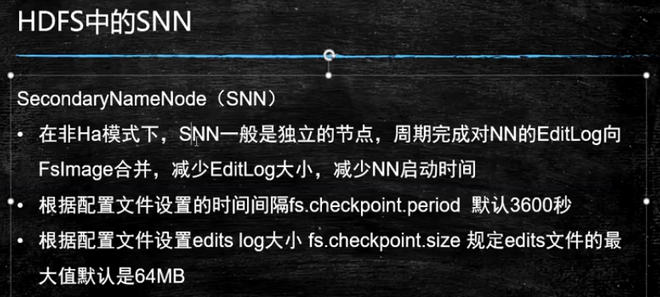

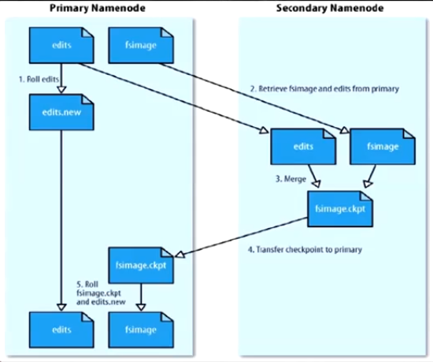

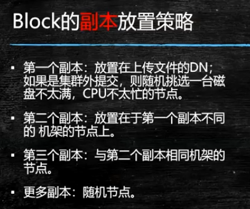

重点：

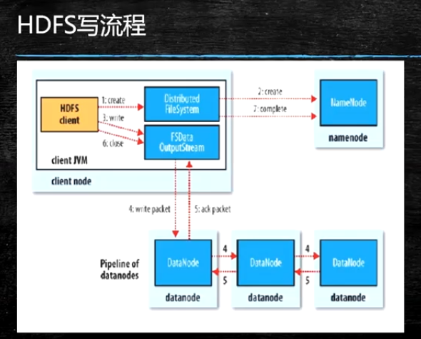

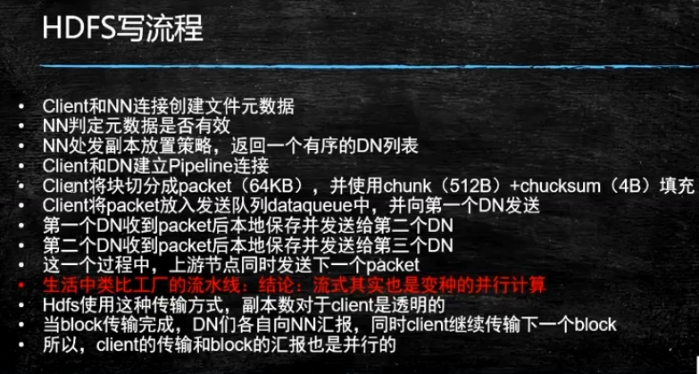

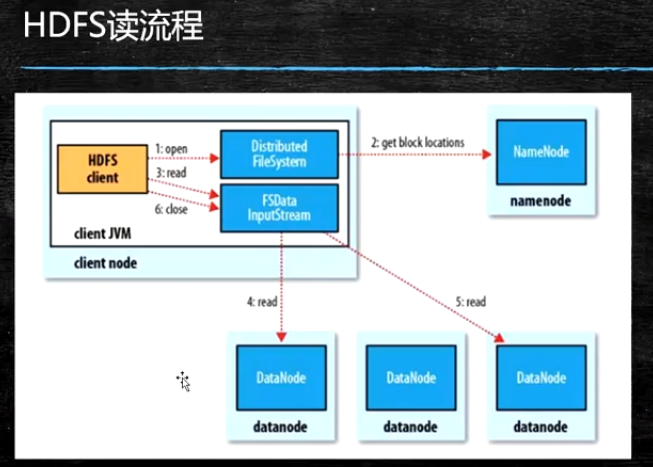

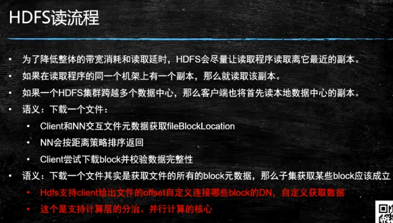