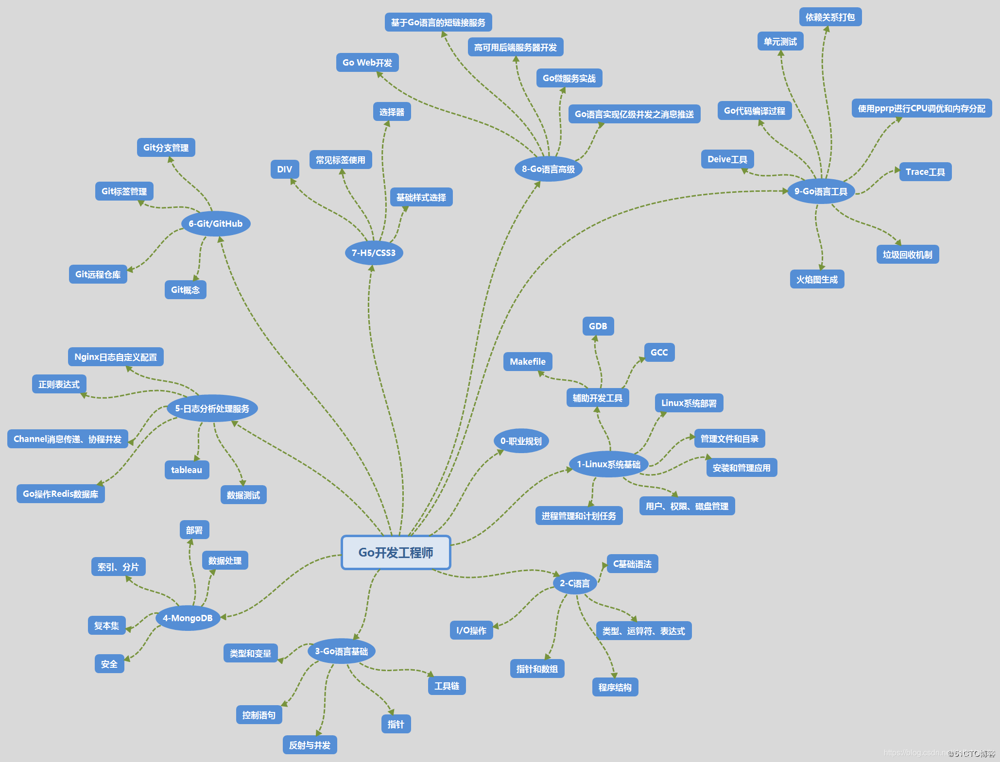

The master has failed more times than the beginner has tried.

大师失败的次数比初学者尝试的次数还要多得多。

学习资料：

>  https://www.v2ex.com/t/749703      ==     https://zhuanlan.zhihu.com/p/348022083
>
> https://www.luozhiyun.com/archives/tag/go

路线图：

> https://www.debuginn.cn/
>
> https://github.com/debuginn/golang-developer-roadmap-cn

## 学习路径

比较有效的学习方式是在理解语言基础后实际地写几个项目，做中学，学中做。

