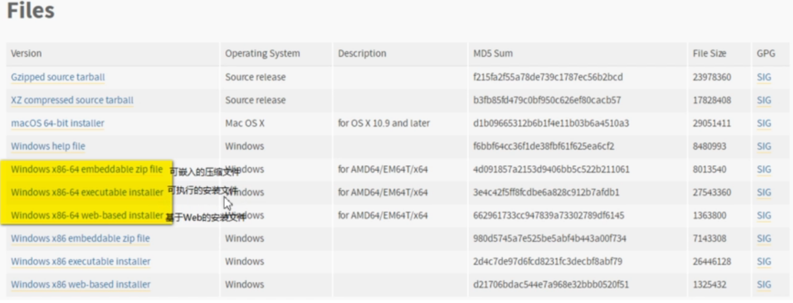

特点

* 对大数据分析、人工智能中至关重要的机器学习，深度学习都提供大力支持
* 有最最庞大的代码库
* 胶水语言

能做什么

* 抢火车票

* 数据分析

* 开发网站

* 开发游戏

---

跨平台

解释型语言

交互式语言

面向对象语言-->一切皆对象

---

搭建python环境

安装python解析器

https://www.python.org/  官网

https://pyton.org/downloads/release/python-381/

开发环境 PyCharm de 下载与安装

