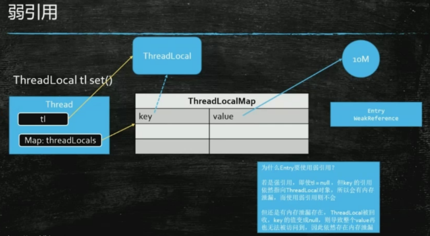
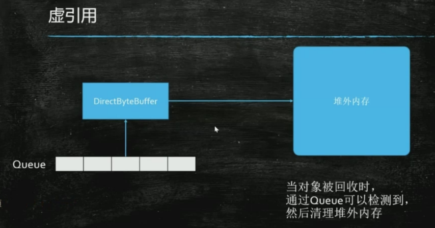
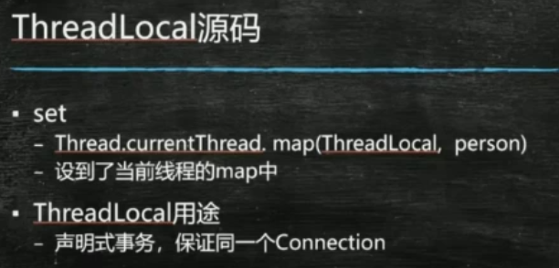

### AQS源码 =  volatile + cas

#### 两个核心

1. state：记录线程重入了多少次 volatile修饰
2. node：线程节点=双向链表（需要看前面节点的状态） cas

添加线程到对接尾巴：compareAndSetTail  
优点：用cas操作尾巴节点，替代锁整条链表的操作，所以性能高

VarHandle：jdk1.9之后才有的。  --addWaiter方法里面。 指向某个变量的引用。 强引用
var变量，handle句柄

* varHandle -> 1：普通属性原子操作 2：比反射快，直接操作二进制码

### 强软弱虚 -- java的四种引用       背

* 强 - 普通引用 new Object( ); GC不会回收
* 软 - 只要遭遇GC就会回收。一般用在容器里。对象如果只有软引用指向，只有在系统内存不够的情况，才会被GC回收，缓存场景使用
* 弱 - tomcat用的也是弱引用。典型的应用：ThreadLocal 
  **weakHashMap干什么用的/AQS unlock的源码**

 ；

* 虚 - 基本没用，给虚拟机用的，jvm用的 

 

《提问的智慧》

### ThreadLocal 隔离线程

不了解，说明平时太不用功
* 读ThreadLocal源码  ThreadLocalMap 
* 用处：
1-Spring的声明式事务，在一个线程中。
2-Hibernate的声明式事务

 

 * weakReference

