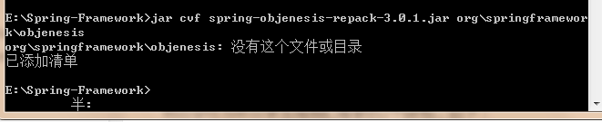
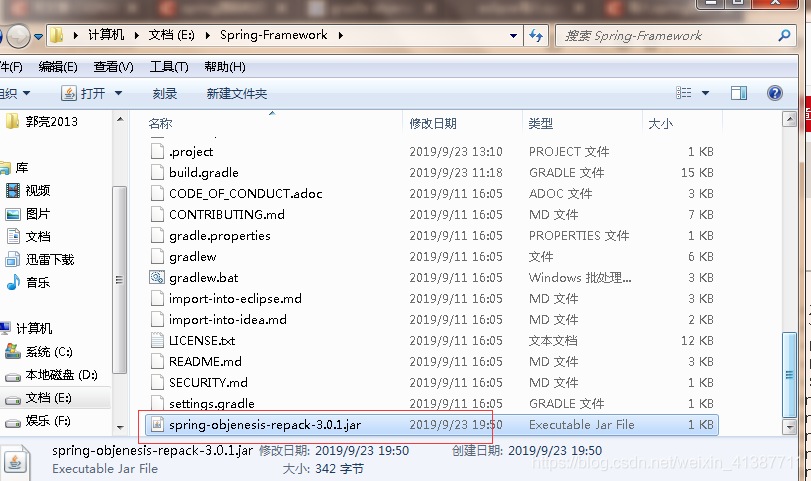
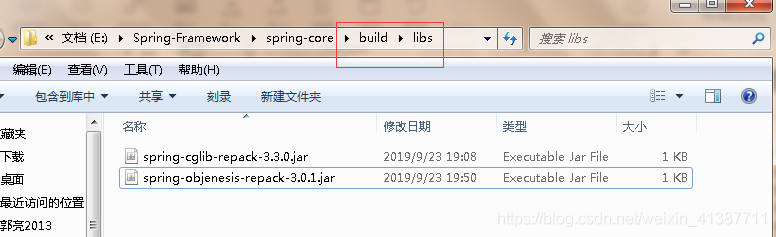
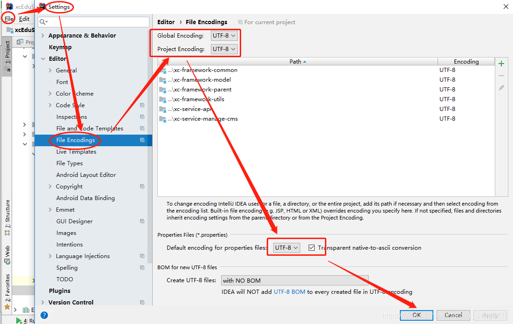

1、修改gradle环境变量，idea里面修改gradle仓库地址

2、少包：

spring-cglib-repack-3.3.0.jar
 spring-objenesis-repack-3.0.1.jar

解决方法：手动添加jar包。
 cmd 命令先下载2个jar包：
同样cmd进入目录：E:\Spring-Framework
 执行
 jar cvf spring-cglib-repack-3.3.0.jar org\springframework\cglib
 jar cvf spring-objenesis-repack-3.0.1.jar org\springframework\objenesis

然后会在当前目录生成我们需要的2个jar包，如下：

手动添加到制定目录

3、jdk版本 - jdk11

4、控制台乱码

更详细的处理流程参考：

https://juejin.im/post/6844904008625160206

记住，**要重启idea**配置才生效

