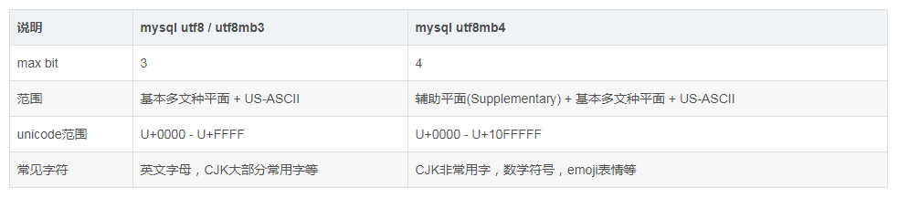

### Mysql中utf8mb4编码及排序规则

对比utf8mb4_bin，utf8mb4_general_ci，utf8mb4_unicode_ci 

#### 前言

utf8mb4说明

UTF-8是使用1-4个字节，一种变长的编码格式，字符编码。

mb4即 most bytes 4，使用4个字节来表示完整的UTF-8。

mysql的 utf8 编码最大字符长度为 3 字节，如果遇到 4 字节的宽字符就会插入异常了。三个字节的 UTF-8 最大能编码的 Unicode 字符是 0xffff，也就是 Unicode 中的基本多文种平面(BMP)。也就是说，任何不在基本多文本平面的 Unicode字符，都无法使用 Mysql 的 utf8 字符集存储。包括 Emoji 表情(Emoji 是一种特殊的 Unicode 编码，常见于 ios 和 android 手机上)，和很多不常用的汉字，以及任何新增的 Unicode 字符等等。

总结：MySQL的utf8是utfmb3，只有三个字节，节省空间但不能表达全部的UTF-8。所以推荐使用utf8mb4。

**utf8mb4_bin:**

将字符串每个字符用二进制数据编译存储，区分大小写，而且可以存二进制的内容。

**utf8mb4_general_ci：**

ci即case insensitive，不区分大小写。没有实现Unicode排序规则，在遇到某些特殊语言或者字符集，排序结果可能不一致。但是，在绝大多数情况下，这些特殊字符的顺序并不需要那么精确。

**utf8mb4_unicode_ci：**

是基于标准的Unicode来排序和比较，能够在各种语言之间精确排序，Unicode排序规则为了能够处理特殊字符的情况，实现了略微复杂的排序算法。

utf8mb4_general_ci是一个遗留的校对规则，不支持扩展，它仅能够在字符之间进行逐个比较。utf8_general_ci校对规则进行的比较速度很快，但是与使用 utf8mb4_unicode_ci的校对规则相比，比较正确性较差。

总结：general_ci 更快，unicode_ci 更准确。但相比现在的CPU来说，它远远不足以成为考虑性能的因素，索引涉及、SQL设计才是。使用者更应该关心字符集与排序规则在db里需要统一。（可能产生乱码的字段不要作为主键或唯一索引。例如：以 url 来作为唯一索引，但是它记录的有可能是乱码。）

utf8mb4是支持emoji表情的

