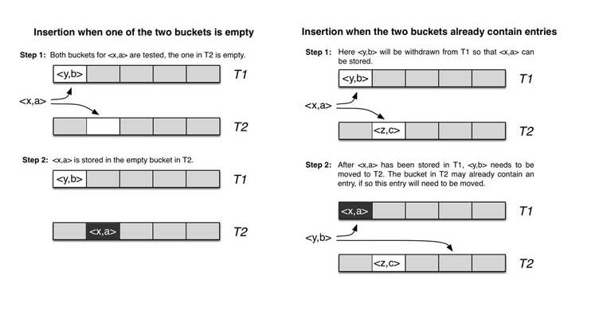

# Redis高级运用

##### 一、管道连接redis（一次发送多个命令，节省往返时间）

1.安装nc

```
yum install nc -y
```

2.通过nc连接redis

```
nc localhost 6379
```

3.通过echo向nc发送指令

```
echo -e "set k2 99\nincr k2\n get k2" |nc localhost 6379
```

##### 二、发布订阅(pub/Sub)

```
publish channel message
```

```
subscribe channel
```

##### 三、事务（transactions）

```
multi 开启事务
...
exec 执行事务
```

```
watch 如果数据被更改，那就不执行事务
unwatch 取消监视
```

```
discard 放弃事务
```

##### 四、布隆过滤器（redisbloom）

在redis.io/modules选择redisbloom的github，克隆下来

解压，make编译，将redisbloom.so这个链接库复制到/opt/redis

执行

```
redis-server --loadmodule /opt/redis/redisbloom.so 
```


```
科普：bloom filter,counting bloom,cukcoo是什么？
1.bloom filter
它实际上是一个很长的二进制向量和一系列随机映射函数。布隆过滤器可以用于检索一个元素是否在一个集合中。它的优点是空间效率和查询时间都远远超过一般的算法，缺点是有一定的误识别率和删除困难。
运用:网页黑名单、垃圾邮件、爬虫网址判重
Java想要使用BloomFilter可以考虑使用google的guava

2.counting bloom
这个计数器，使用4位bit来表示一个计数（这个数字可以自己指定长度的），所以我们可以进行计数。

（详细参考：https://wenku.baidu.com/view/9e5832df7f1922791688e84f.html）

3.cuckcoo
cuckoo filter的产生源于一个故事，盒子故事（参考：https://www.cnblogs.com/chuxiuhong/p/8215719.html）
我们使用2个表存，可以存放在任意一个，那么数学期望由O(logN/loglogN)变成O(loglogN)。
因此，而设计出来布谷过滤器。
布谷过滤器使用2个哈希表，元素计算哈希，如果没有值，则放入，有值，则踢出元素，重新计算新的哈希，放入，如此反复。参考附件：cuckoo filter

redis的布隆过滤器模块也是用到了cuckoo的哈希，在cuckoo.c文件中


为了解决布隆过滤器不能删除元素的问题，布谷鸟过滤器横空出世。论文《Cuckoo Filter：Better Than Bloom》作者将布谷鸟过滤器和布隆过滤器进行了深入的对比。相比布谷鸟过滤器而言布隆过滤器有以下不足：查询性能弱、空间利用效率低、不支持反向操作（删除）以及不支持计数。
```



Redis Bloom的使用：

```
BF.ADD k1 V   添加数据值
BF.EXISTS k1 V    判断是否存在
```

LRU和LFU的区别

- LRU (Least recently used) 最近最少使用，如果数据最近被访问过，那么将来被访问的几率也更高。
- LFU (Least frequently used) 最不经常使用，如果一个数据在最近一段时间内使用次数很少，那么在将来一段时间内被使用的可能性也很小。

LRU是最近最少使用页面置换算法(Least Recently Used),也就是首先淘汰最长时间未被使用的页面!--memcache 默认淘汰算法

LFU是最近最不常用页面置换算法(Least Frequently Used),也就是淘汰一定时期内被访问次数最少的页!