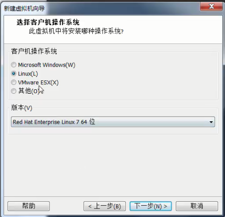
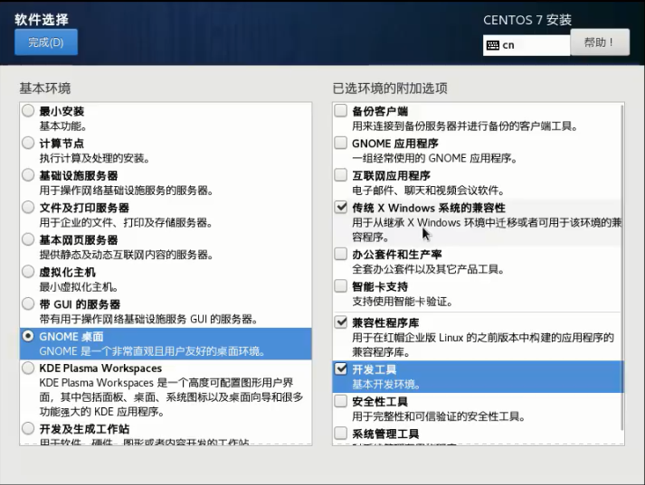
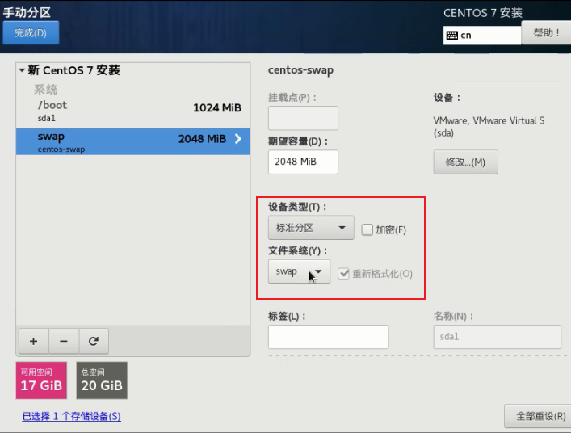
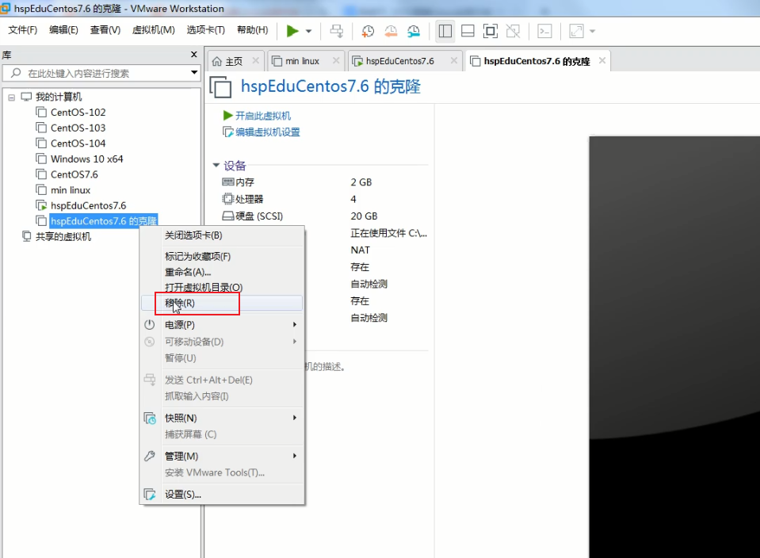
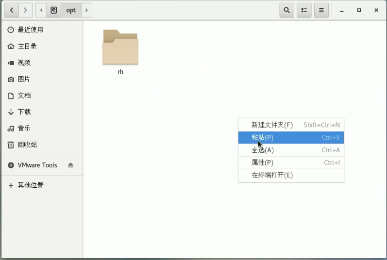

# linux 基础篇

## 一、应用领域

## 二、入门

## 三、vm 和 linux的安装

 

 

安装vm ware 时，注意选择自定义安装目录。

### 3.1 创建虚拟机

 

 

典型，下一步

 

稍后安装操作系统

 

系统：linux，版本：红帽7

 

选择空间比较大的磁盘

 

磁盘并不是马上占满，会随着后期使用而增加，最大的上限就是设定的值。当然如果磁盘空间不够了，还可以增加磁盘。

选拆分多个文件。

 

自定义硬件

 

查看有多少个cpu：任务管理器--》 资源管理器 --》

下图左边区域是指有多少个cpu，如下图所示，有2个cpu。

那每个cpu有多少个内核，看右侧的黑色区域。下拉到最后，可以看到有cpu7，从cpu0-cpu7，所有是有8个核。

即总共有2个cpu，8核

 给虚拟机分配2个cpu，每个cpu分配2个核，即总共4核。

 

网络适配器，难点，一般情况下，选NAT模式，不容易造成ip冲突。

NAT：网络地址转换模式

 

 

完成自定义硬件。

### 3.2 安装Centos 7.6

 

 

选择好ISO影像文件之后即可，点确定。

 

 

 

 

软件选择：默认是最小安装，不带界面的。但是上课或学习最好有界面，所以调整了下

 

开发工具选上的话，可以有gcc 和jdk 、mysql

下面，硬盘分区，重点：

 

 

 

一般会把linux 分三个区：

* boot分区--引导分区

* swap分区--交换分区，大小和分配的内存一致就好

* 根分区

 

 

 

 

 swap分区原理：临时充当内存

 

 

 

根分区：

 

接受更改

 

生产环境需要打开KDUMP，练习则关上即可，节省内存。

 

网络和主机：

 

 

关闭安全策略，然后接口点击”开始安装“

 

 

设置root密码：root

工作时密码一定要设置复杂，可参考工具：

https://suijimimashengcheng.51240.com/

创建其他用户：

 

然后，耐心等待系统安装即可。

系统启动：

进入系统桌面后，如果看到右上角的这个图标，说明网络已经链接上了。也可以通过使用浏览器访问网页测试。

设置分辨率：

### 3.3、网络链接的三种方式

桥接模式：虚拟系统可以和外部系统通讯，但是容易造成ip冲突。

NAT模式：网络地址转换模式，虚拟系统可以和外部系统通讯，不造成ip冲突。

主机模式：独立的系统，不和外部发生联系。

### 3.4 虚拟机的克隆

 

 

 

 

 

### 3.5 虚拟机快照

 

### 3.6 虚拟机迁移删除

上图的移除，只是把vmware 的指向移除了，真正的虚拟机并没有移除。

  

### 3.7 安装vmtools

 

 

打开主文件夹

其他位置--》计算机

 

 

 

 

 

执行安装命令，然后一直按回车确认即可。

./vmware-install.pl

 

 

设置共享文件夹

 

 

 

 

至此，完成虚拟机上共享文件夹创建。

linux系统的上的共享文件夹一般放在/mnt/hgfs/目录下：

 

## 四、Linux 目录结构

