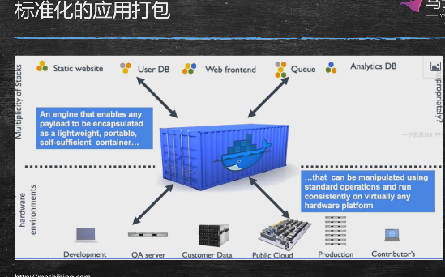
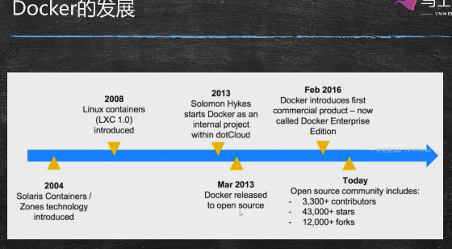
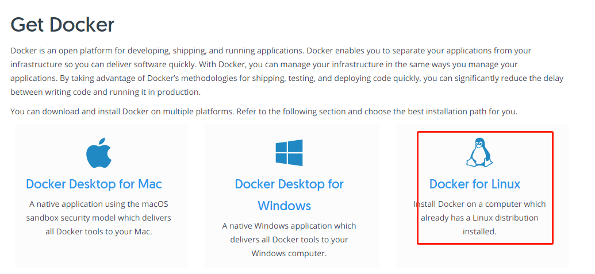
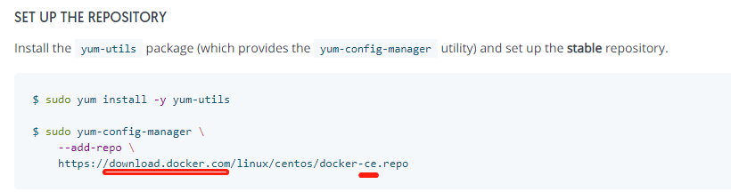
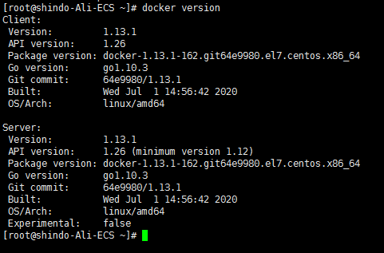
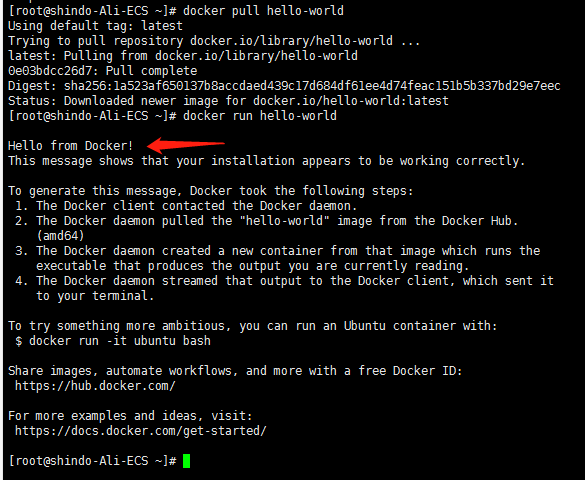

## 概述与历史

基于go语言开发




标准化应用打包本质上是镜像文件，包含了应用所需要的所有资源依稀外部引用，比如数据库，队列，web应用服务器......，同时还描述运行这些应用要哪些硬件上的要求：硬盘/cpu/内存，部署后还可以灵活调整。



ce：社区版，ee：企业版-收费

## 安装docker

windows 必须是win10 64 专业版：这版才有虚拟linux系统

https://docs.docker.com/




下载源是国外的，需增加国内的安装源（ce：社区版）

```
https://download.docker.com/linux/centos/docker-ce.repo
```



### 1、安装组件包

-y ：自动确认安装

yum-utils ：yum 的工具集

device-mapper-persistent-data：数据存储的驱动包

lvm2：数据存储的驱动包

docker的内部容器如果要做数据存储，是需要通过device-mapper-persistent-data、lvm2这两个驱动来完成。

 ```shell
yum install -y yum-utils device-mapper-persistent-data lvm2
 ```

### 2、修改yum的安装源

yum-config-manager ：是上一步yum-utils准备的简化工具

--add-repo：设置新的安装源

```shell
yum-config-manager --add-repo http://mirrors.aliyun.com/docker-ce/linux/centos/docker-ce.repo
```

### 3、yum自动检测哪个哪个安装最快，优先使用

```she
yum makecache fast
```

### 4、安装docker

```shell
yum -y install docker-ce
```

### 5、验证docker是否安装

```shell
service docker start
```

使用docker常用命令测试docker是否正常运行。

```
docker version #查看docker版本号
```

docker 是cs 架构，使用docker version可以看到响应了Client 和 Server 两方面的信息



下载测试国外的测试镜像

```shell
docker pull hello-world
```

简单创建hello-world的容器

```shell
docker run hello-world
```



### 设置阿里云的加速代理

1、访问阿里云的官方首页：www.aliyun.com

2、在阿里云首页搜索框输入：容器镜像服务


3、点击“立即开通”

4、点击新页面左侧菜单栏的镜像加速器：


5、每个人的docker加速地址都不一样，相当于阿里云给每个用户都做了一个docker代理。

6、将对应系统的操作问的配置shell语句，拷贝到xshell中运行，即可。

可以测试：docker pull tomcat