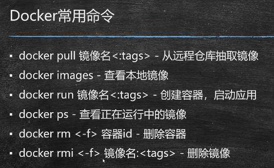
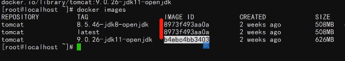
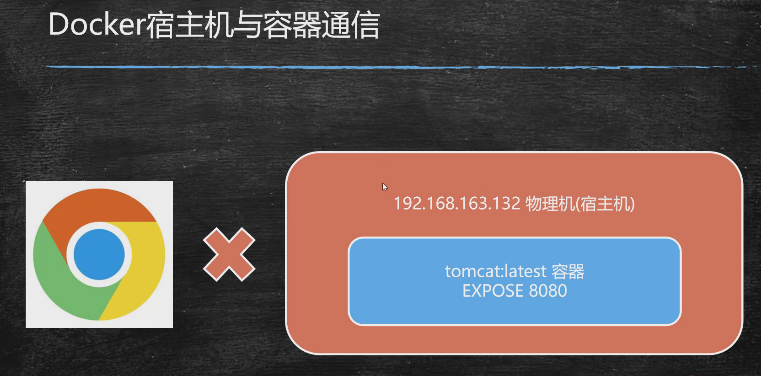
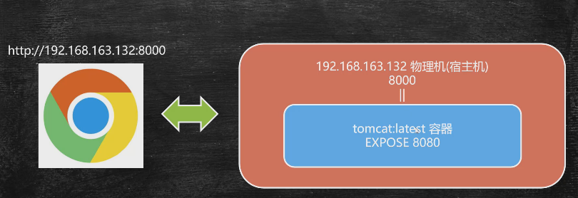
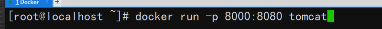
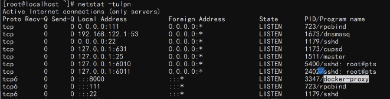
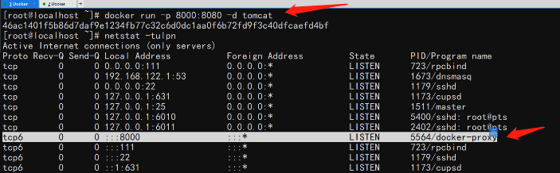
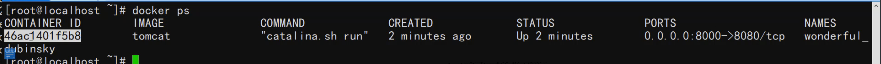

本节涉及6个命令



可以通过imageID来判断当前镜像和其他镜像是否相同





端口映射：



端口映射命令：



查看启用的端口：



后台运行（非阻塞状态）： -d



查看当前运行的容器：docker  ps



查看所有容器（包括已停止的）：docker ps -a

停止容器：docker stop 容器ID

删除容器：docker rm 容器ID

强制删除容器：docker rm -f 容器ID

删除镜像：docker rmi 镜像ID

强制删除镜像：docker rmi -f 镜像ID


---
### 查看镜像列表

```shell
docker images
```


### 查看容器列表

```shell
docker ps
```

### 查看全部容器列表

```shell
docker ps -a
```

### 删除容器的命令

```shell
docker rm  <容器Id>
```

### 删除镜像的命令

```shell
docker rmi <镜像id>
```

### 进入容器的命令

```shell
docker exec -it <容器ID> /bin/sh
```

### 退出容器的命令

```shell
alt + p + q  或者exit命令
```


进入容器后，按照正常的linux命令操作

docker实际上是使用namespace原理隔离linux进程空间

进入容器后，目录规格和正常的linux规格一致，按照正常linux系统操作即可


