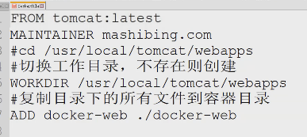
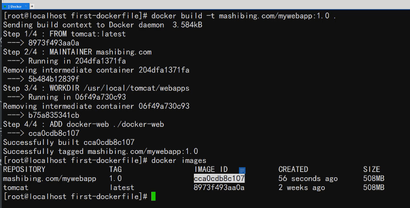

例子：

每一行前面的内容都是Dockerfile内置的命令，命令说明如下：

FROM：设置基准镜像

MAINTAINER：说明当前镜像是由哪个人或者哪个机构维护的

WORKDIR：用于**切换**工作目录（相当于cd命令，而且如果指定目录不存在，WORKDIR会主动创建它） 

ADD：是将指定文件或目录**复制**到镜像的指定目录下  （和Dockerfile同级的文件夹  WORKDIR切换的工作目录下的文件夹，不存在则自动创建）

注意：Dockerfile文件是没有扩展名的

使用docker build 命令创建镜像（以下例子使用相对路径）

docker build -t mashibing.com/webapp:1.0 .

