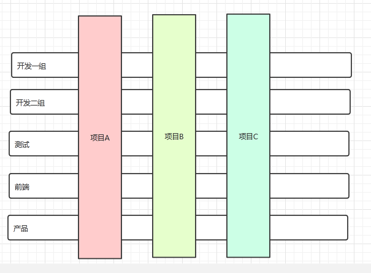
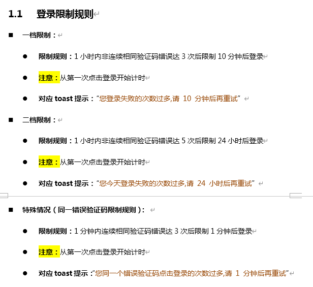

什么是项目？ --> 在有限的资源下开发一个服务

# 项目过程

 

## 启动

可行性分析，立项。项目背景：**面试：（背景，为什么做？残障人士（后备箱有轮椅），孕妇（开车比较稳司机），小孩（儿童座椅））。**


## 计划阶段：

进度安排，资源计划，成本估计，质量保证计划，风险，实施。

**面试：（1 加班，2加人，加资源，3 功能排优先级，重要的先做保证能用，后面再迭代。）**


## 实施控制阶段：

开发，测试，等等。


## 收尾

验收。产品验收。


# 项目和产品

矩阵式（开发：1组，2组，产品1组，2组），项目组。

 

# 人员安排

项目管理：3（1高级项目经理，2助理）

技术总监：1

运维：2

能力层：10

业务层：12

产品：10，（乘客，司机，boss，h5）

安卓：4

ios：3

h5：5

测试：20（功能，自动化测试，接口测试，安全测试）

运营，市场，大客户关系：未知。

## 你在项目中的职责

组长：接口定义，工程结构设计，代码review，各方沟通（产品，测试），核心功能开发。

组员：具体开发实现。核心功能开发。


----

Kick Off

各方参与，齐聚一堂。启动会。动员大会。

---


# 实现的需求

## 乘客端：

1. 发送验证码。

```sh
三挡验证。技术人员防止恶意发短信。
```

 

2. 登录/注册。

3. 查看开通区域

```sh
高德围栏
```

4. 预估价格。
5. 下单
6. （司机流程）  司乘同显
7. 支付（分布式事务：订单，支付，积分）
8. 评价。

# 司机端

1. 发送验证码
2. 登录，注册
3. 查看，改变司机状态。
4. 司机抢单（分布式锁）
5. 订单状态变更。
6. 发起收款

# boss

运营。


---

# 微服务设计原则

架构，模式，拆分，隔离。目标：**隔离系统的变化点**。  （就是为什么要这样做）


## 具体原则：

高内聚，低耦合。

高度自治：开发，测试，构建，部署，运行，发布。（无状态）

以业务为中心。

弹性设计。（容错，隔离，降级）。

自动化。持续集成，持续交付。

粒度把控：没有标准。任何一个服务，不要因为自己的开发和维护，影响其他服务。


api组，service组。

业务层，能力层。


## AKF：

x轴：水平复制。A  A  A   A   A。

y轴：A 

z轴：数据分片：手机，衣服，家电。； 杭州，北京。盘古。


 

 