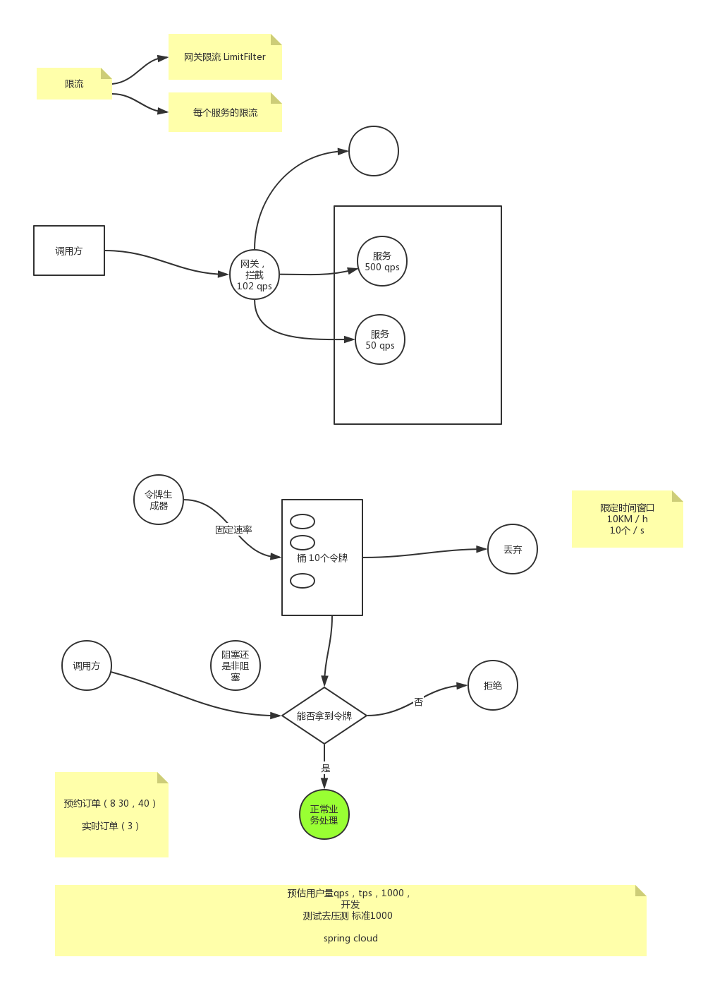

### 1、限流的场景：

两个方面考虑：

1、对外入口的限流（网关）

2、每个服务自身的限流

### 2、可用技术：

1、Guava 的 RateLimiter

2、阿里的senitel

### 3、设计原则：

服务总的限流总量原则上要比网关的限流总量要大。

### 4、网关的限流和 Ribbon的负载均衡的区别：

网关限流的场景，更多的是从客户方考虑，就是大量的请求涌入，处理不过来的直接打回。

但是Ribbon的负载更多的是请求已经打进来了，在内部服务调用的时候，下游的服务处理不过来了，而做的服务降级操作。

两者是有本质上的区别的，不能混为一谈。

