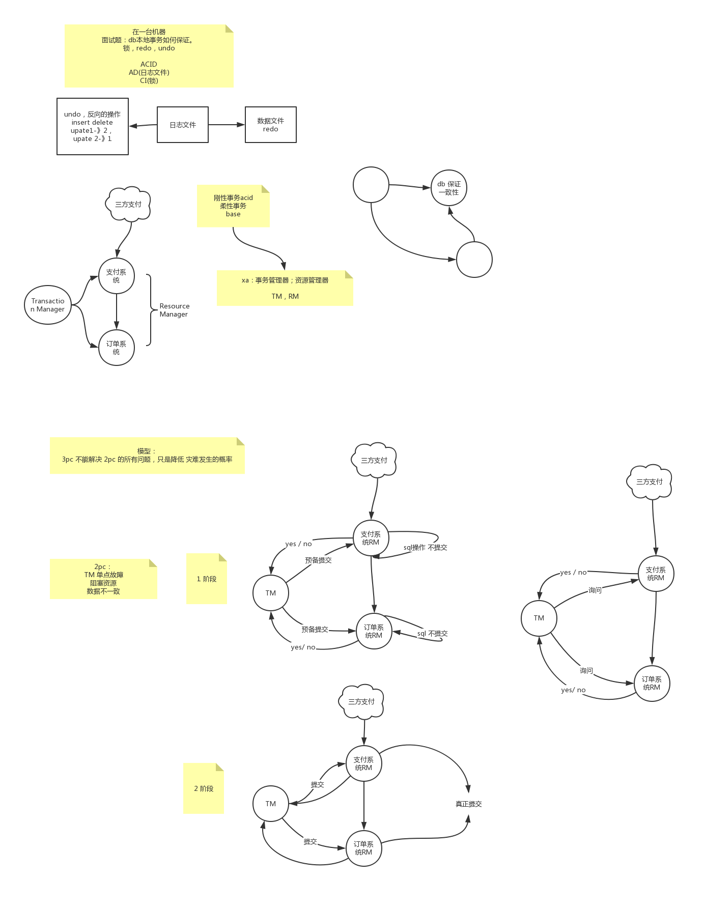
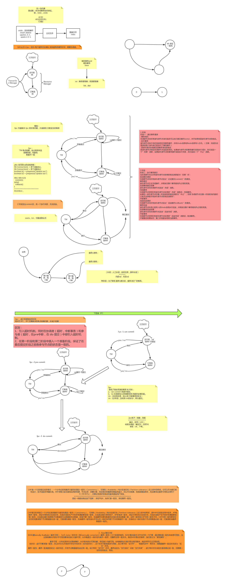

XA协议：TM（事务管理器）  和  RM （资源管理器）   

理论模型：2pc   3pc

---

目前主流的技术实现框架：

消息队列+本地事件表+定时任务

LCN

TCC

seata - 支持AT （一般用这个）、TCC、SAGA、XA   ， seata提供了更多选择。

可靠消息服务 RocketMq

最大努力通知

seata 的at模式只能作用在有sql事务支持的。就和lcn一样。

---

### 二阶段、三阶段 理论模型

