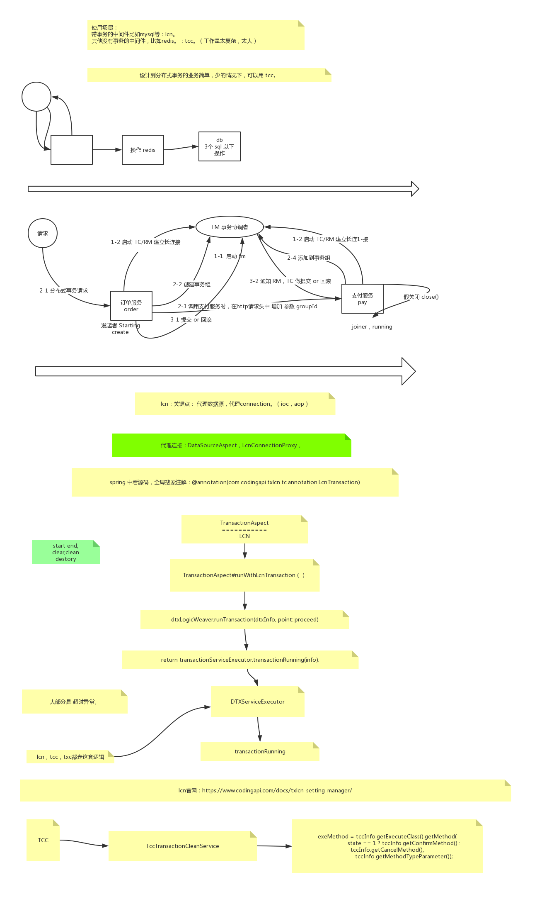

lcn与tcc 的使用场景：

lcn适合中间件都是支持事务类型，他的模型在一阶段的时候并没有真正提交，只是预提交，如果在第二阶段出现异常需要回滚，直接不提交事务即可。实现上比较简单，代码侵入性也比较低。

tcc虽然和lcn一样都是预提交的模型，但是tcc要手动实现confirm 和 cancel 方法。如果要处理的分布式事务场景都是自带事务支持的，本身支持事务回滚的，更推荐使用lcn，比较不用写一大堆cancel逆向逻辑的代码。

所以，tcc这种手动实现cancel的模型，更适合解决分布式事务场景中混合了支持事务和不支持事务的中间件，比如mysql和redis混合使用，更偏向于使用cancel来逆向redis的操作。

