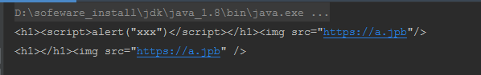

**防止xss攻击插件**

> https://www.cnblogs.com/qizhelongdeyang/p/9884716.html 

owasp：开放式Web应用程序安全项目，（Open Web Application Security Project）是一个组织。

sanitizer ：消毒杀菌剂

---

1、引入依赖

```xml
<dependency>
    <groupId>com.googlecode.owasp-java-html-sanitizer</groupId>
    <artifactId>owasp-java-html-sanitizer</artifactId>
    <version>r136</version>
</dependency>
```


2、演示案例

```java
package com.shindo.spring.utils;

import org.owasp.html.ElementPolicy;
import org.owasp.html.HtmlPolicyBuilder;
import org.owasp.html.PolicyFactory;

import java.util.List;

/**
 * WASP HTML Sanitizer 是一个简单快捷的java类库，主要用于防止XSS
 * 优点如下：
 * 　　1.使用简单。不需要繁琐的xml配置，只用在代码中少量的编码
 * 　　2.由Mike Samuel（谷歌工程师）维护
 * 　　3.通过了AntiSamy超过95%的UT覆盖
 * 　　4.高性能，低内存消耗
 * 　　5.是 AntiSamy DOM性能的4倍
 */
public class HtmlUtils {

	//允许的标签
	private static final String[] allowedTags = {"h1", "h2", "h3", "h4", "h5", "h6",
			"span", "strong",
			"img", "video", "source",
			"blockquote", "p", "div",
			"ul", "ol", "li",
			"table", "thead", "caption", "tbody", "tr", "th", "td", "br",
			"a"
	};

	//需要转化的标签
	private static final String[] needTransformTags = {"article", "aside", "command", "datalist", "details", "figcaption", "figure",
			"footer", "header", "hgroup", "section", "summary"};

	//带有超链接的标签
	private static final String[] linkTags = {"img", "video", "source", "a"};

	public static String sanitizeHtml(String htmlContent) {
		PolicyFactory policy = new HtmlPolicyBuilder()
				//所有允许的标签
				.allowElements(allowedTags)
				//内容标签转化为div
				.allowElements(new ElementPolicy() {
					@Override
					public String apply(String elementName, List<String> attributes) {
						return "div";
					}
				}, needTransformTags)
				.allowAttributes("src", "href", "target").onElements(linkTags)
				//校验链接中的是否为http
				.allowUrlProtocols("https")
				.toFactory();
		String safeHTML = policy.sanitize(htmlContent);
		return safeHTML;
	}

	public static void main(String[] args) {
		String inputHtml = "<h1><script>alert(\"xxx\")</script></h1>";
		System.out.println(inputHtml);
		System.out.println(sanitizeHtml(inputHtml));
	}
}

```


3、案例执行结果

 