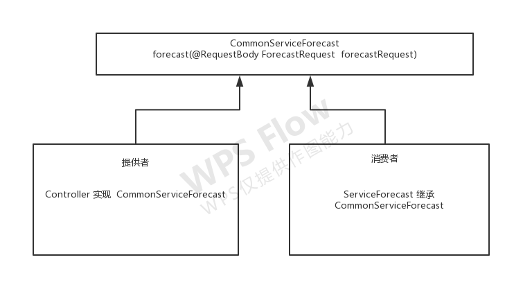
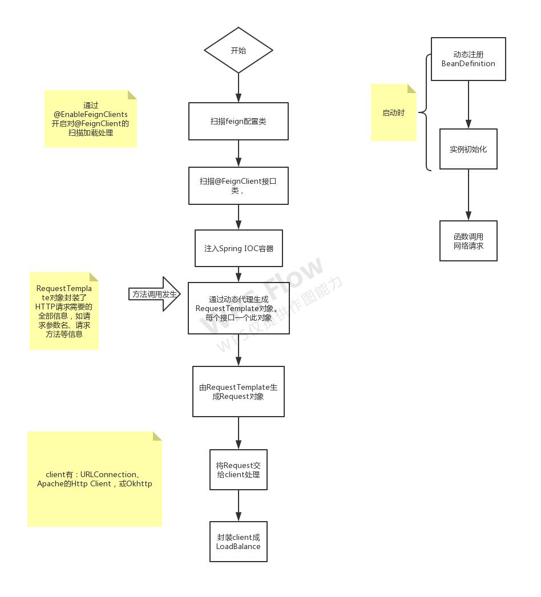
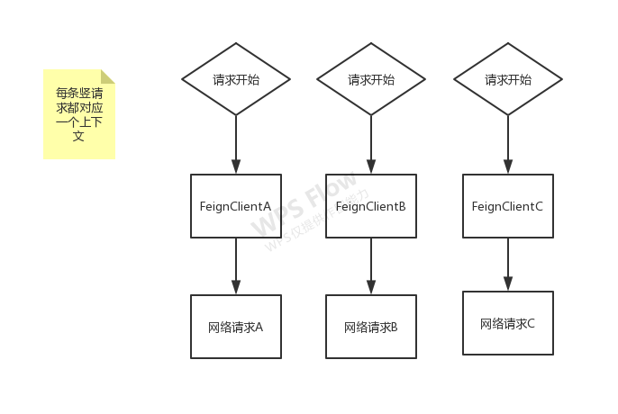

# 14. Feign声明式REST调用

## 14.1 概念

OpenFeign是Netflix 开发的声明式、模板化的HTTP请求客户端。可以更加便捷、优雅地调用http api。

OpenFeign会根据带有注解的函数信息构建出网络请求的模板，在发送网络请求之前，OpenFeign会将函数的参数值设置到这些请求模板中。

> 《Ribbon流程图》

feign主要是构建微服务消费端。只要使用OpenFeign提供的注解修饰定义网络请求的接口类，就可以使用该接口的实例发送RESTful的网络请求。还可以集成Ribbon和Hystrix，提供负载均衡和断路器。


英文表意为“假装，伪装，变形”， 是一个 Http 请求调用的轻量级框架，可以以 Java 接口注解的方式调用 Http 请求，而不用像 Java 中通过封装 HTTP 请求报文的方式直接调用。通过处理注解，将请求模板化，当实际调用的时候，传入参数，根据参数再应用到请求上，进而转化成真正的请求，这种请求相对而言比较直观。Feign 封装 了HTTP 调用流程，面向接口编程，回想第一节课的SOP。


## 14.2 项目安排

api-passenger-feign

service-valuation

预估价格功能。

## 14.3 编码及测试

一言以蔽之：创建接口，添加注解。

1. pom.xml。

   ```sh
   <!-- 引入feign依赖 ，用来实现接口伪装 -->
   <dependency>
   	<groupId>org.springframework.cloud</groupId>
   	<artifactId>spring-cloud-starter-openfeign</artifactId>
   </dependency>
   ```

2. 添加接口,注解。

```sh
一般一个服务提供者，写一个interface

//此处由于结合了eureka，所以name是 虚拟主机名，默认服务名，请求时 会将它解析成注册表中的服务。
//不结合eureka，就是自定义一个client名字。就用url属性指定 服务器列表。url=“http://ip:port/”
//此时的name作用就是创建负载均衡器。
//也可以添加@RequestMapping
@FeignClient(name = "service-valuation")
public interface ServiceForecast {
	
	@RequestMapping(value = "/forecast/single",method = RequestMethod.POST)
	public ResponseResult<ForecastResponse> forecast(@RequestBody ForecastRequest 		                   forecastRequest);
	
}
```

3. 启动类

```sh
@EnableFeignClients
@EnableFeignClients就像是一个开关，只有使用了该注解，OpenFeign相关的组件和配置机制才会生效。
@EnableFeignClients还可以对OpenFeign相关组件进行自定义配置
```

4. 调用

   ```sh
   	@Autowired
   	private ServiceForecast serviceForecast;
   	
   	@PostMapping("/forecast")
   	public ResponseResult<ForecastResponse> forecast(@RequestBody ForecastRequest forecastRequest) {
   		
   		ResponseResult<ForecastResponse> result = serviceForecast.forecast(forecastRequest);
   		
   		return ResponseResult.success(result.getData());
   	}
   	
   	PS:调用此方法：会向service-valuation服务的接口：/forecast/single 发送请求。
   	
   ```

5. 测试

   测试点：

   1. 测试单独的 计价接口，是否可用。(去掉权限认证， pom中依赖security，yml中去掉用户名密码，config重命名.javab)。测试计价是否正常。

   2. 通过api-passenger调用（下面两个TC）。

      

```sh
   TC1：运行eureka-7900，service-valuation-8060，service-valuation-8061，api-passenger。
   访问预估价格。

   TC2：通过配置文件更改 负载均衡策略。ribbon的配置。访问预估价格，看8061和8062的控制台，数量。
   
service-valuation: 
  ribbon: 
    NFLoadBalancerRuleClassName: com.netflix.loadbalancer.RandomRule
```

  

可以看到负载均衡也生效。

继续测试：

测试feign作为一个http客户端使用

```sh
api-passenger-feign-custom

@FeignClient(name = "service-valuation-without-eureka",url = "http://localhost:8060",configuration = FeignAuthConfiguration.class)
public interface ServiceForecastWithoutEureka {
	
	
	@RequestMapping(value = "/forecast/single",method = RequestMethod.POST)
	public ResponseResult<ForecastResponse> forecast(@RequestBody ForecastRequest forecastRequest);
	
}

```


## 14.4 自定义feign配置

### 14.4.1 Java代码定义

feign的默认配置类是：org.springframework.cloud.openfeign.FeignClientsConfiguration。默认定义了feign使用的编码器，解码器等。

允许使用@FeignClient的configuration的属性自定义Feign配置。自定义的配置优先级高于上面的FeignClientsConfiguration。


通过权限的例子，学习feign的自定义配置。

服务提供者。上述例子开放service-valuation的权限 后，访问。

```sh
开放权限：
<!-- 安全认证 -->
<dependency>
	<groupId>org.springframework.boot</groupId>
	<artifactId>spring-boot-starter-security</artifactId>
</dependency>

@Configuration
@EnableWebSecurity
public class WebSecurityConfig extends WebSecurityConfigurerAdapter {

	@Override
	protected void configure(HttpSecurity http) throws Exception {
		// 关闭csrf
		http.csrf().disable();
		// 表示所有的访问都必须认证，认证处理后才可以正常进行
		http.httpBasic().and().authorizeRequests().anyRequest().fullyAuthenticated();
		// 所有的rest服务一定要设置为无状态，以提升操作效率和性能
		http.sessionManagement().sessionCreationPolicy(SessionCreationPolicy.STATELESS);
	}
}
		
spring: 
  security: 
    user: 
      name: root
      password: root
      
      
```

继续feign原来访问，报错。401。


有如下两种方式：

1. 自定义配置类。
2. 增加拦截器。


**自定义配置**

```sh
配置类：
public class FeignAuthConfiguration {
	
	@Bean
	public BasicAuthRequestInterceptor basicAuthRequestInterceptor() {
		return new BasicAuthRequestInterceptor("root", "root");
	}
}

在feign上加配置
@FeignClient(name = "service-valuation",configuration = FeignAuthConfiguration.class)


```

OK，可以正常访问了。


小结：如果在配置类上添加了@Configuration注解，并且该类在@ComponentScan所扫描的包中，那么该类中的配置信息就会被所有的@FeignClient共享。最佳实践是：不指定@Configuration注解（或者指定configuration，用注解忽略），而是手动：

@FeignClient(name = "service-valuation",configuration = FeignAuthConfiguration.class)


**拦截器**

```sh
import feign.RequestInterceptor;
import feign.RequestTemplate;

public class MyBasicAuthRequestInterceptor implements RequestInterceptor {

	@Override
	public void apply(RequestTemplate template) {
		// TODO Auto-generated method stub
		template.header("Authorization", "Basic cm9vdDpyb290");
	}
}

feign:
  client: 
    config:  
      service-valuation: 
        
        request-interceptors:
        - com.online.taxi.passenger.feign.interceptor.MyBasicAuthRequestInterceptor
```


代码中取消上面的配置，访问，报401.用下面的方式。

  

### 14.4.2 属性定义

1. 接上面例子，此例子和上面例子实现的功能一样。记得两者取一个即可。说明用属性而不是用属性中的configuration。

```sh
定义拦截器
public class MyBasicAuthRequestInterceptor implements RequestInterceptor {

	@Override
	public void apply(RequestTemplate template) {
		// TODO Auto-generated method stub
		template.header("Authorization", "Basic cm9vdDpyb290");
	}
}

配置文件
feign:
  client: 
    config:  
      service-valuation: 
        request-interceptors:
        - com.online.taxi.passenger.feign.interceptor.MyBasicAuthRequestInterceptor
        

```

再次访问，测试Ok。

2. 扩展

指定服务名称配置：

```sh
   feign:
     client: 
       config:  
         service-valuation: 
           connect-timeout: 5000
           read-timeout: 5000
           logger-level: full
           
```

   通用配置

```sh
   feign:
     client: 
       config:  
         default: 
           connect-timeout: 5000
           read-timeout: 5000
           logger-level: full
```

 属性配置比Java代码优先级高。也可通过配置设置java代码优先级高。

```sh
feign:
	client: 
		default-to-properties: false
```

feign在方法上可以设置：@RequestMapping,@ResponseBody。

方法中的参数可以设置：@RequestBody等等，Spring MVC中的注解。


推荐使用yml配置方式，在yml中按 代码提示键，可以看到所有配置。

## 14.5 Feign继承

1. 编写通用服务接口A，接口方法上写@RequestMapping()，此接口用于 feign。

2. 服务提供者 实现上面接口A。

3. 服务消费者的feign client接口 继承A。

   

   例子，画个图

   > 《feign继承》

    
   
   ```sh
   common组件：
   package com.online.taxi.common.interactor;
   
   import org.springframework.web.bind.annotation.RequestBody;
   import org.springframework.web.bind.annotation.RequestMapping;
   import org.springframework.web.bind.annotation.RequestMethod;
   
   import com.online.taxi.common.dto.ResponseResult;
   import com.online.taxi.common.dto.order.ForecastRequest;
   import com.online.taxi.common.dto.order.ForecastResponse;
   
   public interface CommonServiceForecast {
   	
   	@RequestMapping(value = "/forecast/single",method = RequestMethod.POST)
   	public ResponseResult<ForecastResponse> forecast(@RequestBody ForecastRequest 				forecastRequest);
   	
   }
   
   提供者：
   @RestController
   public class ServiceForecastController implements CommonServiceForecast {
   
   	@Override
   	@PostMapping("/forecast")
   	public ResponseResult<ForecastResponse> forecast(@RequestBody ForecastRequest forecastRequest) {
   		// 业务逻辑
   		return null;
   	}
   
   }
   
   消费者
   @FeignClient(name = "service-valuation")
   public interface ServiceForecast extends CommonServiceForecast {
   
}
   ```

   
   
   个人不喜欢这么做，也有的企业这么用，不喜欢是因为这样服务端和客户端就耦合了，这么用，会方便编码。自己权衡取舍。没有对错。

## 14.6 Feign压缩

开启压缩可以有效节约网络资源，但是会增加CPU压力，建议把最小压缩的文档大小适度调大一点，进行gzip压缩。

```sh
feign:
  compression:
    request:
      enabled: true
    response: #设置返回值后，接受参数要改一下。
      enabled: true  

点注解进去，看看默认值
org.springframework.cloud.openfeign.encoding
/**
	 * The list of supported mime types.
	 */
	private String[] mimeTypes = new String[] { "text/xml", "application/xml",
			"application/json" };

	/**
	 * The minimum threshold content size.
	 */
	private int minRequestSize = 2048; 单位是B。
```

也可以选择性的进行某种类型的压缩

```sh
feign:
  compression:
    request:
      enabled: true
      mime-types:
      - text/xml
      min-request-size: 2048
```

源码

```sh
org.springframework.cloud.openfeign.encoding.FeignContentGzipEncodingInterceptor

方法 判断内容是否超过配置的大小
private boolean contentLengthExceedThreshold(Collection<String> contentLength) {

		try {
			if (contentLength == null || contentLength.size() != 1) {
				return false;
			}

			final String strLen = contentLength.iterator().next();
			final long length = Long.parseLong(strLen);
			return length > getProperties().getMinRequestSize();
		}
		catch (NumberFormatException ex) {
			return false;
		}
	}
	
	
在HTTP协议中，有Content-Length的详细解读。Content-Length用于描述HTTP消息实体的传输长度the transfer-length of the message-body。在HTTP协议中，消息实体长度和消息实体的传输长度是有区别，比如说gzip压缩下，消息实体长度是压缩前的长度，消息实体的传输长度是gzip压缩后的长度。


```

一般不需要设置压缩，如果系统流量浪费比较多，可以考虑一下。


## 14.7 Feign日志

```sh
feign:
  client: 
    config:  
      service-valuation: 
        logger-level: basic
        
//上面有4种日志类型
none:不记录任何日志，默认值
basic:仅记录请求方法，url，响应状态码，执行时间。
headers：在basic基础上，记录header信息
full：记录请求和响应的header，body，元数据。
        
        
//上面的logger-level只对下面的 debug级别日志做出响应。
logging:
  level:
    com.online.taxi.passenger.feign.ServiceForecast: debug
```

跑例子看一下。debug模式启动，在		

```sh
ResponseResult<ForecastResponse> result = serviceForecast.forecast(forecastRequest);
```

行打断点。执行此语句一行，看日志打印。

日志情况:

> feign日志.txt，用notepad++看，比较清楚。查看这些日志，便于拍错。

```sh
none:啥也没有	没有出现ServiceForecast#forecast

basic：只有ServiceForecast#forecast，响应时间，ServiceForecast#forecast出现2（请求1，返回1）次。

header：有ServiceForecast#forecast，有header信息。ServiceForecast#forecast出现16（请求5，返回11）次，有header信息。搜索Content-Type之类的。

full：查看{"startLatitude":"labore et laboris eiusmod","startLongitude":"ut cupidatat","endLatitude":"sit sint111","endLongitude":"Excepteur Lorem reprehend"}
ServiceForecast#forecast出现 20次（请求7,返回13）

```


预估订单。

## 14.8 Feign构造多参数请求

### 14.8.1 GET多参数请求

1. 接口方法种使用  方法（@RequestParam("id") long id）。
2. 用map，方法（@RequestParam Map<String , Object> map）。


### 14.8.2 POST多参数请求

1. 用bean。方法（@RequestBody User bean）


## 14.9 原理

> 《Feign流程图》

 

1. 主程序入口添加@EnableFeignClients注解开启对Feign Client扫描加载处理。根据Feign Client的开发规范，定义接口并加@FeignClient注解。
2. 当程序启动时，会进行包扫描，扫描所有@FeignClient注解的类，并将这些信息注入Spring IoC容器中。当定义的Feign接口中的方法被调用时，通过JDK的代理方式，来生成具体的RequestTemplate。当生成代理时，Feign会为每个接口方法创建一个RequestTemplate对象，该对象封装了HTTP请求需要的全部信息，如请求参数名、请求方法等信息都在这个过程中确定。
3. 然后由RequestTemplate生成Request，然后把这个Request交给client处理，这里指的Client可以是JDK原生的URLConnection、Apache的Http Client，也可以是Okhttp。最后Client被封装到LoadBalanceClient类，这个类结合Ribbon负载均衡发起服务之间的调用。

## 14.10 源码

### 两大流程

1. 程序启动时：接口的bean实例时如何初始化的，被@FeignClient修饰的接口类。构建Bean。

2. 网络调用时：调用上面类的方法时如何发送网络请求。网络请求。

   

   源码分为两部分入手：一部分初始化bean实例，一部分发送网络请求。

### 核心组件

FeignClientFactoryBean是创建@FeignClient修饰的接口类Bean实例的工厂类；

FeignContext是配置组件的上下文环境，保存着相关组件的不同实例，这些实例由不同的FeignConfiguration配置类构造出来；想象一下如图：

> feign上下文图

 

SynchronousMethodHandler是MethodHandler的子类，可以在FeignClient相应方法被调用时发送网络请求，然后再将请求响应转化为函数返回值进行输出。

### 流程

1. 启动时会首先进行相关的BeanDefinition的动态注册，
2. 然后当Spring容器注入相关实例时会进行实例初始化，
3. 最后当feign接口类实例函数调用时会发送网络请求。


### 入口

```sh
spring-cloud-starter-openfeign-2.1.2.RELEASE.jar
中基于spring-cloud-openfeign-core-2.1.2.RELEASE.jar
自动注入一大堆：
org.springframework.boot.autoconfigure.EnableAutoConfiguration=\
org.springframework.cloud.openfeign.ribbon.FeignRibbonClientAutoConfiguration,\
org.springframework.cloud.openfeign.FeignAutoConfiguration,\
org.springframework.cloud.openfeign.encoding.FeignAcceptGzipEncodingAutoConfiguration,\
org.springframework.cloud.openfeign.encoding.FeignContentGzipEncodingAutoConfiguration

先记着FeignAutoConfiguration
```


### 开关

打开源码看。

从开关开始@EnableFeignClients，点进去此注解。

@EnableFeignClients有三个作用：

一是引入FeignClientsRegistrar；

@Import(FeignClientsRegistrar.class)

```sh
在@Import注解的参数中可以填写类名，例如@Import(Abc.class)，根据类Abc的不同类型，spring容器有以下四种处理方式：

1. 如果Abc类实现了ImportSelector接口，spring容器就会实例化Abc类，并且调用其selectImports方法；
2. DeferredImportSelector是ImportSelector的子类，如果Abc类实现了DeferredImportSelector接口，spring容器就会实例化Abc类，并且调用其selectImports方法，和ImportSelector的实例不同的是，DeferredImportSelector的实例的selectImports方法调用时机晚于ImportSelector的实例，要等到@Configuration注解中相关的业务全部都处理完了才会调用（具体逻辑在ConfigurationClassParser.processDeferredImportSelectors方法中）
3. 如果Abc类实现了ImportBeanDefinitionRegistrar接口，spring容器就会实例化Abc类，并且调用其registerBeanDefinitions方法；
4. 如果Abc没有实现ImportSelector、DeferredImportSelector、ImportBeanDefinitionRegistrar等其中的任何一个，spring容器就会实例化Abc类；
```

我们此时的FeignClientsRegistrar，属于第三种情况。

二是指定扫描FeignClient的包信息，就是指定FeignClient接口类所在的包名；

value()，basePackages()，basePackageClasses() ，默认都为空，如果要指定，可以在注解中加。

三是指定FeignClient接口类的自定义配置类。

defaultConfiguration()，看注释：默认是：FeignClientsConfiguration，

clients()，罗列被@FeignClient修饰的类

### FeignClientsRegistrar

上面提到的org.springframework.cloud.openfeign.FeignClientsRegistrar implements ImportBeanDefinitionRegistrar。

FeignClientsRegistrar是ImportBeanDefinitionRegistrar的子类，Spring用ImportBeanDefinitionRegistrar来动态注册BeanDefinition。OpenFeign通过FeignClientsRegistrar也能实现动态注册beanfefinition的功能。即处理@FeignClient修饰的FeignClient接口类，将这些接口类的BeanDefinition注册到Spring容器中，这样就可以使用@Autowired等方式来自动装载这些FeignClient接口类的Bean实例。

```sh
BeanDefinition
Spring使用BeanDefinition来描述bean

BeanDefinitionBuilder是Builder模式的应用。通过这个类我们可以方便的构建BeanDefinition的实例对象
建造者模式：https://www.runoob.com/design-pattern/builder-pattern.html

其实就是将Bean的定义信息存储到这个BeanDefinition相应的属性中，后面对Bean的操作就直接对BeanDefinition进行，例如拿到这个BeanDefinition后，可以根据里面的类名、构造函数、构造函数参数，使用反射进行对象创建。
```


```sh
打断点可以，看到启动的时候执行到这个方法。
class FeignClientsRegistrar
中：
	@Override
	public void registerBeanDefinitions(AnnotationMetadata metadata,
			BeanDefinitionRegistry registry) {
		// 从开关EnableFeignClients的属性值来构建Feign的自定义Configuration进行注册。看其代码的第一句。
		registerDefaultConfiguration(metadata, registry);
		// 注册被@FeignClient的修饰的接口类的信息。
		registerFeignClients(metadata, registry);
	}

两个功能：
1、注册@EnableFeignClients提供的自定义配置类中的相关bean。此时的配置类是被 @Configuration注解修饰的配置类，它会提供一系列组装FeignClient的各类组件实例，比如Decoder、Encoder等。
2、根据@EnableFeignClients提供的包信息扫描@FeignClient修饰的接口类，并注册。
	
```

### registerDefaultConfiguration方法


```sh
点第一个方法进去，registerDefaultConfiguration。
	private void registerDefaultConfiguration(AnnotationMetadata metadata,
			BeanDefinitionRegistry registry) {
			// 获取@EnableFeignClients中属性键值对。
		Map<String, Object> defaultAttrs = metadata
				.getAnnotationAttributes(EnableFeignClients.class.getName(), true);
		// 如果@EnableFeignClients，注解中有属性，并且包含defaultConfiguration，则进入此逻辑。
		if (defaultAttrs != null && defaultAttrs.containsKey("defaultConfiguration")) {
			String name;
			if (metadata.hasEnclosingClass()) {
				name = "default." + metadata.getEnclosingClassName();
			}
			else {
				name = "default." + metadata.getClassName();
			}
			registerClientConfiguration(registry, name,
					defaultAttrs.get("defaultConfiguration"));
		}
	}
debug看出name是：default.com.online.taxi.passenger.ApiPassengerApplication	

点进去registerClientConfiguration，此方法进行BeanDefinitionRegistry注册。
private void registerClientConfiguration(BeanDefinitionRegistry registry, Object name,
			Object configuration) {
		// 先生成beanDefinition。
		BeanDefinitionBuilder builder = BeanDefinitionBuilder
				.genericBeanDefinition(FeignClientSpecification.class);
		
		builder.addConstructorArgValue(name);
		builder.addConstructorArgValue(configuration);
		// 注册beandefinition
		registry.registerBeanDefinition(
				name + "." + FeignClientSpecification.class.getSimpleName(),
				builder.getBeanDefinition());
	}

上面方法第一个参数：BeanDefinitionRegistry是Spring框架中用于动态注册BeanDefinition信息的接口，调用其registerBeanDefinition方法可以将BeanDefinition注册到Spring容器中，此方法第一个参数是beanName，name属性就是注册BeanDefinition的名称（default.com.online.taxi.passenger.ApiPassengerApplication）。 

上面FeignClientSpecification
class FeignClientSpecification implements NamedContextFactory.Specification
FeignClientSpecification持有自定义配置类提供的组件实例，供OpenFeign使用。

Spring Cloud框架使用NamedContextFactory创建一系列的运行上下文(ApplicationContext)，来让对应的Specification在这些上下文中创建实例对象。这样使得各个子上下文中的实例对象相互独立，互不影响，可以方便地通过子上下文管理一系列不同的实例对象。意思就是：此处的FeignClientSpecification持有的自定义配置类的组件在feign的上下文中和其他上下文独立。feign组件就是feign的组件，和其他组件区分开。
        
        NamedContextFactory有三个功能，
        一是创建AnnotationConfigApplicationContext子上下文；
        二是在子上下文中创建并获取Bean实例；
        三是当子上下文消亡时清除其中的Bean实例（通过其父类DisposableBean的destory实现）。
        我们看NamedContextFactory的实现类有：FeignContext。
        构造方法中有：super(FeignClientsConfiguration.class, "feign", "feign.client.name");
        可以看出FeignContext存储了各类 openFeign的 组件实例。
        
        此时我们发现一个类FeignContext。
        
        而FeignContext组件实例是通过：FeignAutoConfiguration自动配置的。
        我们看到在org.springframework.cloud.openfeign.FeignAutoConfiguration中，定义了一个bean：
    @Bean
	public FeignContext feignContext() {
		FeignContext context = new FeignContext();
		// 此时将上面注册的FeignClientSpecification设置到feignContext的configuration中。
		context.setConfigurations(this.configurations);
		return context;
	}
看构造函数：
public FeignContext() {
		super(FeignClientsConfiguration.class, "feign", "feign.client.name");
	}
	发现了上面所说开关中的默认配置FeignClientsConfiguration类。
	     	   	
上面就是：将@EnableFeignClients注解中的自定义配置注册到spring中。
	
```


### registerFeignClients

```sh
第二个方法。注册feignclient接口的beanDefinition。
public void registerFeignClients(AnnotationMetadata metadata,
			BeanDefinitionRegistry registry) {
		ClassPathScanningCandidateComponentProvider scanner = getScanner();
		scanner.setResourceLoader(this.resourceLoader);

		Set<String> basePackages;

		Map<String, Object> attrs = metadata
				.getAnnotationAttributes(EnableFeignClients.class.getName());
				
				注册被@FeignClient的修饰的接口类的信息。
		AnnotationTypeFilter annotationTypeFilter = new AnnotationTypeFilter(
				FeignClient.class);

此方法中有两个for循环：
for (String basePackage : basePackages) {
			Set<BeanDefinition> candidateComponents = scanner
					.findCandidateComponents(basePackage);
			for (BeanDefinition candidateComponent : candidateComponents) {

第一层循环是 项目主包，第二层循环是循环所有@FeignClient注解修饰的接口。找出来后注册到spring，beandefinition。			
```

小结：

FeignClientsRegistrar的registerBeanDefinitions方法主要做了两个事情：

一是注册@EnableFeignClients提供的自定义配置类中的相关Bean实例，

二是注册@FeignClient注解修饰的FeignCleint接口类，然后进行Bean实例注册。


@EnableFeignClients的自定义配置类是被@Configuration注解修饰的配置类，它会提供一系列组装FeignClient的各类组件实例。这些组件包括：Client、Targeter、Decoder、Encoder和Contract等

------

### 实例初始化

上面讲了BeanDefinition注册。下面进行实例初始化。

在spring-cloud-openfeign-core-2.1.2.RELEASE中，org.springframework.cloud.openfeign.FeignClientFactoryBean。Spring容器通过调用它的getObject来获取对应的bean实例。此时的实例是指被@FeignClient修饰的接口类的实例。点getTarget方法进去。

意思：每个feignclient的实例都通过此工厂类，获取对应的实例。

Client client = getOptional(context, Client.class);获取client对象。


org.springframework.cloud.openfeign.Targeter有两个实现类：DefaultTargeter和HystrixTargeter

主要说DefaultTargeter。

```sh
class DefaultTargeter implements Targeter {

	@Override
	public <T> T target(FeignClientFactoryBean factory, Feign.Builder feign,
			FeignContext context, Target.HardCodedTarget<T> target) {
		return feign.target(target);
	}

}
```

其中：Feign.Builder feign，作用：负责生成被@FeignClient修饰的接口类实例，通过Java的反射机制，生成实例，当feignclient的方法被调用时，InvocationHandler的回调函数会被调用。在回调函数中发送网络请求。

```sh
    public <T> T target(Target<T> target) {
      return build().newInstance(target);
    }

    public Feign build() {
      SynchronousMethodHandler.Factory synchronousMethodHandlerFactory =
          new SynchronousMethodHandler.Factory(client, retryer, requestInterceptors, logger,
              logLevel, decode404, closeAfterDecode, propagationPolicy);
      ParseHandlersByName handlersByName =
          new ParseHandlersByName(contract, options, encoder, decoder, queryMapEncoder,
              errorDecoder, synchronousMethodHandlerFactory);
      return new ReflectiveFeign(handlersByName, invocationHandlerFactory, queryMapEncoder);
    }

ReflectiveFeign有个newInstance方法，2个功能：1：扫描feignclient接口类的所有函数，生成对应的Handler。2：用Proxy生成feignclient的实例对象。
@SuppressWarnings("unchecked")
  @Override
  public <T> T newInstance(Target<T> target) {
    Map<String, MethodHandler> nameToHandler = targetToHandlersByName.apply(target);
    Map<Method, MethodHandler> methodToHandler = new LinkedHashMap<Method, MethodHandler>();
    List<DefaultMethodHandler> defaultMethodHandlers = new LinkedList<DefaultMethodHandler>();

    for (Method method : target.type().getMethods()) {
      if (method.getDeclaringClass() == Object.class) {
        continue;
      } else if (Util.isDefault(method)) {
        DefaultMethodHandler handler = new DefaultMethodHandler(method);
        defaultMethodHandlers.add(handler);
        methodToHandler.put(method, handler);
      } else {
        methodToHandler.put(method, nameToHandler.get(Feign.configKey(target.type(), method)));
      }
    }
    InvocationHandler handler = factory.create(target, methodToHandler);
    T proxy = (T) Proxy.newProxyInstance(target.type().getClassLoader(),
        new Class<?>[] {target.type()}, handler);

    for (DefaultMethodHandler defaultMethodHandler : defaultMethodHandlers) {
      defaultMethodHandler.bindTo(proxy);
    }
    return proxy;
  }
  
此方法中apply方法作用：通过Contract的parseAndValidatateMetadata方法获得了接口类中所有方法的元数据，这些信息中包含了每个方法所对应的网络请求信息。比如说请求的路径(path)、参数(params)、头部(headers)和body。接下来apply方法会为每个方法生成一个MethodHandler。  

此方法中factory.create作用：创建接口类的实例，然后通过bindTo将InvocationHandler绑定到接口类实例上，用于处理函数调用。
```

### 函数调用

在配置和实例生成结束之后，就可以直接使用FeignClient接口类的实例，调用它的函数来发送网络请求。在调用其函数的过程中，由于设置了MethodHandler，所以最终函数调用会执行SynchronousMethodHandler的invoke方法。在该方法中，OpenFeign会将函数的实际参数值与之前生成的RequestTemplate进行结合，然后发送网络请求。

feign.SynchronousMethodHandler方法中

```sh
@Override
  public Object invoke(Object[] argv) throws Throwable {
  // 生成请求类似于：GET /uri HTTP/1.1
  argv：[BaseOrder(startLatitude=labore et laboris eiusmod, startLongitude=ut cupidatat, endLatitude=sit sint111, endLongitude=Excepteur Lorem reprehend)]
  
  template：
  POST /forecast/single HTTP/1.1
Content-Length: 148
Content-Type: application/json;charset=UTF-8


    RequestTemplate template = buildTemplateFromArgs.create(argv);
    Retryer retryer = this.retryer.clone();
    while (true) {
      try {
        return executeAndDecode(template);
      } catch (RetryableException e) {
        try {
          retryer.continueOrPropagate(e);
        } catch (RetryableException th) {
          Throwable cause = th.getCause();
          if (propagationPolicy == UNWRAP && cause != null) {
            throw cause;
          } else {
            throw th;
          }
        }
        if (logLevel != Logger.Level.NONE) {
          logger.logRetry(metadata.configKey(), logLevel);
        }
        continue;
      }
    }
  }

构建RequestTemplate，用RequestTemplate.Factory.create，构建url，queryMap，headerMap等。

上面提到一个：executeAndDecode点进去，有一句：response = client.execute(request, options);
此时的client，就是具体发送请求的client。此时发送完请求后，还会将结果封装成Response。
```

### feign和ribbon结合的源码，课上实际跟踪一下。

打断点到feign.SynchronousMethodHandler的invoke第一行。

```sh
feign.SynchronousMethodHandler。
上面讲到invoke。
里面有executeAndDecode
此代码主要功能：构建request数据，然后通过request和options去通过LoadBalancerFeignClient.execute()方法去获得返回值。
F5进executeAndDecode。
Object executeAndDecode(RequestTemplate template) throws Throwable {
// 构建request对象，类似于：GET /uri HTTP/1.1

request：
POST http://service-valuation/forecast/single HTTP/1.1
Authorization: Basic cm9vdDpyb290
Content-Length: 148
Content-Type: application/json;charset=UTF-8

{"startLatitude":"labore et laboris eiusmod","startLongitude":"ut cupidatat","endLatitude":"sit sint111","endLongitude":"Excepteur Lorem reprehend"}


    Request request = targetRequest(template);

    if (logLevel != Logger.Level.NONE) {
      logger.logRequest(metadata.configKey(), logLevel, request);
    }

    Response response;
    long start = System.nanoTime();
    try {
    // 这个client就是之前构建的LoadBalancerFeignClient，是Client的实现类LoadBalancerFeignClient。
      response = client.execute(request, options);
    } catch (IOException e) {
      if (logLevel != Logger.Level.NONE) {
        logger.logIOException(metadata.configKey(), logLevel, e, elapsedTime(start));
      }
      throw errorExecuting(request, e);
    }
    long elapsedTime = TimeUnit.NANOSECONDS.toMillis(System.nanoTime() - start);

    boolean shouldClose = true;
    try {
      if (logLevel != Logger.Level.NONE) {
        response =
            logger.logAndRebufferResponse(metadata.configKey(), logLevel, response, elapsedTime);
      }
      if (Response.class == metadata.returnType()) {
        if (response.body() == null) {
          return response;
        }
        if (response.body().length() == null ||
            response.body().length() > MAX_RESPONSE_BUFFER_SIZE) {
          shouldClose = false;
          return response;
        }
        // Ensure the response body is disconnected
        byte[] bodyData = Util.toByteArray(response.body().asInputStream());
        return response.toBuilder().body(bodyData).build();
      }
      if (response.status() >= 200 && response.status() < 300) {
        if (void.class == metadata.returnType()) {
          return null;
        } else {
          Object result = decode(response);
          shouldClose = closeAfterDecode;
          return result;
        }
      } else if (decode404 && response.status() == 404 && void.class != metadata.returnType()) {
        Object result = decode(response);
        shouldClose = closeAfterDecode;
        return result;
      } else {
        throw errorDecoder.decode(metadata.configKey(), response);
      }
    } catch (IOException e) {
      if (logLevel != Logger.Level.NONE) {
        logger.logIOException(metadata.configKey(), logLevel, e, elapsedTime);
      }
      throw errorReading(request, response, e);
    } finally {
      if (shouldClose) {
        ensureClosed(response.body());
      }
    }
  }

F5点进去execute方法。（TraceLoadBalancerFeignClient.execute）.走了这一行
response = super.execute(request, options);
F5进去
实际就是org.springframework.cloud.openfeign.ribbon.execute
@Override
	public Response execute(Request request, Request.Options options) throws IOException {
		try {
			// asUri:  http://service-valuation/forecast/single
			URI asUri = URI.create(request.url());
			// clientName:service-valuation
			String clientName = asUri.getHost();
			// uriWithoutHost:http:///forecast/single
			URI uriWithoutHost = cleanUrl(request.url(), clientName);
			
			FeignLoadBalancer.RibbonRequest ribbonRequest = new FeignLoadBalancer.RibbonRequest(
					this.delegate, request, uriWithoutHost);

			IClientConfig requestConfig = getClientConfig(options, clientName);
			// 真正执行负载均衡的地方：
			return lbClient(clientName)
					.executeWithLoadBalancer(ribbonRequest, requestConfig).toResponse();
		}
		catch (ClientException e) {
			IOException io = findIOException(e);
			if (io != null) {
				throw io;
			}
			throw new RuntimeException(e);
		}
	}
	
F5 进入	lbClient（）。
	private FeignLoadBalancer lbClient(String clientName) {
		return this.lbClientFactory.create(clientName);
	}
	
	public FeignLoadBalancer create(String clientName) {
		FeignLoadBalancer client = this.cache.get(clientName);
		if (client != null) {
			return client;
		}
		IClientConfig config = this.factory.getClientConfig(clientName);
		// 获取Ribbon ILoadBalancer信息,鼠标放到lb上，发现：我们自己配置的com.netflix.loadbalancer.RandomRule@498bbb15
		
		ILoadBalancer lb = this.factory.getLoadBalancer(clientName);
		ServerIntrospector serverIntrospector = this.factory.getInstance(clientName,
				ServerIntrospector.class);
		client = this.loadBalancedRetryFactory != null
				? new RetryableFeignLoadBalancer(lb, config, serverIntrospector,
						this.loadBalancedRetryFactory)
				: new FeignLoadBalancer(lb, config, serverIntrospector);
		this.cache.put(clientName, client);
		return client;
	}
	
F7回到：
return lbClient(clientName)
					.executeWithLoadBalancer(ribbonRequest, requestConfig).toResponse();

F5进入executeWithLoadBalancer。
AbstractLoadBalancerAwareClient的下面方法：
public T executeWithLoadBalancer(final S request, final IClientConfig requestConfig) throws ClientException {
        LoadBalancerCommand<T> command = buildLoadBalancerCommand(request, requestConfig);

        try {
            return command.submit(
                new ServerOperation<T>() {
                    @Override
                    public Observable<T> call(Server server) {
                        URI finalUri = reconstructURIWithServer(server, request.getUri());
                        S requestForServer = (S) request.replaceUri(finalUri);
                        try {
                            return Observable.just(AbstractLoadBalancerAwareClient.this.execute(requestForServer, requestConfig));
                        } 
                        catch (Exception e) {
                            return Observable.error(e);
                        }
                    }
                })
                .toBlocking()
                .single();
        } catch (Exception e) {
            Throwable t = e.getCause();
            if (t instanceof ClientException) {
                throw (ClientException) t;
            } else {
                throw new ClientException(e);
            }
        }
        
    }
    
 打断点到：com.netflix.loadbalancer.reactive.LoadBalancerCommand的
    public Observable<T> submit(final ServerOperation<T> operation) {
        final ExecutionInfoContext context = new ExecutionInfoContext();
        
看这行代码： (server == null ? selectServer() : Observable.just(server))
进入selectServer()。
执行到（打断点到此行  F8）Server server = loadBalancerContext.getServerFromLoadBalancer(loadBalancerURI, loadBalancerKey);

打断点：com.netflix.loadbalancer.LoadBalancerContext
行    public Server getServerFromLoadBalancer(@Nullable URI original, @Nullable Object loadBalancerKey) throws ClientException {
        String host = null;

打断点： ILoadBalancer lb = getLoadBalancer();

打断点：Server svc = lb.chooseServer(loadBalancerKey);

终于看到ribbon的东西了。

进入chooseServer

进入if (!ENABLED.get() || getLoadBalancerStats().getAvailableZones().size() <= 1) {
            logger.debug("Zone aware logic disabled or there is only one zone");
            return super.chooseServer(key);
        }
        
来到：com.netflix.loadbalancer.BaseLoadBalancer
    public Server chooseServer(Object key) {

看到了return rule.choose(key);
	
```


小结：

1. 注册beanDefinition。
2. 实例化
3. 调用

前2步在启动时执行。


```sh
feign在调用其他微服务接口前，会去请求该微服务的相关信息(地址、端口等)，并做一些初始化操作，由于默认的懒加载特性，导致了在第一次调用时，出现超时的情况
ribbon:
  eager-load:
    enabled: true
    clients:
    - SERVICE-SMS
配置ribbon立即加载，此处需要注意的是，光配置立即加载是不生效的，还要配置客户端列表.    
```


## 14.11 总结

1. feign的使用。
2. feign的独立使用。（大家课下实践,feignClient(name="",url="http://ip:port/xxx")）
3. feign和ribbon结合。（配置负载均衡的地方）
4. 原理，源码。
5. 继承，压缩，日志（方便开发）。


RestTemplate，自由，更贴近httpclient，方便调用别的第三方的http服务。

feign，更面向对象一些，更优雅一些。

------

第5节课完，2020.2.16


404问题。4开头的基本上和开发有关系。