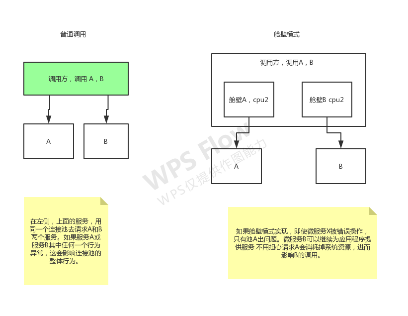
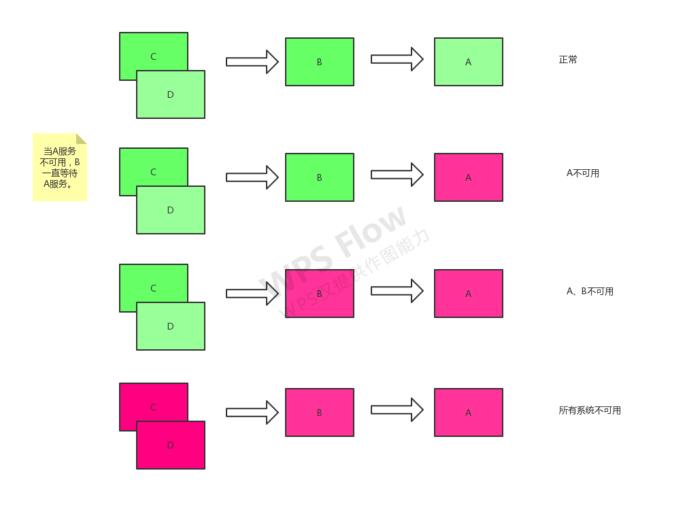
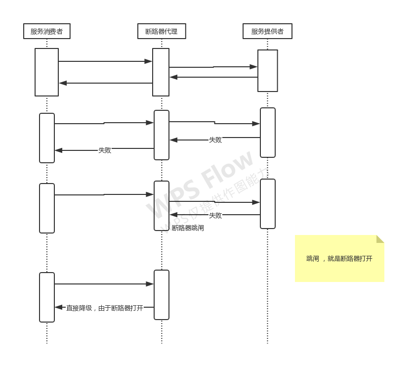
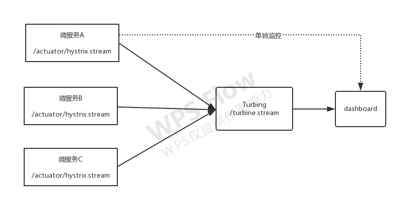
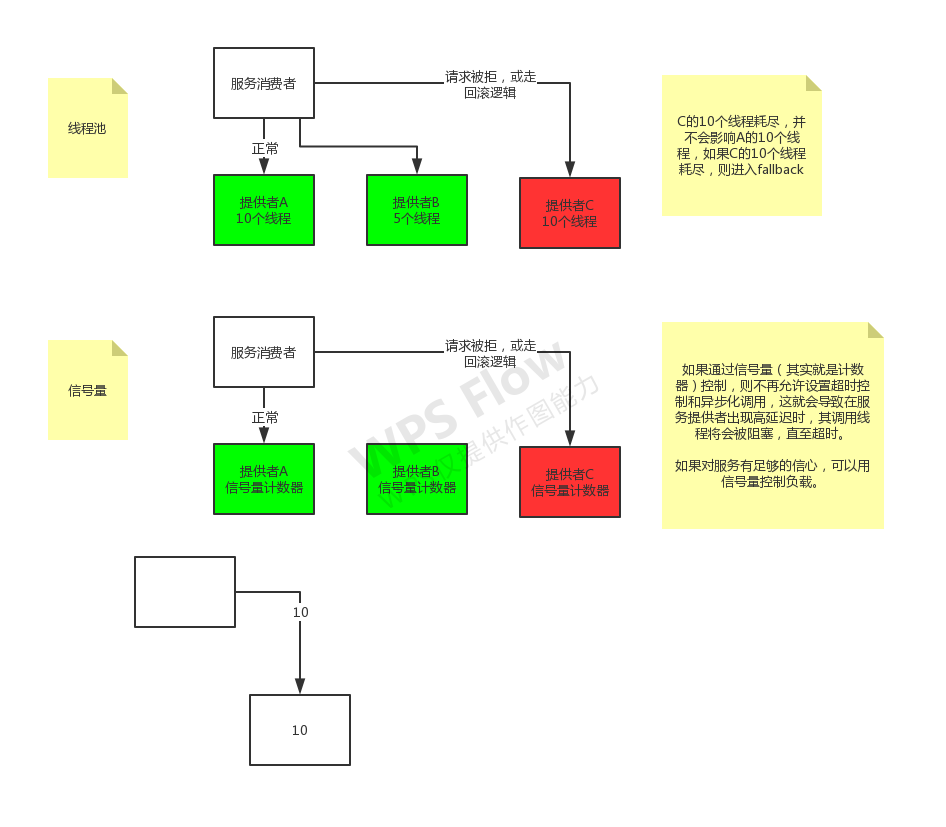
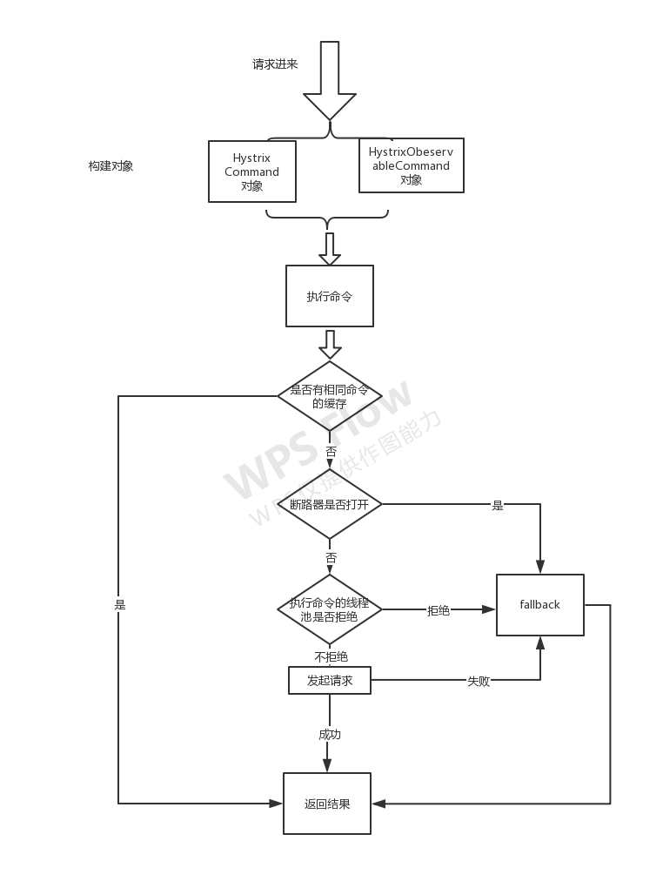

# 15 熔断

## 15.1 概念：

### 概述

前面我们学过：

Eureka实现了服务注册与发现

服务间调用。

Ribbon实现了客户端负载均衡

Feign实现了声明式 API调用

这节学习 微服务间的容错


​		在分布式系统下，微服务之间不可避免地会发生相互调用，但每个系统都无法百分之百保证自身运行不出问题。在服务调用中，很可能面临依赖服务失效的问题（网络延时，服务异常，负载过大无法及时响应）。因此需要一个组件，能提供强大的容错能力，为服务间调用提供保护和控制。


我们的目的：***当我自身 依赖的服务不可用时，服务自身不会被拖垮。防止微服务级联异常***。

图。


本质：就是隔离坏的服务，不让坏服务拖垮其他服务（调用坏服务的服务）。


比如：武汉发生疫情，隔离它，不让依赖于武汉的地方感染。

和我们课程中熔断降级更贴切一点：北京从武汉招聘大学生，武汉有疫情了，当北京去武汉请求大学生来的时候，武汉熔断，然后北京启动自身的备用逻辑：去上海找大学生（降级）。


### 舱壁模式

舱壁模式（Bulkhead）隔离了每个工作负载或服务的关键资源，如连接池、内存和CPU，硬盘。每个工作单元都有独立的 连接池，内存，CPU。

使用舱壁避免了单个服务消耗掉所有资源，从而导致其他服务出现故障的场景。
这种模式主要是通过防止由一个服务引起的级联故障来增加系统的弹性。


据说泰坦尼克原因：泰坦尼克号上有16个防水舱，设计可以保障如果只有4个舱进水，密闭和隔离可以阻止水继续进入下一个防水舱，从而保证船的基本浮力。

但是当时冰山从侧面划破了船体，从而导致有5个防水舱同时进水，而为了建造豪华的头等舱大厅，也就是电影里杰克和罗斯约会的地方，5号舱的顶部并未达到密闭所需要的高度，水就一层层进入了船体，隔离的失败导致了泰坦尼克的沉没。

> 舱壁模式

 

给我们的思路：可以对每个请求设置，单独的连接池，配置连接数，不要影响 别的请求。就像一个一个的防水舱。


对在公司中的管理也一样：给每个独立的 小组，分配独立的资源，比如产品，开发，测试。在小公司，大多数情况 这些资源都是共享的，有一个好处是充分利用资源，坏处是，如果一个项目延期，会影响别的项目推进。自己权衡利弊。

最近比较火的一句话： 真正的知识，是 产品提高一个等级和成本提高0.2元的 痛苦抉择。

### 雪崩效应

​		每个服务 发出一个HTTP请求都会 在 服务中 开启一个新线程。而下游服务挂了或者网络不可达，通常线程会阻塞住，直到Timeout。如果并发量多一点，这些阻塞的线程就会占用大量的资源，很有可能把自己本身这个微服务所在的机器资源耗尽，导致自己也挂掉。

​		如果服务提供者响应非常缓慢，那么服务消费者调用此提供者就会一直等待，直到提供者响应或超时。在高并发场景下，此种情况，如果不做任何处理，就会导致服务消费者的资源耗竭甚至整个系统的崩溃。一层一层的崩溃，导致所有的系统崩溃。

> 《雪崩示意图》

​		雪崩：由基础服务故障导致级联故障的现象。描述的是：提供者不可用 导致消费者不可用，并将不可用逐渐放大的过程。像滚雪球一样，不可用的服务越来越多。影响越来越恶劣。

 

雪崩三个流程：

服务提供者不可用

重试会导致网络流量加大，更影响服务提供者。

导致服务调用者不可用，由于服务调用者 一直等待返回，一直占用系统资源。

（不可用的范围 被逐步放大）


服务不可用原因：

服务器宕机

网络故障

宕机

程序异常

负载过大，导致服务提供者响应慢

缓存击穿导致服务超负荷运行


总之 ： 基础服务故障  导致 级联故障   就是  雪崩。


### 容错机制

1. 为网络请求设置超时。

   必须为网络请求设置超时。一般的调用一般在几十毫秒内响应。如果服务不可用，或者网络有问题，那么响应时间会变很长。长到几十秒。

   每一次调用，对应一个线程或进程，如果响应时间长，那么线程就长时间得不到释放，而线程对应着系统资源，包括CPU,内存，得不到释放的线程越多，资源被消耗的越多，最终导致系统崩溃。

   因此必须设置超时时间，让资源尽快释放。

2. 使用断路器模式。

   想一下家里的保险丝，跳闸。如果家里有短路或者大功率电器使用，超过电路负载时，就会跳闸，如果不跳闸，电路烧毁，波及到其他家庭，导致其他家庭也不可用。通过跳闸保护电路安全，当短路问题，或者大功率问题被解决，在合闸。

   自己家里电路，不影响整个小区每家每户的电路。

### 断路器

 		如果对某个微服务请求有大量超时（说明该服务不可用），再让新的请求访问该服务就没有意义，只会无谓的消耗资源。例如设置了超时时间1s，如果短时间内有大量的请求无法在1s内响应，就没有必要去请求依赖的服务了。

1. 断路器是对容易导致错误的操作的代理。这种代理能统计一段时间内的失败次数，并依据次数决定是正常请求依赖的服务还是直接返回。
2. 断路器可以实现快速失败，如果它在一段时间内检测到许多类似的错误（超时），就会在之后的一段时间，强迫对该服务的调用快速失败，即不再请求所调用的服务。这样对于消费者就无须再浪费CPU去等待长时间的超时。
3. 断路器也可自动诊断依赖的服务是否恢复正常。如果发现依赖的服务已经恢复正常，那么就会恢复请求该服务。通过重置时间来决定断路器的重新闭合。

   这样就实现了微服务的“自我修复”：当依赖的服务不可用时，打开断路器，让服务快速失败，从而防止雪崩。当依赖的服务恢复正常时，又恢复请求。

> 断路器开关时序图

 


```sh
第一次正常

第二次提供者异常

提供者多次异常后，断路器打开

后续请求，则直接降级，走备用逻辑。
```


​	断路器状态转换的逻辑：

```
关闭状态：正常情况下，断路器关闭，可以正常请求依赖的服务。

打开状态：当一段时间内，请求失败率达到一定阈值，断路器就会打开。服务请求不会去请求依赖的服务。调用方直接返回。不发生真正的调用。重置时间过后，进入半开模式。

半开状态：断路器打开一段时间后，会自动进入“半开模式”，此时，断路器允许一个服务请求访问依赖的服务。如果此请求成功(或者成功达到一定比例)，则关闭断路器，恢复正常访问。否则，则继续保持打开状态。

断路器的打开，能保证服务调用者在调用异常服务时，快速返回结果，避免大量的同步等待，减少服务调用者的资源消耗。并且断路器能在打开一段时间后继续侦测请求执行结果，判断断路器是否能关闭，恢复服务的正常调用。
```

> 《熔断.doc》《断路器开关时序图》《状态转换》


### 降级

为了在整体资源不够的时候，适当放弃部分服务，将主要的资源投放到核心服务中，待渡过难关之后，再重启已关闭的服务，保证了系统核心服务的稳定。当服务停掉后，自动进入fallback替换主方法。

用fallback方法代替主方法执行并返回结果，对失败的服务进行降级。当调用服务失败次数在一段时间内超过了断路器的阈值时，断路器将打开，不再进行真正的调用，而是快速失败，直接执行fallback逻辑。服务降级保护了服务调用者的逻辑。

```sh
熔断和降级：
共同点：
	1、为了防止系统崩溃，保证主要功能的可用性和可靠性。
	2、用户体验到某些功能不能用。
不同点：
	1、熔断由下级故障触发，主动惹祸。
	2、降级由调用方从负荷角度触发，无辜被抛弃。

```


19年春晚 百度 红包，凤巢的5万台机器熄火4小时，让给了红包。


### Hystrix

spring cloud 用的是 hystrix，是一个容错组件。

Hystrix实现了 超时机制和断路器模式。

Hystrix是Netflix开源的一个类库，用于隔离远程系统、服务或者第三方库，防止级联失败，从而提升系统的可用性与容错性。主要有以下几点功能：

1. 为系统提供保护机制。在依赖的服务出现高延迟或失败时，为系统提供保护和控制。
2. 防止雪崩。
3. 包裹请求：使用HystrixCommand（或HystrixObservableCommand）包裹对依赖的调用逻辑，每个命令在独立线程中运行。
4. 跳闸机制：当某服务失败率达到一定的阈值时，Hystrix可以自动跳闸，停止请求该服务一段时间。
5. 资源隔离：Hystrix为每个请求都的依赖都维护了一个小型线程池，如果该线程池已满，发往该依赖的请求就被立即拒绝，而不是排队等候，从而加速失败判定。防止级联失败。
6. 快速失败：Fail Fast。同时能快速恢复。侧重点是：（不去真正的请求服务，发生异常再返回），而是直接失败。
7. 监控：Hystrix可以实时监控运行指标和配置的变化，提供近实时的监控、报警、运维控制。
8. 回退机制：fallback，当请求失败、超时、被拒绝，或当断路器被打开时，执行回退逻辑。回退逻辑我们自定义，提供优雅的服务降级。
9. 自我修复：断路器打开一段时间后，会自动进入“半开”状态，可以进行打开，关闭，半开状态的转换。前面有介绍。


提问

## 15.2 Hystrix 使用

### hystrix独立使用脱离spring cloud

代码：study-hystrix项目，HelloWorldHystrixCommand类。看着类讲解。

关注点：

继承hystrixCommand

重写run

fallback（程序发生非HystrixBadRequestException异常，运行超时，熔断开关打开，线程池/信号量满了）

熔断（熔断机制相当于电路的跳闸功能，我们可以配置熔断策略为当请求错误比例在10s内>50%时，该服务将进入熔断状态，后续请求都会进入fallback。）

结果缓存（支持将一个请求结果缓存起来，下一个具有相同key的请求将直接从缓存中取出结果，减少请求开销。）


这个例子，只是独立使用hystrix，  通过这个例子，了解 hystrix 的运行逻辑。

使用了命令模式，底层是依靠切面拦截实现。

### 和restTemplate结合

在api-driver（服务消费端）中：

pom.xml

```sh
<!-- 引入hystrix依赖 -->
		<dependency>
			<groupId>org.springframework.cloud</groupId>
			<artifactId>spring-cloud-starter-netflix-hystrix</artifactId>
		</dependency>
```

启动类

```sh
@EnableCircuitBreaker
```

调用的方法上，通过使用@HystrixCommand，将方法纳入到hystrix监控中。

```sh
@HystrixCommand(fallbackMethod = "sendFail")

下面的service，功能只是：调用service-sms服务。
RestTemplateRequestServiceImpl中的smsSend
```


sendFail，此处需要注意：此方法的 请求参数和 返回参数 要和原方法一致。

```sh
	private ResponseResult sendFail(SmsSendRequest smsSendRequest) {
		
		//备用逻辑
		return ResponseResult.fail(-3, "熔断");
	}
```


正常调用：启动eureka-7900，service-sms 8002，api-driver。

测试点：

1. 访问sms是否正常。
2. 访问yapi：api-driver下：司机获取验证码。是否正常。
3. 停止service-sms。访问司机获取验证码，是否走备用逻辑。


两个注解@EnableCircuitBreaker，@EnableHystrix点进去看，其实一样。

点@EnableHystrix进去。


ps：配置：HystrixCommandProperties


写好方法封装restTemplate 请求的service。一般将HystrixCommand，写在此service。也可以扩大范围。


上面的例子中，如果不走熔断的备用方法，则，停止提供者时，会抛出500错误。


更多的配置：

点击@HystrixCommand 进去。可以看到很多配置项。

下面说一下：commandProperties。

https://github.com/Netflix/Hystrix/wiki/Configuration

打开官网，对比着看一下。

```sh
1、Execution：
用来控制HystrixCommand.run()的执行
具体意义：
execution.isolation.strategy：该属性用来设置HystrixCommand.run()执行的隔离策略。默认为THREAD。
execution.isolation.thread.timeoutInMilliseconds：该属性用来配置HystrixCommand执行的超时时间，单位为毫秒。
execution.timeout.enabled：该属性用来配置HystrixCommand.run()的执行是否启用超时时间。默认为true。
execution.isolation.thread.interruptOnTimeout：该属性用来配置当HystrixCommand.run()执行超时的时候是否要它中断。
execution.isolation.thread.interruptOnCancel：该属性用来配置当HystrixCommand.run()执行取消时是否要它中断。
execution.isolation.semaphore.maxConcurrentRequests：当HystrixCommand命令的隔离策略使用信号量时，该属性用来配置信号量的大小。当最大并发请求达到该设置值时，后续的请求将被拒绝。

2、Fallback：
用来控制HystrixCommand.getFallback()的执行
fallback.isolation.semaphore.maxConcurrentRequests：该属性用来设置从调用线程中允许HystrixCommand.getFallback()方法执行的最大并发请求数。当达到最大并发请求时，后续的请求将会被拒绝并抛出异常。
fallback.enabled：该属性用来设置服务降级策略是否启用，默认是true。如果设置为false，当请求失败或者拒绝发生时，将不会调用HystrixCommand.getFallback()来执行服务降级逻辑。

mock。

3、Circuit Breaker：用来控制HystrixCircuitBreaker的行为。
circuitBreaker.enabled：确定当服务请求命令失败时，是否使用断路器来跟踪其健康指标和熔断请求。默认为true。
circuitBreaker.requestVolumeThreshold：用来设置在滚动时间窗中，断路器熔断的最小请求数。例如，默认该值为20的时候，如果滚动时间窗（默认10秒）内仅收到19个请求，即使这19个请求都失败了，断路器也不会打开。
circuitBreaker.sleepWindowInMilliseconds：用来设置当断路器打开之后的休眠时间窗。休眠时间窗结束之后，会将断路器设置为“半开”状态，尝试熔断的请求命令，如果依然时候就将断路器继续设置为“打开”状态，如果成功，就设置为“关闭”状态。
circuitBreaker.errorThresholdPercentage：该属性用来设置断路器打开的错误百分比条件。默认值为50，表示在滚动时间窗中，在请求值超过requestVolumeThreshold阈值的前提下，如果错误请求数百分比超过50，就把断路器设置为“打开”状态，否则就设置为“关闭”状态。
circuitBreaker.forceOpen：该属性默认为false。如果该属性设置为true，断路器将强制进入“打开”状态，它会拒绝所有请求。该属性优于forceClosed属性。
circuitBreaker.forceClosed：该属性默认为false。如果该属性设置为true，断路器强制进入“关闭”状态，它会接收所有请求。如果forceOpen属性为true，该属性不生效。

4、Metrics：该属性与HystrixCommand和HystrixObservableCommand执行中捕获的指标相关。
metrics.rollingStats.timeInMilliseconds：该属性用来设置滚动时间窗的长度，单位为毫秒。该时间用于断路器判断健康度时需要收集信息的持续时间。断路器在收集指标信息时会根据设置的时间窗长度拆分成多个桶来累计各度量值，每个桶记录了一段时间的采集指标。例如，当为默认值10000毫秒时，断路器默认将其分成10个桶，每个桶记录1000毫秒内的指标信息。
metrics.rollingStats.numBuckets：用来设置滚动时间窗统计指标信息时划分“桶”的数量。默认值为10。
metrics.rollingPercentile.enabled：用来设置对命令执行延迟是否使用百分位数来跟踪和计算。默认为true，如果设置为false，那么所有的概要统计都将返回-1。
metrics.rollingPercentile.timeInMilliseconds：用来设置百分位统计的滚动窗口的持续时间，单位为毫秒。
metrics.rollingPercentile.numBuckets：用来设置百分位统计滚动窗口中使用桶的数量。
metrics.rollingPercentile.bucketSize：用来设置每个“桶”中保留的最大执行数。
metrics.healthSnapshot.intervalInMilliseconds：用来设置采集影响断路器状态的健康快照的间隔等待时间。

5、Request Context：涉及HystrixCommand使用HystrixRequestContext的设置。
requestCache.enabled：用来配置是否开启请求缓存。
requestLog.enabled：用来设置HystrixCommand的执行和事件是否打印到日志的HystrixRequestLog中。

```


通过下面例子，说一下配置方法。大家下去可以参考上面 看需要试试。

```sh
将下面  值  写成false
@HystrixCommand(fallbackMethod = "sendFail",ignoreExceptions = {HystrixIgnoreException.class},
	commandProperties = {
			@HystrixProperty(name = "fallback.enabled",value = "false")
			
	})

则请求，如果熔断，报500，

改成true，则走熔断逻辑。

测试点：
1.默认熔断走降级逻辑。
2.false后，报500.
3.改成true后，走降级逻辑。

```


### 和feign结合

api-passenger

上面的pom一样。

feign自带Hystrix，但是默认没有打开，首先打开Hystrix。(从Spring Cloud Dalston开始，feign的Hystrix 默认关闭，如果要用feign，必须开启)

```sh
feign:
  hystrix:
    enabled: true 
```

注解添加feignclient

```sh
@FeignClient(name = "service-sms",fallback = SmsClientFallback.class)
```

类，实现feignClient接口

```sh
import java.util.concurrent.TimeUnit;

import org.apache.commons.lang.StringUtils;
import org.springframework.beans.factory.annotation.Autowired;
import org.springframework.data.redis.core.StringRedisTemplate;
import org.springframework.stereotype.Component;

import com.online.taxi.common.dto.ResponseResult;
import com.online.taxi.common.dto.sms.SmsSendRequest;
import com.online.taxi.passenger.service.SmsClient;
/**
 * @author yueyi2019
 */
@Component
public class SmsClientFallback implements SmsClient {

	
	@Override
	public ResponseResult sendSms(SmsSendRequest smsSendRequest) {
		System.out.println("不好意思，我熔断了");
		
		return ResponseResult.fail(-3, "feign熔断");
	}

}
```

启动类

```sh
@EnableFeignClients
@EnableCircuitBreaker
```

正常调用：启动eureka-7900，service-sms 8002，api-passenger。

测试点：

1. 访问sms是否正常。

2. 访问yapi：api-passenger下：乘客获取验证码。是否正常。

3. 停止service-sms。访问乘客获取验证码，是否走备用逻辑。

4. 去掉yml中熔断改成false。  熔断是否生效。

   feign:

     hystrix:
       enabled: false 


### 所有（restTemplate和feign）配置默认值

HystrixCommandProperties

```sh
/* --------------统计相关------------------*/ 
// 统计滚动的时间窗口,默认:5000毫秒（取自circuitBreakerSleepWindowInMilliseconds）   
private final HystrixProperty metricsRollingStatisticalWindowInMilliseconds;   
// 统计窗口的Buckets的数量,默认:10个,每秒一个Buckets统计   
private final HystrixProperty metricsRollingStatisticalWindowBuckets; // number of buckets in the statisticalWindow   
// 是否开启监控统计功能,默认:true   
private final HystrixProperty metricsRollingPercentileEnabled;   
/* --------------熔断器相关------------------*/ 
// 熔断器在整个统计时间内是否开启的阀值，默认20。也就是在metricsRollingStatisticalWindowInMilliseconds（默认10s）内至少请求20次，熔断器才发挥起作用   
private final HystrixProperty circuitBreakerRequestVolumeThreshold;   
// 熔断时间窗口，默认:5秒.熔断器中断请求5秒后会进入半打开状态,放下一个请求进来重试，如果该请求成功就关闭熔断器，否则继续等待一个熔断时间窗口
private final HystrixProperty circuitBreakerSleepWindowInMilliseconds;   
//是否启用熔断器,默认true. 启动   
private final HystrixProperty circuitBreakerEnabled;   
//默认:50%。当出错率超过50%后熔断器启动
private final HystrixProperty circuitBreakerErrorThresholdPercentage;  
//是否强制开启熔断器阻断所有请求,默认:false,不开启。置为true时，所有请求都将被拒绝，直接到fallback 
private final HystrixProperty circuitBreakerForceOpen;   
//是否允许熔断器忽略错误,默认false, 不开启   
private final HystrixProperty circuitBreakerForceClosed; 
/* --------------信号量相关------------------*/ 
//使用信号量隔离时，命令调用最大的并发数,默认:10   
private final HystrixProperty executionIsolationSemaphoreMaxConcurrentRequests;   
//使用信号量隔离时，命令fallback(降级)调用最大的并发数,默认:10   
private final HystrixProperty fallbackIsolationSemaphoreMaxConcurrentRequests; 
/* --------------其他------------------*/ 
//使用命令调用隔离方式,默认:采用线程隔离,ExecutionIsolationStrategy.THREAD   
private final HystrixProperty executionIsolationStrategy;   
//使用线程隔离时，调用超时时间，默认:1秒   
private final HystrixProperty executionIsolationThreadTimeoutInMilliseconds;   
//线程池的key,用于决定命令在哪个线程池执行   
private final HystrixProperty executionIsolationThreadPoolKeyOverride;   
//是否开启fallback降级策略 默认:true   
private final HystrixProperty fallbackEnabled;   
// 使用线程隔离时，是否对命令执行超时的线程调用中断（Thread.interrupt()）操作.默认:true   
private final HystrixProperty executionIsolationThreadInterruptOnTimeout; 
// 是否开启请求日志,默认:true   
private final HystrixProperty requestLogEnabled;   
//是否开启请求缓存,默认:true   
private final HystrixProperty requestCacheEnabled; // Whether request caching is enabled. 
```

HystrixThreadPoolProperties

```sh
/* 配置线程池大小,默认值10个 */ 
private final HystrixProperty corePoolSize; 
/* 配置线程值等待队列长度,默认值:-1 建议值:-1表示不等待直接拒绝,测试表明线程池使用直接决绝策略+ 合适大小的非回缩线程池效率最高.所以不建议修改此值。 当使用非回缩线程池时，queueSizeRejectionThreshold,keepAliveTimeMinutes 参数无效 */
private final HystrixProperty maxQueueSize; 
```


### 捕获熔断的异常信息

1. restTemplate中：

在备用方法中 api-driver

```sh
	public ResponseResult sendFail(ShortMsgRequest shortMsgRequest,Throwable throwable) {
		log.info("异常信息："+throwable);
		//备用逻辑
		return ResponseResult.fail(-1, "熔断");
	}
```

加上一个Throwable，就Ok。

上面例子跑一便。停止服务提供者，测试结果如下：

```sh
2020-02-01 23:00:44.182  INFO [api-driver,f1100452d8b33b08,874b9cac5fe20385,true] 18088 --- [SmsController-1] c.o.t.driver.controller.SmsController    : 异常信息：java.lang.IllegalStateException: No instances available for SERVICE-SMS
```


不走异常，就走500方法。


2. feign中：

注解

```sh
@FeignClient(name = "service-sms",fallbackFactory = SmsClientFallbackFactory.class)

```

factory类

```sh
package com.online.taxi.passenger.fallback;

import org.springframework.stereotype.Component;

import com.online.taxi.common.dto.ResponseResult;
import com.online.taxi.common.dto.sms.SmsSendRequest;
import com.online.taxi.passenger.feign.SmsClient;

import feign.hystrix.FallbackFactory;

@Component
public class SmsClientFallbackFactory implements FallbackFactory<SmsClient> {

	@Override
	public SmsClient create(Throwable cause) {
		return new SmsClient() {
			
			@Override
			public ResponseResult sendSms(SmsSendRequest smsSendRequest) {
				System.out.println("feign异常："+cause);
				return ResponseResult.fail(-3, "feign fallback factory熔断");
			}
		};
	}

}

参数和返回值一样。匿名内部类。
```

测试点：

1. 启动eureka 7900，api-driver,是否走降级方法。

------


3. 忽略异常

有些情况下，提供者是好的，但在消费者发生业务异常时，我们不希望走熔断的备用方法。则用以下两个办法。

1. 第一种方式：继承HystrixBadRequestException

```sh
自定义异常，继承HystrixBadRequestException，当发生此异常时，不走备用方法。

public class BusinessException extends HystrixBadRequestException {
	
	private String message;
	
	public BusinessException(String message) {
		super(message);
		this.message = message;
	}
	
	/**
	 * 
	 */
	private static final long serialVersionUID = 1L;
	
}

在调用的地方前：
		// 下面是故意跑出异常代码
		try {
			int i = 1/0;
		} catch (Exception e) {
			// TODO: handle exception
			throw new BusinessException("熔断忽略的异常");
		}
```

2. 第二种方式：Hystrix属性配置。

```sh
配置属性：
@HystrixCommand(fallbackMethod = "sendFail",
   ignoreExceptions = {HystrixIgnoreException.class})

自定义异常：

public class HystrixIgnoreException extends RuntimeException {
	
	private String message;
	
	public HystrixIgnoreException(String message) {
		this.message = message;
	}
	
	/**
	 * 
	 */
	private static final long serialVersionUID = 1L;
	
}

此异常也不走备用逻辑。
```


### 禁用feign客户端的hystrix

为@feignclient单独配置Feign.Builder

配置类

```sh
@Configuration
@ExcudeFeignConfig
public class FeignDisableHystrixConfiguration {
	
	@Bean
	@Scope("prototype")
	public Feign.Builder feignBuilder(){
		return Feign.builder();
	}
}
```

注解

```sh
@FeignClient(name = "service-sms",configuration = FeignDisableHystrixConfiguration.class)

```

测试点：

启动eureka，api-passenger。测试发送验证码，是否走熔断。没走是正确，报500.


hystrix command 配置

```sh
@HystrixCommand(fallbackMethod = "sendFail",ignoreExceptions = {HystrixIgnoreException.class},
	commandProperties = {
			@HystrixProperty(name = "fallback.enabled",value = "true")
	})
```


------

第6节课完，2020.2.23

操作步骤：

1. 启动eureka7900，service-sms 8002，api-driver 9002，
2. 正常访问 yapi->api-driver->司机获取验证码。正常。查看开关，UP。

```sh
http://localhost:9002/actuator/health

hystrix: {
status: "UP"
}
```

3. 关闭 service-sms 8002。
4. 打开jemeter，（检查jmeter设置，api-driver设置日志为info。）设置1秒访问25次(默认10秒 20次，才开始熔断计算)。错误，熔断。查看开关.

```sh
http://localhost:9002/actuator/health

hystrix: {
status: "CIRCUIT_OPEN",
details: {
openCircuitBreakers: [
"RestTemplateRequestServiceImpl::smsSend"
]
}
}
```

5. 恢复UP。启动service-sms 8002,成功请求一次yapi中 司机发送验证码。查看开关。又变成了UP。


熔断计算：先10秒20次，再算错误次数超过阈值 50%。

小结：

1. 注意上面发生的异常信息：有下面不同的2种。

```sh
异常信息：java.lang.IllegalStateException: No instances available for service-sms

异常信息：java.lang.RuntimeException: Hystrix circuit short-circuited and is OPEN
```

2. 上节课开关不生效.

   原因：我最后讲 熔断忽略的异常时，走了忽略的异常，不走熔断。所以开关没打开。

   此次熔断触发的条件：1、走熔断处理，2、依赖服务停止。

   熔断恢复：1、底层服务启动，2、成功请求一次。


课下问题:

1. 两个eureka，彼此注册，为什么 连个eureka里面都有 彼此。1向2注册，2将1信息同步给1,2向1注册。
2. eureka server中的url和eureka client 中的url没关系。没必要一致。


### 断路器开关演示

在项目中引入

```sh
<dependency>
			<groupId>org.springframework.boot</groupId>
			<artifactId>spring-boot-starter-actuator</artifactId>
		</dependency>
```

访问健康地址：

```sh
http://localhost:9002/actuator/health
最开始：
hystrix: {
status: "UP"
}


HystrixCommandProperties   default_circuitBreakerRequestVolumeThreshold（在hyxtrix的properties中设置）
10秒内，20次失败（20 requests in 10 seconds），则断路器打开。
hystrix: {
status: "CIRCUIT_OPEN",
details: {
openCircuitBreakers: [
"SmsController::verifyCodeSend"
]
}
}
```


相关的配置，主要是10秒20次，失败率超过 50%。

```sh
Execution相关的属性的配置：
hystrix.command.default.execution.isolation.strategy 隔离策略，默认是Thread, 可选Thread｜Semaphore
thread 通过线程数量来限制并发请求数，可以提供额外的保护，但有一定的延迟。一般用于网络调用
semaphore 通过semaphore count来限制并发请求数，适用于无网络的高并发请求
hystrix.command.default.execution.isolation.thread.timeoutInMilliseconds 命令执行超时时间，默认1000ms
hystrix.command.default.execution.timeout.enabled 执行是否启用超时，默认启用true
hystrix.command.default.execution.isolation.thread.interruptOnTimeout 发生超时是是否中断，默认true
hystrix.command.default.execution.isolation.semaphore.maxConcurrentRequests 最大并发请求数，默认10，该参数当使用ExecutionIsolationStrategy.SEMAPHORE策略时才有效。如果达到最大并发请求数，请求会被拒绝。理论上选择semaphore size的原则和选择thread size一致，但选用semaphore时每次执行的单元要比较小且执行速度快（ms级别），否则的话应该用thread。
semaphore应该占整个容器（tomcat）的线程池的一小部分。

Fallback相关的属性
这些参数可以应用于Hystrix的THREAD和SEMAPHORE策略
hystrix.command.default.fallback.isolation.semaphore.maxConcurrentRequests 如果并发数达到该设置值，请求会被拒绝和抛出异常并且fallback不会被调用。默认10
hystrix.command.default.fallback.enabled 当执行失败或者请求被拒绝，是否会尝试调用hystrixCommand.getFallback() 。默认true

Circuit Breaker相关的属性
hystrix.command.default.circuitBreaker.enabled 用来跟踪circuit的健康性，如果未达标则让request短路。默认true
hystrix.command.default.circuitBreaker.requestVolumeThreshold 一个rolling window内最小的请求数。如果设为20，那么当一个rolling window的时间内（比如说1个rolling window是10秒）收到19个请求，即使19个请求都失败，也不会触发circuit break。默认20
hystrix.command.default.circuitBreaker.sleepWindowInMilliseconds 触发短路的时间值，当该值设为5000时，则当触发circuit break后的5000毫秒内都会拒绝request，也就是5000毫秒后才会关闭circuit。默认5000
hystrix.command.default.circuitBreaker.errorThresholdPercentage错误比率阀值，如果错误率>=该值，circuit会被打开，并短路所有请求触发fallback。默认50，即为50%。
hystrix.command.default.circuitBreaker.forceOpen 强制打开熔断器，如果打开这个开关，那么拒绝所有request，默认false
hystrix.command.default.circuitBreaker.forceClosed 强制关闭熔断器 如果这个开关打开，circuit将一直关闭且忽略circuitBreaker.errorThresholdPercentage

Metrics相关参数
hystrix.command.default.metrics.rollingStats.timeInMilliseconds 设置统计的时间窗口值的，毫秒值，circuit break 的打开会根据1个rolling window的统计来计算。若rolling window被设为10000毫秒，则rolling window会被分成n个buckets，每个bucket包含success，failure，timeout，rejection的次数的统计信息。默认10000
hystrix.command.default.metrics.rollingStats.numBuckets 设置一个rolling window被划分的数量，若numBuckets＝10，rolling window＝10000，那么一个bucket的时间即1秒。必须符合rolling window % numberBuckets == 0。默认10
hystrix.command.default.metrics.rollingPercentile.enabled 执行时是否enable指标的计算和跟踪，默认true
hystrix.command.default.metrics.rollingPercentile.timeInMilliseconds 设置rolling percentile window的时间，默认60000
hystrix.command.default.metrics.rollingPercentile.numBuckets 设置rolling percentile window的numberBuckets。逻辑同上。默认6
hystrix.command.default.metrics.rollingPercentile.bucketSize 如果bucket size＝100，window＝10s，若这10s里有500次执行，只有最后100次执行会被统计到bucket里去。增加该值会增加内存开销以及排序的开销。默认100
hystrix.command.default.metrics.healthSnapshot.intervalInMilliseconds 记录health 快照（用来统计成功和错误绿）的间隔，默认500ms
    
```


### 熔断强制配置

此处配置强制走熔断方法。。

api-driver中RestTemplateRequestServiceImpl

```sh
例子：
@HystrixCommand(fallbackMethod = "sendFail",ignoreExceptions = {HystrixIgnoreException.class},
	commandProperties = {
			@HystrixProperty(name = "fallback.enabled",value = "true"),
			@HystrixProperty(name = "circuitBreaker.forceOpen",value = "true")
			
	})
演示一下。
```

测试点：启动eureka，service-sms，api-driver

1. 访问直接熔断。

2. 将circuitBreaker.forceOpen改成false，正常返回，（默认为false）

3. 观察异常信息。

   ```sh
   异常信息：java.lang.RuntimeException: Hystrix circuit short-circuited and is OPEN
   ```

   


### 开关例子

HelloWorldHystrixCommand2


```sh
调用次数:1   结果:熔断：fallback,name:testCircuitBreaker 开关是否打开: false
调用次数:2   结果:熔断：fallback,name:testCircuitBreaker 开关是否打开: false
调用次数:3   结果:熔断：fallback,name:testCircuitBreaker 开关是否打开: false
调用次数:4   结果:熔断：fallback,name:testCircuitBreaker 开关是否打开: false
调用次数:5   结果:正常调用 Hello testCircuitBreaker 开关是否打开: false
调用次数:6   结果:正常调用 Hello testCircuitBreaker 开关是否打开: false
调用次数:7   结果:熔断：fallback,name:testCircuitBreaker 开关是否打开: false
调用次数:8   结果:熔断：fallback,name:testCircuitBreaker 开关是否打开: false
调用次数:9   结果:熔断：fallback,name:testCircuitBreaker 开关是否打开: false
调用次数:10   结果:熔断：fallback,name:testCircuitBreaker 开关是否打开: true
调用次数:11   结果:熔断：fallback,name:testCircuitBreaker 开关是否打开: true
调用次数:12   结果:熔断：fallback,name:testCircuitBreaker 开关是否打开: true
调用次数:13   结果:熔断：fallback,name:testCircuitBreaker 开关是否打开: true
调用次数:14   结果:熔断：fallback,name:testCircuitBreaker 开关是否打开: true
调用次数:15   结果:熔断：fallback,name:testCircuitBreaker 开关是否打开: true
调用次数:16   结果:熔断：fallback,name:testCircuitBreaker 开关是否打开: true
调用次数:17   结果:熔断：fallback,name:testCircuitBreaker 开关是否打开: true
调用次数:18   结果:熔断：fallback,name:testCircuitBreaker 开关是否打开: true
调用次数:19   结果:熔断：fallback,name:testCircuitBreaker 开关是否打开: true
调用次数:20   结果:正常调用 Hello testCircuitBreaker 开关是否打开: false
调用次数:21   结果:正常调用 Hello testCircuitBreaker 开关是否打开: false
调用次数:22   结果:正常调用 Hello testCircuitBreaker 开关是否打开: false
调用次数:23   结果:正常调用 Hello testCircuitBreaker 开关是否打开: false
调用次数:24   结果:熔断：fallback,name:testCircuitBreaker 开关是否打开: false
调用次数:25   结果:熔断：fallback,name:testCircuitBreaker 开关是否打开: false
调用次数:26   结果:正常调用 Hello testCircuitBreaker 开关是否打开: false
调用次数:27   结果:熔断：fallback,name:testCircuitBreaker 开关是否打开: false
调用次数:28   结果:正常调用 Hello testCircuitBreaker 开关是否打开: false
调用次数:29   结果:熔断：fallback,name:testCircuitBreaker 开关是否打开: true
调用次数:30   结果:熔断：fallback,name:testCircuitBreaker 开关是否打开: true
```

细看日志从里面找规律


1. 第10次，熔断开关才打开。之前的 异常 虽然也报错，但是开关没开。（10秒，9次）默认：10秒，20次。
2. 后面有10-19次，总计5秒钟，因为我们设置程序 500毫秒执行。开关一直打开，都走的熔断。（开关打开）
3. 第20次，距离第一次熔断过去了 5秒钟。断路器尝试放开一部分请求过去，正常了就关闭开关。（如果正常，开关关闭，否则，不关闭）
4. 第29次，开关又打开。又到了下一个周期。


### 监控


在服务消费端 api-driver，配置actuator,jar

```sh
<dependency>
	<groupId>org.springframework.boot</groupId>
	<artifactId>spring-boot-starter-actuator</artifactId>
</dependency>
```

通过event-stream暴露出来的。hystrix的jar包已经包含了下面这个jar包。

```sh
没必要配。
<dependency>
				<groupId>com.netflix.hystrix</groupId>
				<artifactId>hystrix-metrics-event-stream</artifactId>
				<version>${hystrix.version}</version>
				<exclusions>
					<exclusion>
						<groupId>javax.servlet</groupId>
						<artifactId>servlet-api</artifactId>
					</exclusion>
				</exclusions>
			</dependency>
```

启动 eureka 7900，api-driver 9002，service-sms 8002。

地址：

```sh
api-driver
http://localhost:9002/actuator/hystrix.stream

访问，会看到页面一直在ping。

ping: 

data: {"type":"HystrixCommand","name":"SmsClient#sendSms(SmsSendRequest)","group":"service-sms","currentTime":1581931881830,"isCircuitBreakerOpen":false,"errorPercentage":0,"errorCount":0,"requestCount":1,"rollingCountBadRequests":0,"rollingCountCollapsedRequests":0,"rollingCountEmit":0,"rollingCountExceptionsThrown":0,"rollingCountFailure":0,"rollingCountFallbackEmit":0,"rollingCountFallbackFailure":0,"rollingCountFallbackMissing":0,"rollingCountFallbackRejection":0,"rollingCountFallbackSuccess":0,"rollingCountResponsesFromCache":0,"rollingCountSemaphoreRejected":0,"rollingCountShortCircuited":0,"rollingCountSuccess":0,"rollingCountThreadPoolRejected":0,"rollingCountTimeout":0,"currentConcurrentExecutionCount":0,"rollingMaxConcurrentExecutionCount":0,"latencyExecute_mean":0,"latencyExecute":{"0":0,"25":0,"50":0,"75":0,"90":0,"95":0,"99":0,"99.5":0,"100":0},"latencyTotal_mean":0,"latencyTotal":{"0":0,"25":0,"50":0,"75":0,"90":0,"95":0,"99":0,"99.5":0,"100":0},"propertyValue_circuitBreakerRequestVolumeThreshold":20,"propertyValue_circuitBreakerSleepWindowInMilliseconds":5000,"propertyValue_circuitBreakerErrorThresholdPercentage":50,"propertyValue_circuitBreakerForceOpen":false,"propertyValue_circuitBreakerForceClosed":false,"propertyValue_circuitBreakerEnabled":true,"propertyValue_executionIsolationStrategy":"THREAD","propertyValue_executionIsolationThreadTimeoutInMilliseconds":1000,"propertyValue_executionTimeoutInMilliseconds":1000,"propertyValue_executionIsolationThreadInterruptOnTimeout":true,"propertyValue_executionIsolationThreadPoolKeyOverride":null,"propertyValue_executionIsolationSemaphoreMaxConcurrentRequests":10,"propertyValue_fallbackIsolationSemaphoreMaxConcurrentRequests":10,"propertyValue_metricsRollingStatisticalWindowInMilliseconds":10000,"propertyValue_requestCacheEnabled":true,"propertyValue_requestLogEnabled":true,"reportingHosts":1,"threadPool":"service-sms"}

data: {"type":"HystrixThreadPool","name":"service-sms","currentTime":1581931881830,"currentActiveCount":0,"currentCompletedTaskCount":1,"currentCorePoolSize":10,"currentLargestPoolSize":1,"currentMaximumPoolSize":10,"currentPoolSize":1,"currentQueueSize":0,"currentTaskCount":1,"rollingCountThreadsExecuted":0,"rollingMaxActiveThreads":0,"rollingCountCommandRejections":0,"propertyValue_queueSizeRejectionThreshold":5,"propertyValue_metricsRollingStatisticalWindowInMilliseconds":10000,"reportingHosts":1}

```

测试点：

重新 启动eureka7900，service-sms,api-driver

api-driver方。（此时注意，如果熔断了，查看forceOpen）

1. 访问http://localhost:9002/actuator/hystrix.stream。
2. 不发起任何请求，观察页面。一直ping。
3. 发起正常请求（发送验证码），观察页面。ping回来data。查看data。
4. 关闭service-sms，访问（jemeter）。查看data。在页面中搜索："isCircuitBreakerOpen":true


feign和ribbon在这个点上是一样的操作。


### 可视化

上面的操作有点原始，刀耕火种。下面可视化。

项目：hystrix-dashboard

pom

```sh
<dependency>
			<groupId>org.springframework.cloud</groupId>
			<artifactId>spring-cloud-starter-netflix-hystrix-dashboard</artifactId>
		</dependency>
```

启动类

```sh
@EnableHystrixDashboard
```


使用 重新启动eureka7900，service-sms,api-driver

访问：http://localhost:6101/hystrix

输入：上面的地址：http://localhost:9002/actuator/hystrix.stream

停止 service-sms 8002 只留 eureka 7900和api-driver 9002

再发一次25次 jmeter。

查看面板，注意面板变化。


面板说明：

github：https://github.com/Netflix-Skunkworks/hystrix-dashboard

解释：https://github.com/Netflix-Skunkworks/hystrix-dashboard/wiki

> 《熔断》


无需纠结它只能监控10秒的信息，因为如果出问题，会一直报问题。


### 集中可视化

上面的方法只能监控一个服务。实际生产中不方便。

> 《Turbine原理》

 

下面接着改造。


创建study-hystrix-turbine

pom

```sh
<dependency>
			<groupId>org.springframework.cloud</groupId>
			<artifactId>spring-cloud-starter-netflix-turbine</artifactId>
</dependency>
<!-- eureka客户端 -->
        <dependency>
            <groupId>org.springframework.cloud</groupId>
            <artifactId>spring-cloud-starter-netflix-eureka-client</artifactId>
        </dependency>
```

yml

```sh
turbine:
  app-config: api-driver,api-passenger
  cluster-name-expression: "'default'"
```

启动类

```sh
@EnableTurbine
```

地址：http://localhost:6102/turbine.stream,也是一直ping，相当于原来的hystrix.stream,不过此处是综合了所有的项目。

启动hystrix-dashboard。

访问：http://localhost:6101/hystrix

填上上面的地址：http://localhost:6102/turbine.stream


此时注意测试api-driver,api-passenger两个服务。在《熔断中有效果》

停一下service-sms，看界面。


## 15.3 原理

了解前面一些概念：舱壁模式，命令模式（下面），雪崩，容错，断路器，降级。

熔断降级：北京去武汉招大学生的例子。

资源隔离：类似于高铁高架桥，并不是一个整体，而是一块一块的拼装的，一段路坏了，不会影响整条路。


### 隔离策略

概念中的舱壁模式。想一下货船上，每个货仓中间的隔离。两个好处：

1. 服务提供者高延迟或异常，不会影响到整个系统的失败。
2. 能够控制每个调用者的并发度。因为有独立的线程池。


两种线程隔离策略：线程池（默认）、信号量。

> 《Hystrix隔离策略》

 

@HystrixCommand注释修饰一个服务时，HystrixCommand的运行逻辑有可能是在该请求的主线程上一并执行，也有可能是单独起一个线程来执行，这取决于我们如何设置Hystrix线程的隔离策略。
execution.isolation.strategy属性就是用来设置HystrixCommand.run()执行的隔离策略的。（回忆上面讲过的配置，设置线程策略的）


两种隔离策略：线程隔离和信号量隔离，即“THREAD”和“SEMAPHORE”，系统默认为“THREAD”。
它们的含义是：

THREAD(线程隔离）：使用该方式，HystrixCommand将会在单独的线程上执行，并发请求受线程池中线程数量的限制。不同服务通过使用不同线程池，彼此间将不受影响，达到隔离效果。

此种隔离方式：将调用服务线程与服务访问的执行线程分割开来，调用线程能够空出来去做其他工作，而不至于因为服务调用的执行，阻塞过长时间。

hystrix将使用独立的线程池对应每一个服务提供者，用于隔离和限制这些服务。于是某个服务提供者的高延迟或者资源受限只会发生在该服务提供者对应的线程池中。


SEMAPHORE（信号量隔离）：其实就是个计数器，使用该方式，HystrixCommand将会在调用线程上执行，通过信号量限制单个服务提供者的并发量，开销相对较小（因为不用那么多线程池），并发请求受到信号量个数的限制。 线程隔离会带来线程开销，有些场景（比如无网络请求场景）可能会因为用开销换隔离得不偿失，为此hystrix提供了信号量隔离，当服务的并发数大于信号量阈值时将进入fallback。


Hystrix中默认并且推荐使用线程隔离（THREAD)， 
一般来说，只有当调用负载异常高时（例如每个实例每秒调用数百次）才需要信号量隔离，因为这种场景下使用THREAD开销会比较高。信号量隔离一般仅适用于非网络调用的隔离。 


正常情况下，默认为线程隔离, 保持默认即可。


取舍：

线程池和信号量都支持熔断和限流。相比线程池，信号量不需要线程切换，因此避免了不必要的开销。但是信号量不支持异步，也不支持超时，也就是说当所请求的服务不可用时，信号量会控制超过限制的请求立即返回，但是已经持有信号量的线程只能等待服务响应或从超时中返回，即可能出现长时间等待。线程池模式下，当超过指定时间未响应的服务，Hystrix会通过响应中断的方式通知线程立即结束并返回。


### Hystrix实现思路

1. 请求过来时，将请求的远程调用逻辑，封装到HystrixCommand或者HystrixObservableCommand对象（并在构造方法配置请求被执行需要的参数）中，这些远程调用将会在独立的线程中执行。（资源隔离、命令模式）。

   ```sh
   https://www.runoob.com/design-pattern/command-pattern.html
   介绍
   意图：将一个请求封装成一个对象，从而使您可以用不同的请求对客户进行参数化。
   
   主要解决：在软件系统中，行为请求者与行为实现者通常是一种紧耦合的关系，但某些场合，比如需要对行为进行记录、撤销或重做、事务等处理时，这种无法抵御变化的紧耦合的设计就不太合适。
   
   何时使用：在某些场合，比如要对行为进行"记录、撤销/重做、事务"等处理，这种无法抵御变化的紧耦合是不合适的。在这种情况下，如何将"行为请求者"与"行为实现者"解耦？将一组行为抽象为对象，可以实现二者之间的松耦合。
   
   如何解决：通过调用者调用接受者执行命令，顺序：调用者→接受者→命令。
   
   关键代码：定义三个角色：1、received 真正的命令执行对象 2、Command 3、invoker 使用命令对象的入口
   
   应用实例：struts 1 中的 action 核心控制器 ActionServlet 只有一个，相当于 Invoker，而模型层的类会随着不同的应用有不同的模型类，相当于具体的 Command。
   
   优点： 1、降低了系统耦合度。 2、新的命令可以很容易添加到系统中去。
   
   缺点：使用命令模式可能会导致某些系统有过多的具体命令类。
   
   使用场景：认为是命令的地方都可以使用命令模式，比如： 1、GUI 中每一个按钮都是一条命令。 2、模拟 CMD。
   
   注意事项：系统需要支持命令的撤销(Undo)操作和恢复(Redo)操作，也可以考虑使用命令模式，见命令模式的扩展。
   ```

   

   

2. Hystrix对访问耗时超过设置阈值的请求采用自动超时的策略。该策略对所有的命令都有效。（如果是信号量隔离方式，则此特性失效），超时的阈值可以通过命令配置进行自定义。

3. 为每个服务提供者维护一个线程池（信号量），当线程池（信号量）被占满时，对于该服务提供者的请求将会被直接拒绝（快速失败，走回滚）而不是排队等待，减少系统等待资源。

4. 针对请求服务提供者划分出成功、失效、超时和线程池被占满等情况。

5. 断路器将在请求服务提供者失败次数超过一定阈值后手动或自动切断服务一段时间。

6. 当请求服务提供者出现服务拒绝、超时和 短路（多个服务提供者依次顺序请求，前面的服务提供者请求失败，后面的请求将不再发出）等情况，执行器fallback方法，服务降级。

7. 提供近乎实时的监控和配置变更服务。

   

### hystrix实现流程

1. 构建HystrixCommand或者HystrixObservableCommand对象，用于封装请求，并在构造方法配置请求被执行需要的参数。

2. 执行命令，Hystrix提供了4种执行命令的方法。

3. 检查是否有相同命令执行的缓存，若启用了缓存，且缓存可用，直接使用缓存响应请求。Hystrix支持请求缓存，但需要用户自定义启动。

4. 检查断路器是否打开，如果打开走 第8步。

5. 检查线程池或者信号量是否被消耗完，如果已满，走第8步。

6. 调用HystrixCommand的run 或者 HystrixObservableCommand的construct 执行被封装的调用逻辑，如果执行失败或超时，走第8步。

7. 计算链路的健康情况

8. 在命令执行失败时获取fallback逻辑。

9. 返回响应。

   > 《断路器整体流程》

 

## 15.4 源码

debug时，注意上面类名的变化。

### 包裹请求

@HystrixCommand，用此注解来包装需要保护的远程调用方法。

```sh
public @interface HystrixCommand {

    /**
     * The command group key is used for grouping together commands such as for reporting,
     * alerting, dashboards or team/library ownership.
     * <p/>
     * default => the runtime class name of annotated method
     *
     * @return group key
     */
     命令分组键：被此注解修饰的命令被归为一组，默认组名：类名。用于报告，预警，面板展示
    String groupKey() default "";

    /**
     * Hystrix command key.
     * <p/>
     * default => the name of annotated method. for example:
     * <code>
     *     ...
     *     @HystrixCommand
     *     public User getUserById(...)
     *     ...
     *     the command name will be: 'getUserById'
     * </code>
     *
     * @return command key
     */
     命令键：默认为注解的方法名，用于区分不同的方法。
    String commandKey() default "";

    /**
     * The thread-pool key is used to represent a
     * HystrixThreadPool for monitoring, metrics publishing, caching and other such uses.
     *
     * @return thread pool key
     */
     线程池键，用来指定执行命令的 hystrixThreadPool
    String threadPoolKey() default "";

    /**
     * Specifies a method to process fallback logic.
     * A fallback method should be defined in the same class where is HystrixCommand.
     * Also a fallback method should have same signature to a method which was invoked as hystrix command.
     * for example:
     * <code>
     *      @HystrixCommand(fallbackMethod = "getByIdFallback")
     *      public String getById(String id) {...}
     *
     *      private String getByIdFallback(String id) {...}
     * </code>
     * Also a fallback method can be annotated with {@link HystrixCommand}
     * <p/>
     * default => see {@link com.netflix.hystrix.contrib.javanica.command.GenericCommand#getFallback()}
     *
     * @return method name
     */
     回调方法名
    String fallbackMethod() default "";

    /**
     * Specifies command properties.
     *
     * @return command properties
     */
     自定义命令相关配置。我们前面讲过有例子
    HystrixProperty[] commandProperties() default {};

    /**
     * Specifies thread pool properties.
     *
     * @return thread pool properties
     */
     自定义线程池相关配置，
    HystrixProperty[] threadPoolProperties() default {};

    /**
     * Defines exceptions which should be ignored.
     * Optionally these can be wrapped in HystrixRuntimeException if raiseHystrixExceptions contains RUNTIME_EXCEPTION.
     *
     * @return exceptions to ignore
     */
     自定义忽略的异常
    Class<? extends Throwable>[] ignoreExceptions() default {};

    /**
     * Specifies the mode that should be used to execute hystrix observable command.
     * For more information see {@link ObservableExecutionMode}.
     *
     * @return observable execution mode
     */
    ObservableExecutionMode observableExecutionMode() default ObservableExecutionMode.EAGER;

    /**
     * When includes RUNTIME_EXCEPTION, any exceptions that are not ignored are wrapped in HystrixRuntimeException.
     *
     * @return exceptions to wrap
     */
    HystrixException[] raiseHystrixExceptions() default {};

    /**
     * Specifies default fallback method for the command. If both {@link #fallbackMethod} and {@link #defaultFallback}
     * methods are specified then specific one is used.
     * note: default fallback method cannot have parameters, return type should be compatible with command return type.
     *
     * @return the name of default fallback method
     */
    String defaultFallback() default "";
}
```

上面的配置，我们大部分情况仅需要关注fallbackMethod，看注释中关于fallback方法的说明，如果需要对线程池和和命令有特殊要求，可进行额外配置，其实99%不需要配置。


HystrixCommandAspect切面

被注解@HystrixCommand修饰的方法，会被HystrixCommand包装执行，通过切面来实现。

```sh
com.netflix.hystrix.contrib.javanica.aop.aspectj.HystrixCommandAspect

定义切面
@Around("hystrixCommandAnnotationPointcut() || hystrixCollapserAnnotationPointcut()")
    public Object methodsAnnotatedWithHystrixCommand(final ProceedingJoinPoint joinPoint) throws Throwable {
    
主要地方：
备注：
（
@Pointcut("@annotation(com.netflix.hystrix.contrib.javanica.annotation.HystrixCommand)")

    public void hystrixCommandAnnotationPointcut() {
    }
 ）   
    
此方法主要：构建了MetaHolder（请求必要的信息）,在此方法第一行（Method method = getMethodFromTarget(joinPoint);）打断点。 
鼠标放到joinPoint上面看内容：execution(ResponseResult com.online.taxi.driver.service.impl.RestTemplateRequestServiceImpl.smsSend(SmsSendRequest))

鼠标放上去，查看metaHolder
观察hystrixCommand。

构建MetaHolder
根据MetaHolder构建合适的HystrixCommand
委托CommandExecutor执行HystrixCommand
得到结果

此方法中：
Object result;
        try {
            if (!metaHolder.isObservable()) {
                result = CommandExecutor.execute(invokable, executionType, metaHolder);
            } else {
                result = executeObservable(invokable, executionType, metaHolder);
            }
        } catch (HystrixBadRequestException e) {
            throw e.getCause();
        } catch (HystrixRuntimeException e) {
            throw hystrixRuntimeExceptionToThrowable(metaHolder, e);
        }
此处判断是用HystrixCommand还是HystrixObservableCommand，执行HystrixCommand命令执行。
HystrixCommand：同步，异步执行。
HystrixObservableCommand: 异步回调执行（响应式）。


```


MetaHolder 持有用于构建HystrixCommand和与被包装方法相关的必要信息，如被注解的方法，失败回滚执行的方法等

```sh
com.netflix.hystrix.contrib.javanica.command.MetaHolder

    private final HystrixCollapser hystrixCollapser;
    private final HystrixCommand hystrixCommand;
    private final DefaultProperties defaultProperties;

    private final Method method;被注解的方法。
    private final Method cacheKeyMethod;
    private final Method ajcMethod;
    private final Method fallbackMethod;失败回滚执行的方法。
    private final Object obj;
    private final Object proxyObj;
    private final Object[] args;
    private final Closure closure;
    private final String defaultGroupKey;默认的group键
    private final String defaultCommandKey;默认的命令键
    private final String defaultCollapserKey;合并请求键
    private final String defaultThreadPoolKey;线程池 键
    private final ExecutionType executionType;执行类型
    private final boolean extendedFallback;
    private final ExecutionType collapserExecutionType;
    private final ExecutionType fallbackExecutionType;
    private final boolean fallback;
    private boolean extendedParentFallback;
    private final boolean defaultFallback;
    private final JoinPoint joinPoint;
    private final boolean observable;
    private final ObservableExecutionMode observableExecutionMode;
```


创建HystrixCommand方法如下

```sh
com.netflix.hystrix.contrib.javanica.command.HystrixCommandFactory

    public HystrixInvokable create(MetaHolder metaHolder) {
        HystrixInvokable executable;
        if (metaHolder.isCollapserAnnotationPresent()) {
            executable = new CommandCollapser(metaHolder);
            根据metaHolder.isObservable()来判断，是生成HystrixCommand还是HystrixObservableCommand。
        } else if (metaHolder.isObservable()) {
            executable = new GenericObservableCommand(HystrixCommandBuilderFactory.getInstance().create(metaHolder));
        } else {
            executable = new GenericCommand(HystrixCommandBuilderFactory.getInstance().create(metaHolder));
        }
        return executable;
    }
 
 点击GenericObservableCommand（异步回调执行，也就是响应式）和GenericCommand（同步，异步执行）进去，查看父类发现HystrixObservableCommand和HystrixCommand。
```


ExecutionType

```sh
/**
     * Used for asynchronous execution of command.
     */
    ASYNCHRONOUS,异步

    /**
     * Used for synchronous execution of command.
     */
    SYNCHRONOUS,同步

    /**
     * Reactive execution (asynchronous callback).
     */
    OBSERVABLE;异步回调

    /**
     * Gets execution type for specified class type.
     * @param type the type
     * @return the execution type {@link ExecutionType}
     */
    public static ExecutionType getExecutionType(Class<?> type) {
        if (Future.class.isAssignableFrom(type)) {
            return ExecutionType.ASYNCHRONOUS;
        } else if (Observable.class.isAssignableFrom(type)) {
            return ExecutionType.OBSERVABLE;
        } else {
            return ExecutionType.SYNCHRONOUS;
        }
    }
    
根据被包装方法的返回值类型觉得命令执行的ExecutionType，从而（通过上面代码块中的一步）决定构建HystrixCommand   还是 HystrixObservableCommand。 
方法的返回值为Future：异步执行，rx类型：异步回调，其他类型：同步执行。

@HystrixCommand
public Future<T> find(){}
```

debug到：

```sh
HystrixCommandAspect类中。
create方法。

HystrixCommand hystrixCommand = method.getAnnotation(HystrixCommand.class);
            ExecutionType executionType = ExecutionType.getExecutionType(method.getReturnType());
            
可以看到命令是同步还是异步，又方法的返回值决定。            
```


命令模式在此的应用

```sh
HystrixInvokable是被HystrixCommand标记的接口，继承了它的类，都是可以被执行的HystrixCommand。提供具体方法的为HystrixExecutable。
```


主要的2个类

```sh
public abstract class HystrixCommand<R> extends AbstractCommand<R>

public abstract class HystrixObservableCommand<R> extends AbstractCommand<R>
```

queue和execute

```sh
public abstract class HystrixCommand<R> extends AbstractCommand<R>的下面的方法，
 public Future<R> queue() {
 
 回想study-hystrix中queue的说明，异步执行。execute同步执行。
```


### 断路器

```sh
断路器核心接口：
com.netflix.hystrix.HystrixCircuitBreaker

一个Command key （也就是method）对应一个HystrixCircuitBreaker。

public boolean allowRequest();//是否允许命令执行

public boolean isOpen();//断路器是否打开（开关）

void markSuccess();//在半开状态时，执行成功反馈。将半开转为关闭。

void markNonSuccess();//在半开状态时，执行失败反馈。将半开转为打开。

实现类：HystrixCircuitBreakerImpl
@Override
        public boolean allowRequest() {
            if (properties.circuitBreakerForceOpen().get()) {
                return false;
            }
            if (properties.circuitBreakerForceClosed().get()) {
                return true;
            }
            if (circuitOpened.get() == -1) {
                return true;
            } else {
                if (status.get().equals(Status.HALF_OPEN)) {
                    return false;
                } else {
                    return isAfterSleepWindow();
                }
            }
        }

此处有强制打开，强制关闭，可以通过配置更改。

上面有测试例子（断路器开关强制配置）。	
```


### 统计命令

```sh
com.netflix.hystrix.HystrixMetrics

HystrixCommandMetrics是上面的子类
在断路器的isOpen等方法中，均有对HealthCount的数量的计算，来判断断路器状态：
public boolean isOpen() {
            if (circuitOpen.get()) {
                // if we're open we immediately return true and don't bother attempting to 'close' ourself as that is left to allowSingleTest and a subsequent successful test to close
                return true;
            }

            // we're closed, so let's see if errors have made us so we should trip the circuit open
            HealthCounts health = metrics.getHealthCounts();

            // check if we are past the statisticalWindowVolumeThreshold
            if (health.getTotalRequests() < properties.circuitBreakerRequestVolumeThreshold().get()) {
                // we are not past the minimum volume threshold for the statisticalWindow so we'll return false immediately and not calculate anything
                return false;
            }

            if (health.getErrorPercentage() < properties.circuitBreakerErrorThresholdPercentage().get()) {
                return false;
            } else {
                // our failure rate is too high, trip the circuit
                if (circuitOpen.compareAndSet(false, true)) {
                    // if the previousValue was false then we want to set the currentTime
                    circuitOpenedOrLastTestedTime.set(System.currentTimeMillis());
                    return true;
                } else {
                    // How could previousValue be true? If another thread was going through this code at the same time a race-condition could have
                    // caused another thread to set it to true already even though we were in the process of doing the same
                    // In this case, we know the circuit is open, so let the other thread set the currentTime and report back that the circuit is open
                    return true;
                }
            }
        }

统计数据：
public static class HealthCounts {
        private final long totalCount;执行总数
        private final long errorCount;失败数
        private final int errorPercentage;失败百分比

用滑动窗口的方式统计，一个滑动窗口又划分为几个bucket（滑动窗口时间和bucket成整数倍关系），滑动窗口的移动，以bucket为单位，每个bucket仅统计该时间间隔内的请求数据。，最后将所有窗口中的bucket进行聚合。

```


失败回滚

```sh
AbstractCommand的方法executeCommandAndObserve的局部变量：handleFallback（final Func1<Throwable, Observable<R>> handleFallback）
如果失败，走失败逻辑。
```


## 15.5 总结

各种概念。

使用。restTemplate，feign，监控，可视化。

原理。

源码。

------

第7节课完，2020.3.1