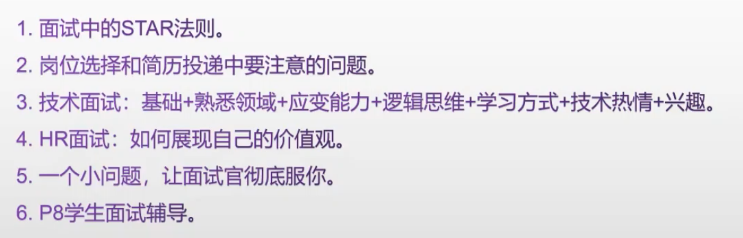
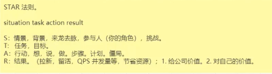
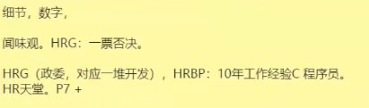
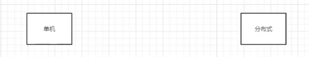
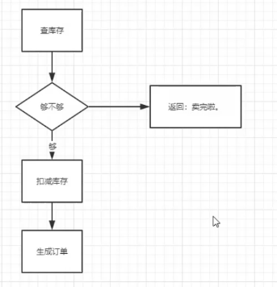
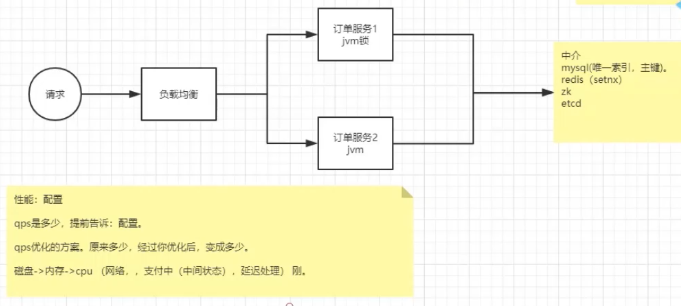
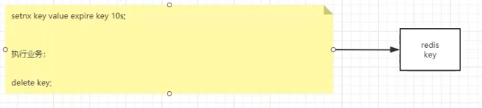
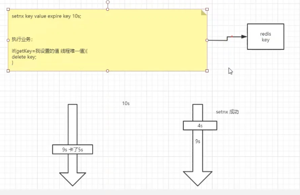

 


 

STAR 法则

situation  task  action  result

S：情景，背景，来龙去脉，参与人（你的角色），挑战

T：任务，目标。

A：行动，想，说，做。步骤。计划。僵局。

R：结果。（拉新--拉到多少新用户，留活--转化多少活跃用户，QPS并发量等，节省资源）；1、给公司价值，2、对自己的价值


 

回答问题，多说  细节、数字 ，

重视HR面

* 闻味观。HRG：一票否决
* HRG（政委，对应一堆开发），HRBP：10年工作经验C程序员。
* HR天堂。 P7 + 


---

例子：秒杀项目

技术：超卖，少卖



1、最初版本的业务实现

 

先说单机情况，上面的实现，在高并发下，肯定会出现超卖。查库存和扣减库存两步数据不同步

解决方法：加锁（synchronized  也叫jvm锁）。


---


**性能：配置**

qps是多少，提前告诉：配置。

qps优化方案，原来多少，经过你优化后，变成多少。

磁盘->内存->cpu（栈  和 堆） （6位验证码：string.append(1)，平方） （网络，支付中（中间状态），延迟处理）




### 3、单机redis方案

#### 3.1、setnx + delete 

```java
1、setnx key value;  
//实际代码
Boolean cacheRes = valueOperations.setIfAbsent(key, value);

（挂了）

2、执行业务；
    
3、delete key 

```


注意的点：

1、要加上delete key 这一步，如果没有这一步删除key，那么锁将无法释放，后续的业务线程无法获取锁进入抢购逻辑

如果在执行完第一步，设置了key，但是服务挂了。问题大了，那么永远没有机会执行第三步delete key，key还是没法释放。

所以有了下面的改良：

#### 3.2、setnx  +  expire  + delete 

```java
1、setnx key value;
//实际代码
Boolean cacheRes = valueOperations.setIfAbsent(key, value);

//设置key失效时间,防止后面的后面的逻辑出现异常，无法删除key，但是过期时间一定要设置大于业务执行时间，不然后续业务没处理完毕就删除了，还是会有并发问题。
2、expire key
//实际代码
stringRedisTemplate.expire(key, 120, TimeUnit.SECONDS);

3、执行业务；
    
4、delete key 
```


**这里引出面试技巧：**

**不能一下把最终方案说出来，要循序渐进，让面试官有成就感，也营造一种不断给他惊喜的节奏。**

**同时，这种回答策略也可以有效拖延面试时间。**

**说出方案改进的同时，也可以同时把STAR法则中 A这一点中关于怎么想，怎么做表达出来，加强面试官对你的认可和信任。**


#### 3.3、delete前要加判断




如果锁的key不具备线程唯一性，会出现一下问题：

1、线程1setnx成功，设置了key 10s超时

2、到第9s的时候，线程1 卡了，redis到第10s的时候，把超时的key删了

3、这时线程2进来，发现没有key，自然setnx成功

4、可以当线程2才执行到第4s的时候，线程1活过来了，逻辑继续执行第四步deletekey，这样的话，线程2的key就被线程1给删了。

所以优化如下：




#### 3.4、redission  的看门狗（watch dog）

[redisson分布式锁官方wiki说明](https://github.com/redisson/redisson/wiki/8.-%E5%88%86%E5%B8%83%E5%BC%8F%E9%94%81%E5%92%8C%E5%90%8C%E6%AD%A5%E5%99%A8)

实现的效果：自动续期


