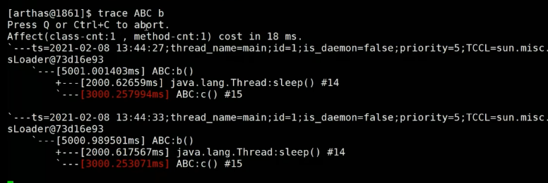

查看非标参数：java -X

查看不稳定参数：java -XX:+PrintFlagsFinal |more     统计有多少行：java -XX:+PrintFlagsFinal wc -l

so-s1之间的复制年龄超过限制时，进入old区，通过参数：-XX:MaxTenuringTHreshold  （最大老年代阈值）

三色标记算法：golang  \  cms  \ G1 在使用

了解常用的垃圾回去算法及对应的参数

调优工具

1. linux 命令和 jdk 命令   自带

2. 专业的工具：arthas（阿里）

3. 图形界面远程连接 ：jprofiler 、 jvisualvm 、 jconsole   

   离线的工具：MAT  

java -Xms200M -Xmx200M -XX:+PrintGC com.mashibing.jvm.gc.T15_FullGC_Problem01

最大堆最小堆设置成一样，可以防止频繁扩缩容，

`-XX:+PrintGC`可以在日志中打印GC回收

可用，但不友好：

top：资源消耗

jps  ：正在运行的java进程

top -Hp 进程号 ：查看进程内所有的线程

jstack 进程号：所有现成详情

jmap -histo 进程号  只查看前20行： jmap -histo 进程号| head  20

这个是可以当做面试资源的--问题是没法准备定位的，要根据业务来分析

arthas 里面好用的命令：

1. jad 反编译

   * 查看源码版本是否正确

2. trace  ABC  a

   * 跟踪ABC的a方法的调用过程
   * 通过下图可以第三行可以发现，有1秒在执行a方法，但是有5秒在执行b方法，那么可以退出来，继续跟踪b方法

    

跟踪b方法

 

定位有问题的代码

### 热更新

arthas在线直接改源码

**redifine 类路径**