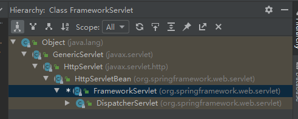
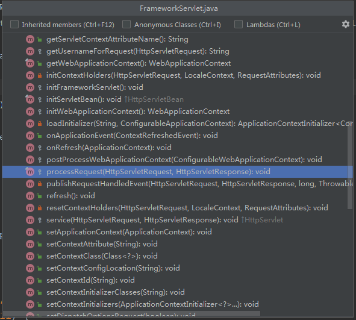

#### 1、如何调用maven窗口

View --> Tool Windows --> Maven即可

 

#### 2、在maven窗口一次性执行多个命令

只需把需要执行的命令使用ctrl 一起选中，就可以一起执行。

 

#### 3、新建项目的时候，修改项目变量

在IDEA启动界面右下角，选中Configure--> Settings 

 

#### 4、CodeGlance插件

类似SublimeText的Mini Map插件，看下图就知道什么用了

#### 打开类的继承树

在子类中 Ctrl + H

 

#### 代开类的结构图

在类中 Ctrl + F12 ， 效果和打开IDEA界面右侧的Structure窗口效果一样。

 

#### 

