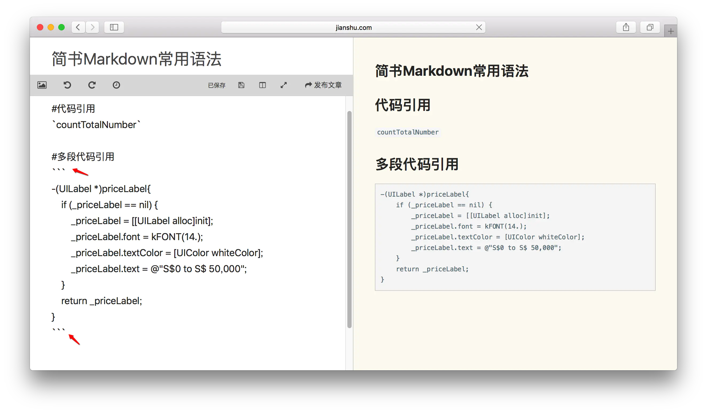
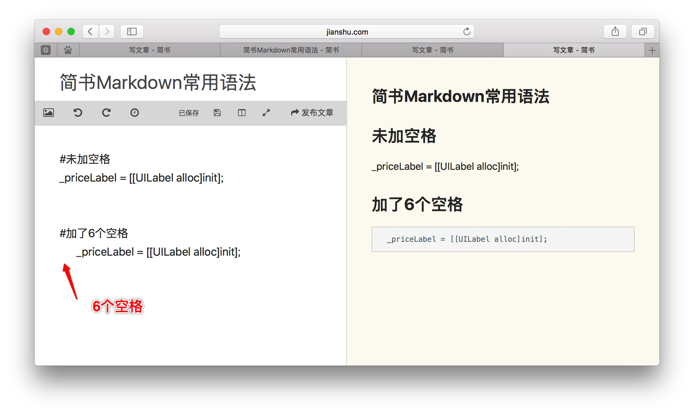
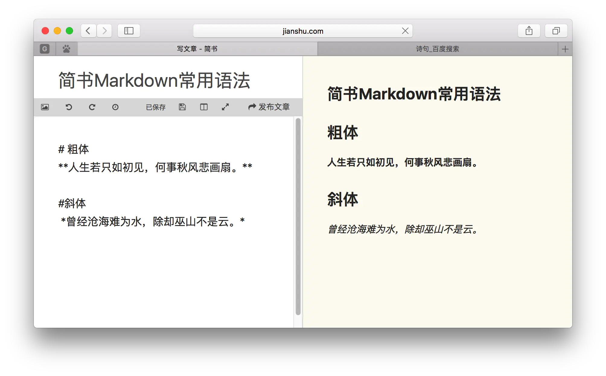

### 1、图片语法


### 2、超链接当前目录下的文档

[当前目录超链接](InnerHyperLink.md)

### 3、超链接其他目录下的文档

[IDEA高效率技巧](../IDEA/高效率技巧.md)

### 4、行内居中、左、右对齐

#### 4.1、居中：

```html
<center>这可以实现居中对齐</center>
```

<center>这可以实现居中对齐</center>

#### 4.2、左对齐：

```html
<p align='left'>
    这可以实现左对齐
</p>
```

<p align='left'>
    这可以实现左对齐
</p>

#### 4.3、右对齐：

```html
<p align='right'>
    这可以实现右对齐
</p>
```


<p align='right'>
    这可以实现左对齐
</p>

### 5、图片左对齐

在markdown中，图片默认是居中对齐的。

如果想实现左对齐，只需要在单行图片的情况下在前面输入一个空格就解决了。右对齐就需要靠css来解决了。


### 6、代码引用

```xml
`单个代码引用`
​```多段代码引用
```


 

另外,除了这种方法,还有就是:六个空格进入代码模式,就是你在代码前边敲六个空格就会进入代码模式,简书会认为后面的就是代码.



### 7、字体加粗和斜体字体

```xml
**粗体**
*斜体*
```



