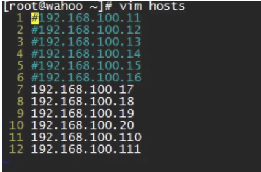
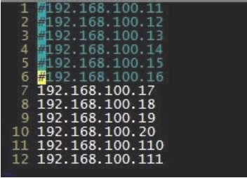
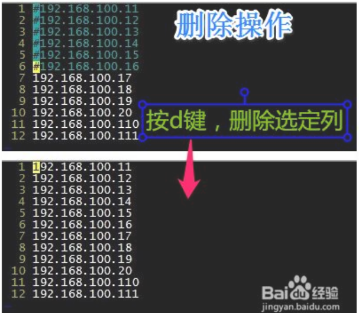
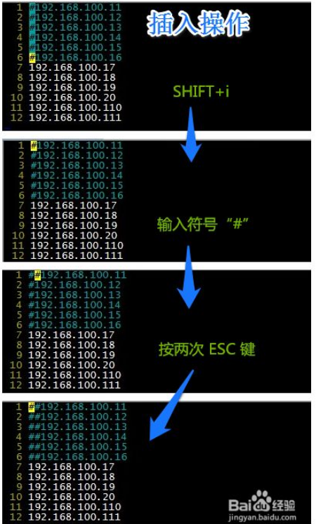
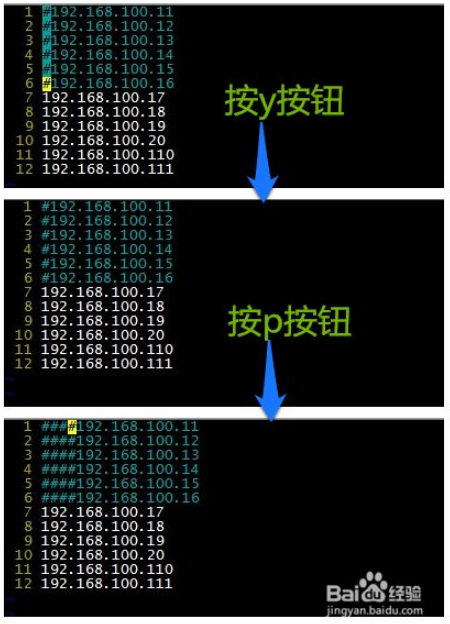
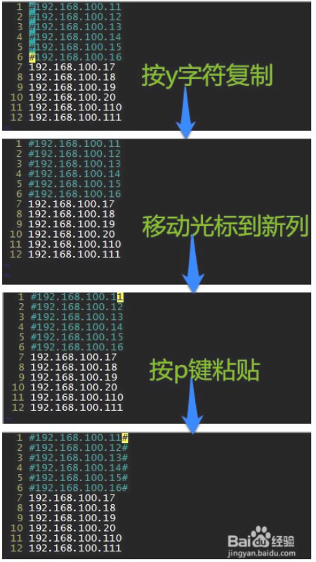

### 多行选中复制

vi的多行选中：

：.,$-1y
:进入编辑模式

.指当前行

，分隔符

$指最后一行

$-1指最后一行往前一行

y表示复制

---

### 替换

R 替换

---

### 删除

 d G 从当前行删除到文档最末位

---

### *列操作

打开要编辑的文档，将光标移动到#号符所在列上，停留处为操作的起始点

 

选定#号符所在列：

CTRL+v 将编辑器切换至"可视模式"（visual mode）

你可以通过操作键盘的上下方向键来控制选定区域

也可以通过组合键进行 下方向键 + 4数字键 + 下方向键

如图

 

执行操作：

删除操作，通过按d键，退出可视模式并删除选定区域内容。

 

插入操作，操作组合键SHIFT+i（SHIFT+i插入到列的左边，SHIFT+a插入到列的右方），这时候光标会回到选定起始点，当时可输入你要插入的内容，输入完成后按ESC键，退出“可视模式”并完成插入操作。

 

复制操作，按y字符键，这时候光标会回到选定起始点，如果想在当前光标处粘贴一列则直接 按 p字符键，当然你也可以移动光标到你想粘贴的位置，再执行操作。

 

 

> 注意：

- 如果操作失误可以通过 u 字符键撤销当前操作（类Window CTRL+z 组合键）
- 如果想恢复上次的操作可通过 CTRL + r 组合键来完成。