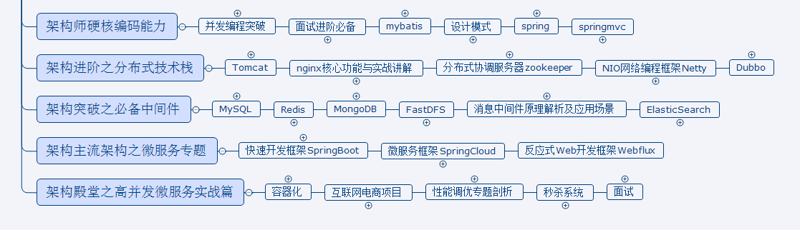

# I-know

# 学习路线：

路线还是java 多线程 jvm spring springmvc springboot springcloud nio netty + 大数据

在架构的思路中，你要有趁手的工具，这样才能编制你的“大厦”；

就好比做木工的时候，你需要先了解你手里的工具。

成长为能与偶像肩并肩的硬核实力。

亚马逊贝佐斯：如何用遗憾最小化框架做艰难的决定？

如何正确、高效做出决策，并确保方案落地执行，越来越成为每个企业家在管理中最重要的一环。
亚马逊CEO贝佐斯的决策方法是——遗憾最小化框架。简而言之，即我们做任何决定，最终都有可能会后悔会遗憾，但是面对多个选择时，我们应该选让自己后悔或者遗憾最少的那个。

我们做任何决定，最终都有可能会后悔会遗憾，但是面对多个选择时，我们应该选让自己后悔或者遗憾最少的那个。

贝佐斯说：“我把自己想象成80岁的模样，并思考：现在回望我的一生，我要把遗憾事件的数量降到最低。”

善良比聪明更难

istio : 32G内存，i7 9700K

达摩院的定位: Research for solving the problem with profit and fun   为解决问题而做研究，创造价值并享受快乐

对自己的定位是做一个善良的人，做有价值的事。

向日葵远程回家

EdrawMax

第一遍先倍速看，大概过一一遍，形成知识脉络。

第二遍就要细看，吸收成自己的东西

### 千锤百炼、韬光养晦

手中无剑，如何仗剑走天涯

### 短期目标

**面向RMB 、面试 学习**

### 长期目标 -- 分布式领域专家

**面向底层学习**

连老师的spring注释源码

**一口吃不成胖子，一步一脚印，扎实走过来**

**优先级：多线程高并发-->JVM-->设计模式-->zookeeper-->redis-->Mysql调优-->Netty-->Spring源码**

知识网络

* 是什么
* 产生的背景
* 解决什么痛点
* 优势
* 竞品是什么

## 多线程与高并发

###### static和volatile的区别

* static指的是类的静态成员，实例间共享
* volatile跟java内存模型相关，线程执行时会将变量从主内存加载到线程工作内存，建立一个副本，在某个时刻写回。volatile指的每次都读取主内存的值，有更新则立即写回主内存。
* static是类的属性，存储在类的那块内存，每个线程操作的时候会读取这个内存块，甚至会加载到寄存器或高速缓存中，这样自然不会保证其他线程对该值的可见性；而volatile表示每次读操作直接到内存，如果多个线程都遵循这样的约定，就会读取到最新的状态.

## JVM

###### 调优

###### 排查

## 设计模式

## Spring

###### spring的事务传播机制与数据库事务的关系

###### http异常传播的方式，不是rpc

###### 分布式事务

###### 灰度发布

###### 怎么界定哪些异常需要对外抛出

## MySql

###### 数据库调优

###### 索引设计，性能比较 （一个表设置多少个索引会比较好）

###### 一张表上建多少索引合适，性能上有没自己测试过

## redis

###### 用法、处理什么问题

## Netty

## zookeeper

## Spring

## SpringMVC/SpringBoot/SpringCloud

## 算法与数据结构

## 计算机系统
### Linux
#### Vi

## 计算机组成

## 计算机网络

## MongoDB

## MQ

[rumen ](docs/MQ/01-基础篇/为什么需要消息队列.md)

[Java 基础知识](docs/MQ/01-基础篇/为什么需要消息队列.md)

## ES

## docker k8s

## 大数据

## 高性能网关

### nginx  lua  

### 高可用 LVS

### 分布式服务
##### 限流
	一般限流做在网关这一层，如Nginx、OpenResty、kong、zuul、Spring Cloud Gateway等，也可以在应用层通过Aop这种方式去做限流。
###### 在Spring Cloud Gateway中如何实现

> https://blog.csdn.net/forezp/article/details/85081162

1. 计数器算法
    简单粗暴，一般我们会限制一秒钟能够通过的请求数，比如限流qps为100。--> 容易产生“突刺现象”
2. 漏桶算法
* 解决“突刺现象”
* 固定流速-->固定的处理速度
* 无法应对短时间的突然流量
3. 令牌桶算法
* 从某种意义上，是对漏桶算法的一种改进。桶算法能够限制请求调用的速率，而令牌桶算法能够在限制调用的平均速率的同时还允许一定程度的突发调用。

### dubbo 

#### rpc 和 http 的区别

### tomcat 和 jetty

### 面试题

[wps-golang](docs/interview/wps.md)

2020-08-05

先把设计模式再学一遍；

然后除了跟直播，就是全部心思都放到spring上去，我要垮过这座山头

之后看数据库（mysql和redis、mongoDB）

然后就是项目

栈： 
 1 基础数据类型 byte short int long float double char boolean
 2 方法的形式参数，方法调用完后从栈空间回收
 3 引用对象的地址，引用完后，栈空间地址立即被回收，堆空间等待GC
 a) 栈内的数据线程之间独立
 b) 具体细分为:
 b.1) 基本类型变量区
 b.2) 执行环境上下文
 b.3) 操作指令区

 

堆
 1 this
 2 new出来的对象
 3 数组
 a) jvm只有一个堆区，并被所有线程共享。

 

方法区域(又叫 静态区) 
 1 字符串常量
 2 static
 3 所有的class
 a) 被所有线程共享, 其内存放程序中永远唯一的元素，eg: static class

1、生产日志调优

2、有什么线程池，为什么要用线程池，这些线程池都分别怎样用，哪些框架用了这些线程池，用来解决什么问题

3、集合，为什么要用集合，什么情况下用什么集合，哪些框架都用了哪些集合，什么场景适合使用

