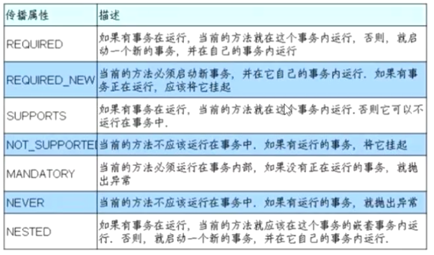
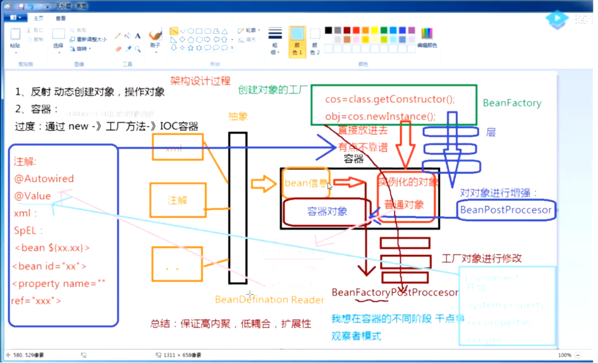

连老师

声明式事务的注解：

打开@Transactional注解源码，看到其标注的属性：

* Propagation 传播特性
* Isolation 隔离型-和数据库的隔离性一致
* readOnly 只读，在多次读的事务中，如果要防止ABA的问题，有使用场景
* rollbackFor
* rollbackForClassName
* notRollbackFor
* notRollbackForClassName

PlatformTransactionManager

Ctrl + h :Intellij IDEA 查看类的继承关系快捷键

#### 事务的传播特性

七种传播特性：

1. REQUIRED：如果有事务，就在当前的事务内运行，如果没有事务，则新建一个事务。

2. REQUIRES_NEW：必须使用新的事务，并在自己的事务内运行。如果已经有事务，则把它挂起。和NESTED对比，就是这个新事务是全新的，和父事务没有任何关系。父事务抛异常也不影响子事务的提交。

   但是NESTED的子事务是嵌套在父事务下的，和父事务有关系，如果父事务抛异常，即使子事务没有异常，操作也会被回滚。

3. SOPPORTS：当前有事务，就在事务内运行，否则可以不运行在事务中。

4. NOT_SUPPORTS：当前方法不应该运行在事务中，如果有事务，则挂起。

5. NEVER：当前方法不应该运行在事务中，如果有事务，则抛出异常

6. MANDATORY：当前方法必须运行在事务中，如果没有事务，则抛出异常。

7. NESTED：如果有事务，则在当前事务的嵌套事务中运行，否则，就启动一个新的事务，并在自己的事务内运行。

事务传播特性验证例子:**<重点>**

*** 源码

ClassPathXmlApplicationContext  --> refresh()

连老师：springframework 5.1 源码包，有注释

Spring IOC的 初始化过程

好好看一下BeanFactory的注解，顶级父类

可以试下装IDEA 的transalate插件

**比较重要的方法：obtainFreshBeanFactory();**

DefaultListableBeanFactory

ConfigurableBeanFactory

可以看下Aware的注释

BeanDefinationReader

loadBeanDefinations(beanDefinationReader)

Aware接口，把容器里面的对象注入进来，方便后续调用

loadBeanDefinitions，把配置信息读取进来

**源码里面所有加do的方法都是实际干活的**

使用document的方式读取配置文件

registerBeanDefinitions

